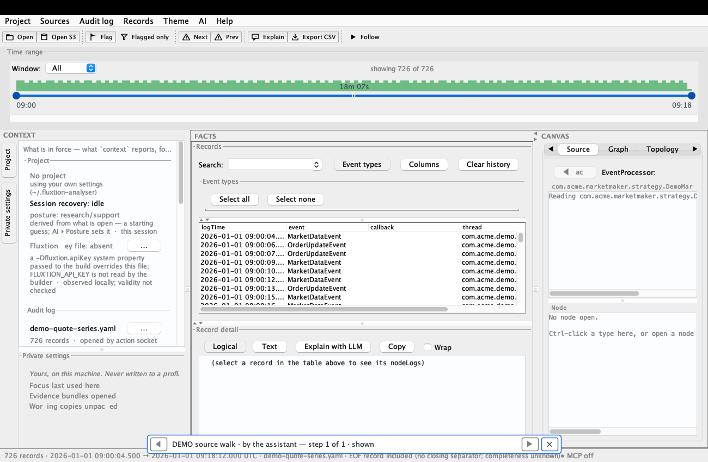
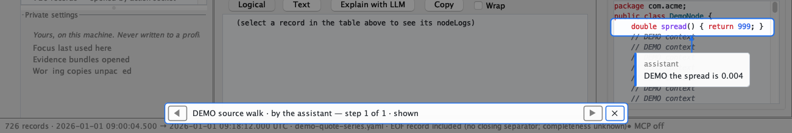

# Third review: bundle provenance and Java walks — issue #84

2026-10-01. **Review reported; required corrections remain.** This report does not approve the released behaviour. R1 is a confirmed false-evidence defect. R2/R3 discard settings, R4 reports evidence shown before it exists, and R8 falsifies a claimed structural guard. R10 is an explicit design challenge rather than an accidental breach of the chosen class-name identity. No production code, generated processor or release was changed.

## Scope and verified state

Read CLAUDE.md, docs/ONBOARDING.md, all of #84 and its comments, #79 and PR #87’s posted review/status. Reviewed the complete v1.29.0...v1.30.0 feature and the #72 change in v1.30.1, using two private-to-the-review worktrees and JDK 21. Release-tag application jars were built offline and used for the new frame probes; released test helpers drove normal actions and deterministic reader boundaries. Only DEMO assets and isolated homes were used.

- v1.29.0: `b1f4c3bd5e1d54cd94a2fa52c27ba64eb98edc05`.
- v1.30.0: `b1fe4fd7ec6fd451329c7182a8f9adc46fc5fed6`.
- v1.30.1: `1b7d71975563f9e8dee9906989b35a862458d3d2`.
- **Item 1 DONE:** independently read [run 36734309006](https://github.com/telaminai/fluxtionauditlog-analyser/actions/runs/36734309006), head `29dc3a33b46b7ca8b8d5b2ca2e6b050854edcb52`; all four mutation shards, collector, self-test, build, ui-frame, loop-bench, static and changes succeeded. Also verified v1.30.0 is its ancestor. This is CI evidence for that head, not a claim that CI ran these new probes.
- **Item 2 reported:** the third review and all its findings are below.
- **Item 3 DONE as recorded by GitHub:** while this review ran, [PR #87](https://github.com/telaminai/fluxtionauditlog-analyser/pull/87) merged as `258da371d957044625da4b88f5a433922f987b00` at 08:17:16 UTC and the owner closed [#79](https://github.com/telaminai/fluxtionauditlog-analyser/issues/79) immediately afterwards. The independent review had requested changes at `11df0d26`; the [implementer’s final report](https://github.com/telaminai/fluxtionauditlog-analyser/pull/87#issuecomment-5927553142) states the corrections and explicit owner CI waivers, and retains the separate colon-policy question. This is merge/issue-status evidence, not an independent approval of `788b2317` or a claim that its full gate was green. No PR #87 code, tests or reviewer worktree were inspected.

## Acceptance coverage

| Requested area | Result and own evidence |
|---|---|
| A1 — three columns / machine tier | Tested project default focus, machine focus history, bundle recents and divider through profile/share/bundle export and machine persistence; isolation and clearing passed. Read the Private panel’s render inputs and inspected its native rendering. GRAPHS borrowing failed (R2). This samples the changed keys, not every machine preference. |
| A2 — reopen decision and record | A real person selection reopened the log after the driver cycle, with isDispatching=false. Disabled offers falsely record offered; audience remains in the frame (R7). |
| A3 — D-L3 guard | Direct frame reference and extra declared action caught; nested frame helper and inherited unnamed action survived with green assertions (R8). |
| A4 — declared external roots | ProjectReopenTest’s declared-source-root and undeclared-sibling cases passed. READ design access canonical containment/authorisation; no root escape demonstrated. Machine fallback misstates membership (R9). A declared directory is a broad grant by definition; pointing one at a shared parent broadens project discovery, so the distinction must remain visible. |
| A5 — recents | Native probe opened/reopened two bundles named same.fexp at different paths, restarted, and checked distinct identities, no working-copy recent project and no working-copy reopen candidate: passed. Official frame suites passed after an unchanged cleanup retry. |
| A6 — startup settings applied | Released BundleProvenanceFrameTest#aRestoredProjectHasItsSourceInForce passed: actual source service, not just listed roots. |
| A6 — borrow leaves no working copy | Actual import preview succeeded; working-copy child set 0→0: passed. |
| A6 — sender’s processor claim | Actual context.project.bundle had processorClaimed and “the sender’s selection at capture; not paired against this log”, no unqualified processor key: passed. |
| A6 — clearing OWN roots preserves bundle anchor | Close bundle, clear own roots, inspect remembered bundle anchor: passed. Offline-root + unrelated import still loses it (R3). |
| A6 — startup never rewrites committed profile | Real frame restored a DEMO profile; after startup its bytes were unchanged: passed. |
| B1 — class/line basis, excluded targets | READ ALLOWED: Java/class/line admitted; design/toolbar/menu still refused. FQN is a usable lookup address, but is not a revision basis for a saved line/caption (R10). |
| B2 — resolvable but not showable | Existing class with line 99999 settled NOT_SHOWN with “outside” and no light: passed. Invalid UTF8 left PREPARING after an EDT exception (R6). |
| B3 — never-returning preparation | Held actual worker; shortened existing deadline to 200ms. NOT_SHOWN, deadline reason, ownership flag false; releasing worker did not light: passed. This proves deadline logic, not interruption of filesystem IO. |
| B3 — view / Source close / project / roots | Native keyboard view move is undone (R5). Source component removal settles NOT_SHOWN; project switch ends the walk with no late light; root change refuses superseded read: passed. Tab removal is an equivalent deterministic boundary, not an OS mouse-close gesture. |
| B3 — Back / Next during read | Next while held prevented old light; Back after release re-prepared correctly. Back before releasing original read blocks the EDT (R6). Preparation is prematurely SHOWN (R4). |

## Findings, most severe first

All behaviours below were **CONFIRMED** by a released-jar frame probe or compiled mutation. Each includes a wrong-result witness and proposed regression; none is claimed fixed or closed. The raw logs retain expected assertion failures.

### R1 — P1 REQUIRED: Failed bundle plan can label an independently replaced profile as the sender’s evidence

**src/main/java/telamin/fluxtion/audit/analyser/analyser/session/node/OpenBundle.java:74 (v1.30.0).** Trust-class: YES — false bundle identity/provenance.

Open an ordinary DEMO project and capture a bundle. Make its dirty-project pre-save throw, then open the bundle: verification holds a plan but application fails. Replace that plan’s profile file with an independent profile, remove the pre-save failure, and open the replacement through open {project}. Path equality resurrects the old plan and identity.

Observed: Expected fromBundle=false; actual true. The applied processor was DEMO.recipient.OtherProcessor, while the window still claimed the aborted evidence bundle. Witness: `aReplacementProfileIsNotTheSendersEvidence` / `replacementProfileMustNotCarryTheAbortedBundlesIdentity`.

Fix/check: Bind provenance to the verified operation/content, not just its profile pathname. Retire an aborted plan without discarding legitimate internal plan-less loads or a bundle still in force. Promote this real-frame witness and add a control for the correlation/retirement.

### R2 — P2 REQUIRED: Borrowing GRAPHS reports success but discards the incoming chart definition

**src/main/java/telamin/fluxtion/audit/analyser/analyser/ui/MainFrame.java:8120 (v1.30.0).** Trust-class: NO — settings loss and a false import-success result.

Create DEMO-chart with note DEMO sender and capture it. Change the open chart’s note to DEMO recipient. Import the bundle with categories=[GRAPHS]. The config apply is overwritten by the save funnel’s merge from the old live chart.

Observed: Expected saved note DEMO sender; configuration, visible chart and committed profile all retained DEMO recipient. Reply: applied=true, categories=[GRAPHS]. Witness: `importingGraphsKeepsIncomingNotes` / `incomingGraphSurvivesTheSaveFunnel`.

Fix/check: Restore imported chart definitions before the ordinary persistence funnel (the existing applyImportedConfig path provides the relevant order). Assert both visible and persisted notes/series; mutate that application ordering.

### R3 — P2 REQUIRED: An unrelated REPORTS import erases a bundle anchor while its source directory is offline

**src/main/java/telamin/fluxtion/audit/analyser/analyser/session/node/BundleAnchor.java:76 (v1.30.0).** Trust-class: NO — silently discarded personal setting.

Anchor a bundle to DEMO-code, close it, temporarily move that directory, and reopen the bundle. Its unavailable root is omitted from live roots but is still remembered. Import only REPORTS. MainFrame.java:6496 posts every config edit as SourceRootsObserved([]), so the node treats an unrelated edit as an intentional deletion.

Observed: Remembered anchor [DEMO-code] became []; restoring the directory and reopening the bundle still gave sourceRoots=[]. Witness: `anUnrelatedEditDoesNotDeleteAnUnavailableAnchor` / `unrelatedReportsImportMustNotDeleteThePersonsAnchor`.

Fix/check: Report a source-root edit with intent/origin, distinct from restoration or unrelated configuration changes. Keep intentional empty edits supported. Add this offline-directory regression plus a targeted control; retain the existing deletion control.

### R4 — P2 REQUIRED: Java walks claim SHOWN and accept the step before source preparation has completed

**src/main/java/telamin/fluxtion/audit/analyser/analyser/session/node/WalkPlayback.java:190 (v1.30.1).** Trust-class: YES — false claim about evidence actually displayed.

Prime availability for a DEMO class in a source archive, then hold its fresh discovery/read boundary. Play a Java-line walk. WalkStepPrepared treats resolvable targets as displayed, before LightWalkTargetsEffect completes.

Observed: With the real asynchronous archive read held: phase=SHOWN, accepted step advanced, walkOwn=true, lit=[]. Expected PREPARING. The native strip also said shown. Witness: `unreadSourceMustStayPreparing` / `aJavaWalkMustNotClaimSHOWNBeforeItHasReadOrLitTheSource`.

Fix/check: Keep the node PREPARING and the accepted dialogue step unchanged until ticket-matched WalkTargetsLit reports the real outcome. Add a held-reader assertion on snapshot, strip, accepted step and empty overlay; mutate the phase/acceptance gate.

### R5 — P2 REQUIRED: A late Java walk read overrides a person’s native keyboard tab selection

**src/main/java/telamin/fluxtion/audit/analyser/analyser/ui/MainFrame.java:3157 (v1.30.1).** Trust-class: NO — a person’s view choice is discarded.

Hold a primed Java walk’s fresh archive read. Use the tabbed pane’s installed native keyboard Previous-tab action to select Summary. Release the read. ownedByWalk suppresses the view guard and line 3173 selects Source again. Mouse navigation has other guards; this finding is specifically the keyboard path.

Observed: The native navigatePrevious action selected Summary while the read was held. Completion switched back to Source and lit the old step. Expected Summary to remain selected. Witness: `aViewChangeDuringReadMustNotUndoThePersonsChoice` / `lateWalkReadMustNotReplaceThePersonsNewView`.

Fix/check: Bind preparation to the intended view and supersede external navigation, while preserving the walk’s own applyView. Carry navigation origin/identity into session facts. Commit the native keyboard regression and a control for the external-navigation guard.

### R6 — P2 REQUIRED: Java walk availability reads on the EDT, can freeze Back, and leaves malformed source PREPARING

**src/main/java/telamin/fluxtion/audit/analyser/analyser/ui/MainFrame.java:2755 (v1.30.1).** Trust-class: NO — broken responsiveness and an unsettled operation.

(1) Hold the real Maven archive discovery monitor, play a cold Java-source walk, and queue an EDT sentinel. (2) Prime availability, hold the fresh read, Next to a status step, then Back before releasing it. (3) Place bytes E9 0A in the resolved DEMO .java file and play. canPrepareSource calls sourceForFqn synchronously, before the async preparation/deadline.

Observed: Cold archive lookup blocked the EDT; a queued sentinel did not run. Back during the original held read also blocked. A resolvable invalid-UTF8 file threw UncheckedIOException and left phase=PREPARING, walkOwn=false, lit=[]. Witness: `availabilityMustNotReadOnTheEventThread` / `javaWalkAvailabilityMustNotBlockTheEDT`.

Fix/check: Do bounded source lookup/read off the EDT and report availability/failure as facts. Exceptions must settle NOT_SHOWN. Add all three witnesses and a control that restores synchronous lookup. Extra named assertions: BackDuringAReadMustNotBlockTheEDTOnTheOriginalLookup; sourceAvailabilityFailureMustSettleHonestlyInsteadOfLeavingPREPARING.

### R7 — P2 REQUIRED: Reopen audience is still decided in MainFrame and disabled offers are recorded as offered

**src/main/java/telamin/fluxtion/audit/analyser/analyser/ui/MainFrame.java:7231 (v1.30.0).** Trust-class: NO — false operation-audit record; no false bundle identity demonstrated.

Without enabling reopen offers or installing a chooser, use the ordinary person project-request path on a DEMO project with a recent log. The effect arm decides asking from sessionInteractive/showingSomething; the deferred helper later silently refuses because offersAllowed is false. ProjectReopenOffer only decides the bundle exclusion, not the audience.

Observed: offersEnabled=false, chooser=null, dialogs=0; session audit nevertheless recorded StatusShown(kind=offerProjectReopen) and success:true, with no offerProjectReopenSkipped. Witness: `aDisabledOfferIsRecordedAsSkipped` / `disabledOfferMustBeRecordedAsSkipped`.

Fix/check: Make audience/eligibility a session-node decision from explicit request and permission facts. The adapter should return candidate facts and ask only when requested. Record the actual offered/skipped outcome. Keep the successful probe that chooses a log outside the driver cycle.

### R8 — P2 REQUIRED: D-L3 guard misses nested MainFrame access and inherited unnamed Navigator actions

**src/test/java/telamin/fluxtion/audit/analyser/analyser/ui/ProjectPanelIsRevealOnlyTest.java:42 (v1.30.0).** Trust-class: NO — claimed regression protection is not held.

Run the published serial FastEngine probes. Add a nested FrameBridge.make() that constructs MainFrame, with an outer helper calling it: the guard reads only the outer class bytes. Separately make Navigator extend HiddenActions with default runAnything(Runnable): getDeclaredMethods at line 69 excludes the inherited public action.

Observed: review-panel-inner-frame and review-navigator-inherited-action both ran 1/0/0/0. Direct MainFrame field and new declared action both failed at the named assertions. These survivors are genuine green runs, not crashes. Witness: `thePanelNeverNamesMainFrame_itsOnlyExitIsTheTwoMethodNavigator` / `two planted forbidden surfaces remain green`.

Fix/check: Check nested/anonymous classes and reachable helper dependencies for forbidden frame/action-surface references; inspect the inherited public Navigator surface as well as declarations. Register both bypass mutations and demand assertion failures plus byte-identical restoration.

### R9 — P2 REQUIRED: Machine-wide reopen fallback falsely labels another project’s log as inside this project

**src/main/java/telamin/fluxtion/audit/analyser/analyser/ui/ProjectReopenDialog.java:74 (v1.30.0).** Trust-class: YES — false membership/origin claim about offered evidence.

Only open a log in DEMO-other-project, then open an empty DEMO-project with no declared root containing that log. MainFrame.java:7871 deliberately falls back to machine recents; the dialog loses that origin and describes every candidate as belonging to the project.

Observed: The actual modal said “Open a log or topology from DEMO-project” and “opened inside this project”, with DEMO-other-project/DEMO-other.yaml preselected. Witness: `fallbackOfferMustNotDescribeAnUnrelatedLogAsInsideTheProject` / `anUnrelatedRecentLogMustNotBeCalledInsideThisProject`.

Fix/check: Carry machine/project origin per candidate list and describe it accurately. Retain the intentional machine fallback and explicit choice. Assert the actual modal’s membership wording for logs-only and topology-only fallback.

### R10 — P2 SHOULD — design decision: Java-line walk captions need an explicit source-revision contract

**src/main/java/telamin/fluxtion/audit/analyser/analyser/walk/WalkSteps.java:173 (v1.30.1).** Trust-class: NO — design risk; CURRENT is deliberately name-only, while the saved line/caption revision is undisclosed.

Save a Java-line walk against a DEMO class, edit the same FQN/line, then play. JAVA/JAVA_LINE use basisKind=none and WalkResolver.java:112 defaults to CURRENT. The class-name contract is deliberate; this is design pushback on applying it to a line and its old explanation, not a newly discovered violation of that deliberate identity definition.

Observed: After line 3 changed from return 0.004 to return 999, target.state was CURRENT and the saved caption “DEMO the spread is 0.004” was shown unchanged. No source basis was saved. Witness: `aMovedJavaLineMustNotBeMarkedCurrentAgainstTheSavedWalk` / `savedJavaLineMustNotClaimCurrentAfterItsTextChanges`.

Fix/check: Choose either a revision/line basis with historical/unresolved qualification, or explicitly label playback as a current name/line lookup whose source revision was not compared. The existing “Source/run: unverified” warning concerns pairing to the log and does not explain comparison to the saved caption. Pin the chosen disclosure with this changed-line probe.

## RAN / READ and raw counts

Counts are **total / failures / errors / skips**. Commands ran from the indicated own released-tag worktree with JDK 21. `EVIDENCE` means this report’s [evidence directory](evidence/issue-84-review-2026-10-01/README.md). Every display invocation was sequential under `lockf -k /tmp/fluxtion-analyser-display.lock`. Native Maven commands also used `-Djava.awt.headless=false -DargLine=-Djava.awt.headless=false -Dsurefire.failIfNoSpecifiedTests=false`.

| Mode | Command / release | Raw result |
|---|---|---|
| RAN | `mvn -o -q package -DskipTests`, each tag | exit 0; tests intentionally not run |
| RAN | `mvn -o -q test`, v1.30.1, initial sandbox | 3026 / 0 / 36 / 218; local socket permission errors |
| RAN | same, unchanged permitted retry | 3026 / 0 / 0 / 218; 406 source-mapped reports, no orphans |
| RAN | same, final before review commit | 3026 / 0 / 0 / 218; 406 source-mapped reports, no orphans |
| RAN | `mvn -o -q test -Dtest=BundleProvenanceFrameTest` + native flags, v1.30.0 | first 18 / 0 / 1 / 0, DirectoryNotEmpty cleanup error; unchanged retry 18 / 0 / 0 / 0 |
| RAN | `mvn -o -q test -Dtest=BundleProvenanceTest,RecentProjectsKeepRealProjectsTest,ProjectReopenTest,SettingsShareTest,NamedFocusTest,KnownKeysCoverTheWritersTest,ProjectSessionTest,ProjectPanelIsRevealOnlyTest`, v1.30.0 | 68 / 0 / 0 / 0 |
| RAN | `mvn -o -q test -Dtest=WalkReviewFrameTest,WalkPlaybackFrameTest,JavaSourceSpotlightFrameTest` + native flags, v1.30.1 | 27 / 0 / 0 / 0; respectively 12, 2, 13; repeated unchanged after final headless run to retain native report rows |
| RAN | `python3 EVIDENCE/run_probes.py bundle`, v1.30.0 | initial 7 / 4 / 0 / 0; expanded 12 / 5 / 0 / 0 |
| RAN | `python3 EVIDENCE/run_probes.py walk`, v1.30.1 | final ten 10 / 4 / 0 / 0 |
| RAN | same `--method aViewChangeDuringReadMustNotUndoThePersonsChoice` | native keyboard refinement 1 / 1 / 0 / 0 |
| RAN | same `--method anUnreadableResolvedClassReportsFailureInsteadOfPreparingForever --method backDuringTheOriginalReadMustNotBlockTheEventThread` | 2 / 2 / 0 / 0 |
| RAN | `python3 EVIDENCE/run_controls.py --bundle-only`, v1.30.0 | baseline 4 / 0 / 0 / 0; five mutant assertion failures 1 / 1 / 0 / 0 each; two actual green mutants 1 / 0 / 0 / 0; seven restored runs 1 / 0 / 0 / 0 |
| RAN | `python3 tools/verify_project_chart_review.py --mode mutations --engine fast --output target/issue84-walk-control.json --case walk-can-point-at-java`, v1.30.1 | baseline 12 / 0 / 0 / 0; mutant 1 / 1 / 0 / 0; restored 1 / 0 / 0 / 0 |
| RAN | `python3 tools/verify_project_chart_review.py --mode preflight --output target/issue84-preflight.json` | exit 0; 40 frame suites, 551 anchors |
| RAN | `python3 tools/test_project_chart_review.py` | 5 / 0 / 0 / 0 (Python unittest) |
| RAN | `.venv/bin/mkdocs build --strict` (existing environment) | exit 0; build succeeded; Python deprecation warning retained |
| RAN | `git diff --check`, documented public-data sweep, additions/public-text sweep | exit/result clean; sweeps print nothing |
| READ | `gh run view 36734309006 --repo telaminai/fluxtionauditlog-analyser --json headSha,conclusion,jobs,url`; `git merge-base --is-ancestor v1.30.0 29dc3a33` | success, all required jobs success; ancestry exit 0; no invented CI test totals |
| READ | `gh issue view 84 --json body,comments`; `gh issue view 79 --json state,comments`; `gh pr view 87 --json state,mergedAt,headRefOid,comments` (repo specified) | full discussion/status read; final #87 MERGED and #79 CLOSED. Final implementer report and its waivers read only. No PR #87 tests run. |
| READ | `git diff v1.29.0...v1.30.0`, released CHANGELOG, nodes/driver/effects, tier persistence/share, source and walk resolver/presenter/guards | inspected against the tag implementations; dynamic coverage distinguished above |

### Requested controls versus caught names

Eight requested, all eight actually ran. Six caught, two intentional forbidden-surface mutants survived. All four **registered** controls requested were caught. Every caught run failed at its named test’s assertion; no crash was scored as a protection.

- Caught: `review-panel-direct-frame`, `review-navigator-list-closed`, `bundle-provenance-matches-the-applied-profile`, `bundle-anchor-forgotten-when-deleted`, `bundle-anchor-restored`, `walk-can-point-at-java`.
- Green survivors: `review-panel-inner-frame`, `review-navigator-inherited-action`.
- Every source and compiled-class tree restored **byte-identically**, and every final restored run was green. The custom runner deliberately continues after a planted survivor, so the later controls were not silently skipped. The ordinary official gate remains fail-fast; its one requested Java control ran and was caught.

The retired close-anchor reasoning was READ against the driver: rendering precedes SettingsRestored, SessionDriver.post queues a fact while dispatching, and queue draining after try/finally really can be skipped by a thrown operation. The null-source write defence depends on the node already observing NONE; it is not an independent live-path defence. No new close-poison scenario was demonstrated here, and that retirement is not presented as a confirmed defect. R3 is a different, reproduced loss through an unrelated edit.

## Evidence, limitations and closure

[Evidence README](evidence/issue-84-review-2026-10-01/README.md), portable probes, mutation definitions, exact assertion messages, per-suite counts and logs are committed with this review. Machine paths and trailing log whitespace were normalised before publication; assertion meaning, test outcomes and counts were not rewritten. Images came from native Swing rendering of the released application jar under isolated homes. Two lower-pane captures exclude temporary-path headers; no painted previews were used. Every published image was read by eye.

No whole local mutation gate, provider trial, other-platform display test, full security audit of bundle parsing, or PR #87 test was run. Reading canonical path checks is not proof against every filesystem race. Native screenshots are Swing component renders, not desktop recordings. Failed harness setup, mistaken verdict casing/scoring and unsuccessful cleanup attempts are retained and explained rather than silently discarded.

After filing every finding, item 2 of #84 is reported. GitHub now records #87 merged and #79 closed, satisfying the owner’s stated closure condition. **Close #84 as a completed review/tracking task, without implying that this review’s findings were fixed.** They remain individually tracked. This reviewer did not merge #87. Filed issues and final public status are linked in the issue’s one summary comment.
