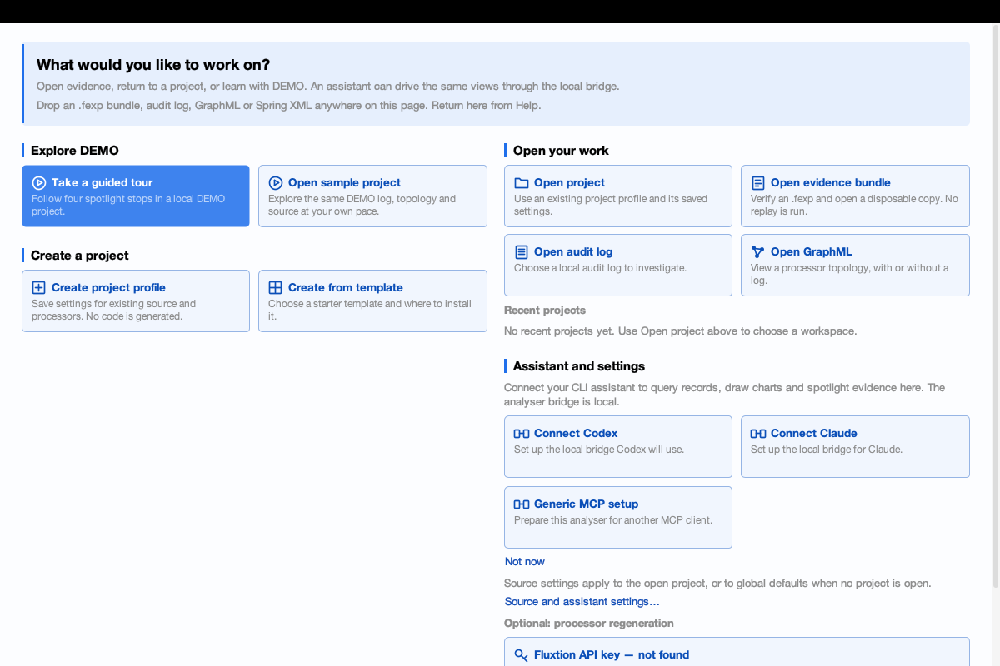
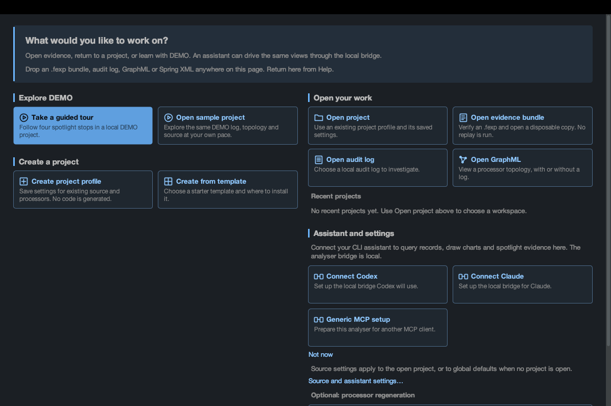
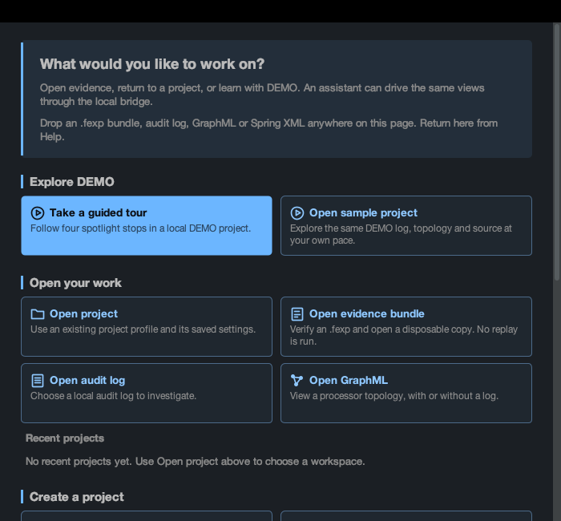

# PR #71: correctness and usability re-review

Reviewed head: `f13fba6d`. Correction: `5f950694`. Reviewer: Codex, 2026-09-29.

**Verdict: the new required correctness finding is fixed and tested. Ready after CI checks the review delta and the already-declared native documentation screenshots are refreshed.** No merge or release performed. This report includes implementation by the reviewer; it is not independent approval of that implementation.

## Findings and dispositions

1. **REQUIRED, fixed in `5f950694`: a late bundle could erase a newer graph choice.** `OperationGate.java:187` (`onGraphOpened`). Input: start preparing a valid bundle, open DEMO GraphML before its completion reaches the event thread, then allow completion. Before the fix, my real-frame probe reported `new graph visible before completion=true`, `new graph survived=false`, `active is bundle=true`. The bundle contained no graph, so applying its project cleared the graph just chosen. RAN. The earlier project-race correction did not cover this entrance.

   The gate now distinguishes preparation from accepted bundle opening. An explicit graph cancels preparation; a reader graph does not. The accepted bundle's own graph does not cancel its log. This decision stays in the session node. `BundleOpenReplayTest:96` failed before the correction at **a newer explicit graph retires the pending bundle immediately** (7 total / 1 failure / 0 errors / 0 skips), then passed (7/0/0/0). Positive tests at lines 112 and 125 cover the two exclusions. `StartWorkspaceFrameTest:361` also drives actual asynchronous bundle preparation and waits until the late result has been rejected before checking the graph, project and log. New mutation controls remove cancellation and corrupt the opening stage respectively; both fail at their named assertions, restore exactly, then pass. RAN.

2. **SHOULD, fixed in `5f950694`: Start blurred different destinations and misstated settings scope.** `StartPanel.java:118–145,300`. The previous “Configure global sources” button opened ordinary Settings while the active project's source tier was still in force. The template guide also directed people to “Author a new project”, which creates a profile, not a template installation. READ against `MainFrame.openSettings`, `onConfigChanged`, `saveConfigQuietly` and action wiring.

   Start now groups **Explore DEMO**, **Open your work**, **Create a project**, and **Assistant and settings**. “Open evidence bundle” states that it opens a copy and runs no replay. “Create project profile” explicitly generates no code; “Create from template” names installation. The duplicate incident chooser is removed from this page. Drop formats are visible; recent entries put profile filenames before the full path. Assistant connection precedes optional regeneration; connection and project icons distinguish those actions. Settings copy describes the actual active tier. Matching site instructions and the spec were corrected. Existing routing and responsive-layout assertions were updated, plus checks for settings scope and drop instructions. RAN with real light/dark and narrow frames; screenshots below.

3. **OPTIONAL, suggested: make the tour teach the task, not only identify controls.** `DemoTour.java:16–29`. At 1200×800 all four steps reached SHOWN with CURRENT, available targets. However, the longer instructional step captions are stored rather than painted in the short target callouts. The final stop highlights Reports while its Reports category is empty; it does not expose the saved walk. The topology is tiny in the default sidebar and its second callout overlaps the bottom strip. RAN and inspected all four images. Suggest concise instructional target captions, selecting Spotlight walks at the final stop, and a later assistant-driven chart question. A regression should assert the selected category and that instruction/callout bounds are visible without overlapping the strip. These are onboarding improvements, not evidence that walk identity or playback failed.

4. **OPTIONAL, suggested: make reading space responsive too.** `ReportsPanel.java:195`, `TemplateProjectDialog.java:177–180`, `ChartPanel.java:375`. At a 400-pixel Reports pane the fixed initial 180-pixel list leaves a cramped preview; at a 330-pixel graph pane the legend leaves roughly 115 pixels for the plot. The template picker opens at 872×532 and cannot be resized. RAN visual probes; READ layout. Prefer a capped proportional report divider, collapsible legend, and a resizable template dialog capped to the usable screen. Add visible-content geometry checks, not just button-existence checks. Walks More, series Add/Pick and wrapped findings remain reachable in the reviewed narrow layouts; those earlier required defects are closed.

## Earlier review closure

The seven earlier required findings were checked against their fixes and actual behavior:

- R1: the project supersession path is now guarded by the session; its real-frame test passes. The additional graph entrance above was still missing and is now fixed.
- R2: a returning project without a log exposes Return to workspace, and Open project is present. RAN the returning flow.
- R3: native drops reach hero text and cards. RAN real Robot drags, not only direct TransferHandler calls. One gate attempt failed at the hero-drop assertion; the unchanged retry passed. Cause of that intermittent failure is not established.
- R4: mixed-drop refusal is visible on Start. RAN the frame witness. A Spring XML outside permitted roots switches to Source and shows a refusal in the status; it does not silently add a grant.
- R5–R7: narrow Walks, series controls and producer findings are reachable/readable in the frame assertions and inspected captures. RAN.

Walk transitions continue through the generated session processor. I read the framework reference and generated GraphOpened dispatch before changing the gate. Owner-authorized `mvn -o -q -Pregen process-classes` completed successfully; generated Java and GraphML were unchanged because the change is private state and logic in an existing node handler. The initial sandboxed regeneration could not resolve the provider host; that failed attempt was retained. No credential was inspected.

## Verification (total / failures / errors / skips)

JDK 21, macOS; isolated worktree and temporary application homes. All display processes ran sequentially under the shared display lock.

| Command / check | Own result |
|---|---|
| `mvn -o -q test`, reviewed head | 2858 / 0 / 0 / 181; 382 source-mapped reports, no orphans |
| Same command, corrected code | **2862 / 0 / 0 / 182**; 382 source-mapped reports, no orphans |
| `python3 tools/test_start_workspace.py`, reviewed head | 15 / 0 / 0 / 0 |
| Same Python gate, corrected code, first attempt | 16 / 1 / 0 / 0; native hero-drop assertion |
| Same command, unchanged retry | **16 / 0 / 0 / 0** (StartWorkspaceFrameTest 12, ProjectLandingTest 2, FileDropRoutingTest 2) |
| AsyncOpenInterleavingFrameTest | 12 / 0 / 0 / 0 |
| ChartLifecycleReviewFrameTest | 11 / 0 / 0 / 0 |
| TemplateCatalogueFrameTest | 1 / 0 / 0 / 0 |
| ReportRecoverableDeleteFrameTest | 6 / 0 / 0 / 0 |
| NamedGraphAndMenuSpotlightFrameTest | 7 / 0 / 0 / 0 |
| WalkVerbFrameTest | 1 / 0 / 0 / 0 |
| `mvn -o -q package -DskipTests` | exit 0 |
| Three targeted mutation controls | 3 caught / 0 survivors, 8.3 seconds; named failures, source/class byte restores, restored green |
| `python3 tools/verify_project_chart_review.py --mode preflight` | 33 frame suites, 471 anchors |
| `python3 tools/test_project_chart_review.py` | 5 / 0 / 0 / 0 |
| `mkdocs build --strict` | exit 0 |
| `git diff --check`, tracked and added-line public sweeps | clean |

Each individual Maven display run used `mvn -o -q test -Dtest=<class> -Djava.awt.headless=false -DargLine=-Djava.awt.headless=false`. The Python gate uses those same flags. Initial sandboxed headless testing produced 29 local-socket permission errors (2858/0/29/181); the authorized unchanged run above removed that environmental restriction. Failed attempts are not counted as passes.

Targeted command:

```sh
python3 tools/verify_project_chart_review.py --mode mutations --engine fast   --case ws-newer-graph-cancels-bundle   --case ws-bundle-own-graph-retains-log   --case ws-stale-bundle-verification-refused --output controls.json
```

Additional real-frame probes exercised default/narrow Start, both themes, a project without a log, all tour steps, native card drops, refused XML and the graph/bundle race. Native Tab moved from Tour to Sample, Space started the tour, and Right moved to step 1. Screenshots were inspected by eye. They are Swing paint captures of displayed frames, not claimed to be native documentation captures.

The reviewed head's CI run **36572076631** was read with `gh pr checks 71`: build, ui-frame, loop-bench, self-test, all four mutation shards and collector passed. That result predates this correction; new-head CI must pass separately.

## Not verified / remaining work

No local full mutation gate or full registered display suite was run. The named display suites above ran; headless frame skips are not passes. No template provider run, participant project, LLM trial or replay was used. No user study, screen-reader evaluation, all-platform keyboard guarantee or exhaustive extreme-value axis proof is claimed. Ordinary DEMO axes and related suite assertions were inspected/run.

The PR already lists native refresh of older graph/report documentation images as work before merge; this review does not mark it complete. The native-drop flake is disclosed, not diagnosed or hidden by weakening the assertion. CI should be checked after the pushed review delta.

## Review captures






