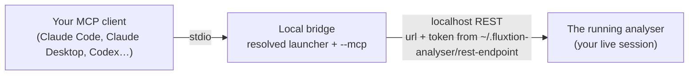
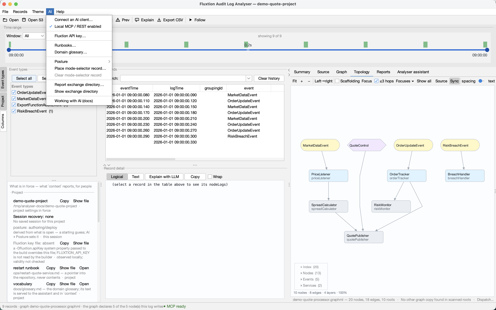
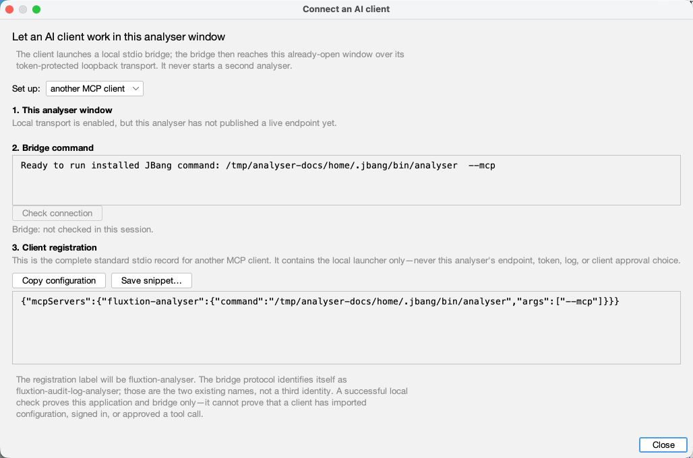
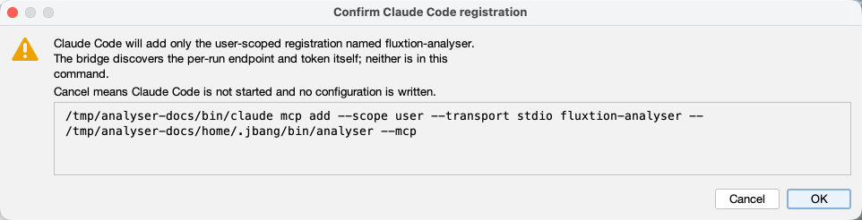

# Connecting an LLM to the analyser

The analyser is the **shared research canvas** of the [build-with-AI loop](the-loop.md): you ask in your
own words, the AI investigates, and it renders what it finds *in the analyser* — filters, flags, charts,
topology steps, a report — for you to review. This page is the plumbing that makes that possible: how an
LLM client connects, and how to check the connection is really working before you rely on it.

## How the connection works



Three parts, and it matters which is which:

1. **The analyser you already have open** — the desktop app, with the log you loaded, the graphs you
   opened and the flags you set. That is the session the AI works on.
2. **A localhost REST transport inside the app.** Off by default. When it is on, the app listens on
   `127.0.0.1` on an ephemeral port with a per-run token, and publishes both to
   `~/.fluxtion-analyser/rest-endpoint` (mode 600) so nothing has to be copied into a prompt.
3. **The bridge.** Your MCP client launches the exact local command shown by **Connect an AI client**
   (an installed JBang launcher or an absolute Java-and-jar command, followed by `--mcp`) and talks MCP
   to it over stdio. The bridge is headless; it reads the endpoint file and forwards each tool call to
   the running app. It does **not** start the app — the point is to drive *your* live session, not a
   fresh one with nothing in it.

The client sees **one tool per verb**, `analyser_open`, `analyser_context`, `analyser_filter`,
`analyser_graph`, `analyser_topology`, `analyser_flag`, `analyser_report` and so on — fourteen in all,
each with its parameter schema, so there is nothing to teach the model. The read-only ones are marked
read-only; the ones that write files or replace what is loaded are marked destructive so your client asks
you first. The full verb reference is in [Analyser assistant](user-guide/assistant.md).

For clarity, JBang installs the local executable as **`analyser`**. The in-app setup registers the
separate MCP client label **`fluxtion-analyser`**, whose command is the resolved
`~/.jbang/bin/analyser --mcp` (or the equivalent packaged-JAR command). Those names have different jobs;
the registration does not require an executable rename.

## Connect, step by step

1. **Start the analyser and turn the transport on.** Tick *AI ▸ Local MCP / REST enabled* (it is
   remembered, and it is the same setting as *Settings ▸ Assistant ▸ localhost REST transport*), or start
   the app with the flag that does the same and says so on the console:

    ```bash
    java -jar fluxtion-auditlog-analyser.jar --rest
    # or: jbang analyser@telaminai/fluxtionauditlog-analyser --rest
    ```

    The status bar reads *Assistant REST transport listening on http://127.0.0.1:…*. `--rest` is also
    what an agent runs on a machine that has never seen the analyser: no dialog stands in its way, and
    the console names the endpoint file. Neither route puts the per-run token in client configuration.



2. **Set up the bridge from the analyser.** **AI ▸ Connect an AI client…** — reachable at any time,
   including with a log open, which is usually when the thought occurs. The same screen is on the Start
   page (**Connect Codex**, **Connect Claude**, **Generic MCP setup**) and at *Settings ▸ Assistant / LLM*.
   It shows the *resolved*, absolute bridge command for this installation rather than a command you have
   to reconstruct.

    - **Codex** and **Claude Code** offer explicit, confirmed CLI registration. Claude Code's automatic
      route is user-scoped; its project command is deliberately copy-only, so run it yourself from the
      project root you mean to change.
    - **Claude Desktop** has no bundled extension for this per-machine JBang/Java bridge. Select its
      **Generic MCP setup** fallback instead; the analyser does not edit Claude Desktop configuration.
    - **Generic MCP setup** shows a complete `mcpServers` JSON record. Copy it or save it to a file you
      choose, then put it in the location your client documents. The JSON preserves every command
      argument separately and never contains the endpoint or token.

    Opening the setup screen changes nothing. Use **Check connection** after enabling local transport:
    it starts the exact bridge command and asks it only for `analyser_context`. A green result proves the
    local analyser-to-bridge chain, not that a client has imported the registration. Restart or reload
    your client where that client requires it.

### The registration screens

The Generic MCP choice shows a complete, selectable `mcpServers` record. **Copy configuration** copies
only that JSON; **Save snippet…** writes it only to a file you select and confirms before replacing one.
Neither action changes a client configuration. The path below is deliberately a neutral documentation
path — use the exact launcher shown by *your* analyser, not the one in this image.



For Codex and Claude Code, choose **Check … registration** first. The app reports only the named
`fluxtion-analyser` entry; it does not infer that an entry at a different scope wins. **Register** or
**Replace** then shows the full command and a clear statement of what will change. It is still only a
proposal: **Cancel** does not start the client or write a configuration.



The Claude Code example is user-scoped. Codex uses the same readable confirmation layout for its shared
local registration. A project-scope Claude Code command remains copy-only; run it from the project root
yourself if that is the configuration you intend to change. A successful confirmation says that the
client command completed—not that a client is currently signed in, connected, or approved to call a tool.

3. **Open a log in the analyser** — or let the AI do it with `analyser_open` once you have checked the
   connection. Everything the AI renders lands in the window you are looking at.

## Check it is working

Do these in order; each one isolates a different part of the chain.

**Is this window even serving?** Read the status bar first — it costs nothing:

| Light | Means |
|---|---|
| **MCP ready** | this window is serving; a client pointed here reaches *this* log |
| **MCP elsewhere** | **another analyser window owns the endpoint** — a client is reading that window's log, not this one |
| **MCP starting** | enabled, but no live endpoint published yet |
| **MCP off** | the transport is off — tick *AI ▸ Local MCP / REST enabled* |

If the window that owns the endpoint **closes**, a window whose transport is on takes the endpoint back within a few
seconds and its light returns to **MCP ready** — a live owner is never displaced, so two windows cannot fight over it.

*Ready* is not *connected*: this window being reachable and a client actually talking to it are different
facts, and only the second needs a probe. **MCP elsewhere** is the one that quietly wastes time — two
analysers open, and the answers are about the other one.

**Does the bridge reach this app?** The quickest normal check is **AI ▸ Connect an AI client… ▸ Check
connection**. It runs the exact command shown on that screen and makes the read-only `analyser_context`
call. It is deliberately a bridge check, not an imitation of Codex, Claude Code or another client.

For a technical check, the endpoint file exists while the analyser is listening and names a URL:

```bash
cat ~/.fluxtion-analyser/rest-endpoint
# {"url":"http://127.0.0.1:52041","token":"…","pid":12684,"startedAt":"…"}
```

No file means the transport is off — tick *AI ▸ Local MCP / REST enabled*, or restart with `--rest`.

**Does your client see the tools?** In Claude Code, `/mcp` should show the server connected with
**14 tools**:

```text
> /mcp
  ⎿ fluxtion-analyser   ✔ connected · 14 tools
       analyser_aggregate · analyser_read · analyser_series
       analyser_filter · analyser_graph · analyser_goto
       analyser_flag · analyser_report · analyser_coverage
       analyser_context · analyser_topology · analyser_screenshot
       analyser_open · analyser_source_root
```

If the server is missing, the client did not launch the bridge. Reopen the analyser setup screen and use
the exact resolved record or registration command; then restart/reload the client if it requires that.

**Does a call reach the app?** Ask for something harmless and read-only:

```text
> Call analyser_context and tell me what log is open.
```

- A description of your session — the log, its record count, the filter, any flags — means the whole
  chain works. Nothing changed on screen: `context` only reads.
- *"analyser not running, or REST transport disabled — start the app with `--rest`"* means the tools
  are registered but the bridge found no endpoint file or could not reach it: the app is closed, or the
  transport is off. Fix step 1 and ask again — no client restart needed.
- *"no log loaded"* means the chain works and the analyser is simply empty. Open a log, or ask the AI
  to: `Open /path/to/audit.yaml in the analyser.`

**Does a render land on the canvas?** Ask for one visible, reversible change:

```text
> Filter the analyser to the last 30 seconds and flag the record with the highest spread.
```

The records table narrows and a flagged row appears — in your window, as you watch. Everything the AI
does from here is like that: a change you can see, click into and undo. If you would rather script the
same check without a model in the loop, `tools/drive-analyser.sh context` in the repository sends the
same call the bridge does.

## If something is off

| Symptom | Cause | Fix |
|---|---|---|
| Tools listed, every call says *not running* | app closed, or REST transport off | start the app; *AI ▸ Local MCP / REST enabled*, or `--rest` |
| Server never appears in the client | stale launcher or client not reloaded | reopen **AI ▸ Connect an AI client…**, use its resolved registration/JSON, then restart or reload the client if required |
| Calls time out on a very large log | an `aggregate` over millions of records | raise the client's tool timeout (Codex: `tool_timeout_sec`) |
| `screenshot` / `report` refused | file exchange is opt-in | Settings ▸ Assistant ▸ *Allow assistant file exchange*, and pick the directory |
| The AI opened a log but `context` shows nothing yet | opening is asynchronous | ask for `context` again — it reports the log, its time-order report and any offers once the load lands |

The same token-guarded, loopback-only transport also lets a plain script or another agent drive the
analyser without MCP at all — `GET /manifest` on the endpoint URL publishes every verb's schema. See
[Analyser assistant](user-guide/assistant.md) for the action protocol and the [FAQ](faq.md) for what the
socket can and cannot do to your machine.
