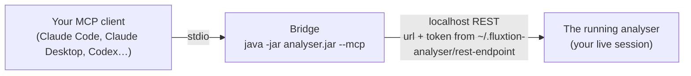

# Connecting an LLM to the analyser

The analyser is the **shared research canvas** of the [build-with-AI loop](the-loop.md): you ask in your
own words, the AI investigates, and it renders what it finds *in the analyser* — filters, flags, charts,
topology steps, a report — for you to review. This page is the plumbing that makes that possible: how an
LLM client connects, and how to check the connection is really working before you rely on it.

## How the connection works



Three parts, and it matters which is which:

1. **The analyser you already have open** — the desktop app, with the log you loaded, the graphs you
   opened and the flags you set. That is the session the AI works on.
2. **A localhost REST transport inside the app.** Off by default. When it is on, the app listens on
   `127.0.0.1` on an ephemeral port with a per-run token, and publishes both to
   `~/.fluxtion-analyser/rest-endpoint` (mode 600) so nothing has to be copied into a prompt.
3. **The bridge.** Your MCP client launches `java -jar fluxtion-auditlog-analyser.jar --mcp` as a
   subprocess and talks MCP to it over stdio. The bridge is headless; it reads the endpoint file and
   forwards each tool call to the running app. It does **not** start the app — the point is to drive
   *your* live session, not a fresh one with nothing in it.

The client sees **one tool per verb**, `analyser_open`, `analyser_context`, `analyser_filter`,
`analyser_graph`, `analyser_topology`, `analyser_flag`, `analyser_report` and so on — fourteen in all,
each with its parameter schema, so there is nothing to teach the model. The read-only ones are marked
read-only; the ones that write files or replace what is loaded are marked destructive so your client asks
you first. The full verb reference is in [Analyser assistant](user-guide/assistant.md).

## Connect, step by step

1. **Start the analyser and turn the transport on.** Either enable *Settings ▸ Assistant ▸ localhost
   REST transport* once (it is remembered), or start the app with the flag that does the same and says
   so on the console:

    ```bash
    java -jar fluxtion-auditlog-analyser.jar --rest
    # or: jbang analyser@telaminai/fluxtionauditlog-analyser --rest
    ```

    The status bar reads *Assistant REST transport listening on http://127.0.0.1:…* and the console
    prints the full token. `--rest` is also what an agent runs on a machine that has never seen the
    analyser: no dialog stands in its way, and the console names the endpoint file.

2. **Register the bridge with your client.** Use an **absolute path** to the jar (desktop apps do not
   inherit your shell's `PATH`; if `java` is not found, use its full path too). For Claude Code:

    ```bash
    claude mcp add fluxtion-analyser -- java -jar /absolute/path/to/fluxtion-auditlog-analyser.jar --mcp
    ```

    or in `.mcp.json` at the project root:

    ```json
    {
      "mcpServers": {
        "fluxtion-analyser": {
          "command": "java",
          "args": ["-jar", "/absolute/path/to/fluxtion-auditlog-analyser.jar", "--mcp"]
        }
      }
    }
    ```

    Claude Desktop and Codex use the same command in their own config files — the exact snippets are in
    [Analyser assistant ▸ Configure your client](user-guide/assistant.md#configure-your-client).
    Claude Desktop only reads its config at startup, so quit and reopen it.

3. **Open a log in the analyser** — or let the AI do it with `analyser_open` once you have checked the
   connection. Everything the AI renders lands in the window you are looking at.

## Check it is working

Do these in order; each one isolates a different part of the chain.

**Is the app listening?** With the analyser running, the endpoint file exists and names a URL:

```bash
cat ~/.fluxtion-analyser/rest-endpoint
# {"url":"http://127.0.0.1:52041","token":"…","pid":12684,"startedAt":"…"}
```

No file means the transport is off — enable it in Settings ▸ Assistant, or restart with `--rest`.

**Does your client see the tools?** In Claude Code, `/mcp` should show the server connected with
**14 tools**:

```text
> /mcp
  ⎿ fluxtion-analyser   ✔ connected · 14 tools
       analyser_aggregate · analyser_read · analyser_series
       analyser_filter · analyser_graph · analyser_goto
       analyser_flag · analyser_report · analyser_coverage
       analyser_context · analyser_topology · analyser_screenshot
       analyser_open · analyser_source_root
```

If the server is missing, the client did not launch the bridge — check the path to the jar and to
`java` in the config, and that the client was restarted after editing it.

**Does a call reach the app?** Ask for something harmless and read-only:

```text
> Call analyser_context and tell me what log is open.
```

- A description of your session — the log, its record count, the filter, any flags — means the whole
  chain works. Nothing changed on screen: `context` only reads.
- *"analyser not running, or REST transport disabled — start the app with `--rest`"* means the tools
  are registered but the bridge found no endpoint file or could not reach it: the app is closed, or the
  transport is off. Fix step 1 and ask again — no client restart needed.
- *"no log loaded"* means the chain works and the analyser is simply empty. Open a log, or ask the AI
  to: `Open /path/to/audit.yaml in the analyser.`

**Does a render land on the canvas?** Ask for one visible, reversible change:

```text
> Filter the analyser to the last 30 seconds and flag the record with the highest spread.
```

The records table narrows and a flagged row appears — in your window, as you watch. Everything the AI
does from here is like that: a change you can see, click into and undo. If you would rather script the
same check without a model in the loop, `tools/drive-analyser.sh context` in the repository sends the
same call the bridge does.

## If something is off

| Symptom | Cause | Fix |
|---|---|---|
| Tools listed, every call says *not running* | app closed, or REST transport off | start the app; Settings ▸ Assistant ▸ localhost REST, or `--rest` |
| Server never appears in the client | wrong jar or `java` path; client not restarted | absolute paths in the config; restart the client |
| Calls time out on a very large log | an `aggregate` over millions of records | raise the client's tool timeout (Codex: `tool_timeout_sec`) |
| `screenshot` / `report` refused | file exchange is opt-in | Settings ▸ Assistant ▸ *Allow assistant file exchange*, and pick the directory |
| The AI opened a log but `context` shows nothing yet | opening is asynchronous | ask for `context` again — it reports the log, its time-order report and any offers once the load lands |

The same token-guarded, loopback-only transport also lets a plain script or another agent drive the
analyser without MCP at all — `GET /manifest` on the endpoint URL publishes every verb's schema. See
[Analyser assistant](user-guide/assistant.md) for the action protocol and the [FAQ](faq.md) for what the
socket can and cannot do to your machine.
