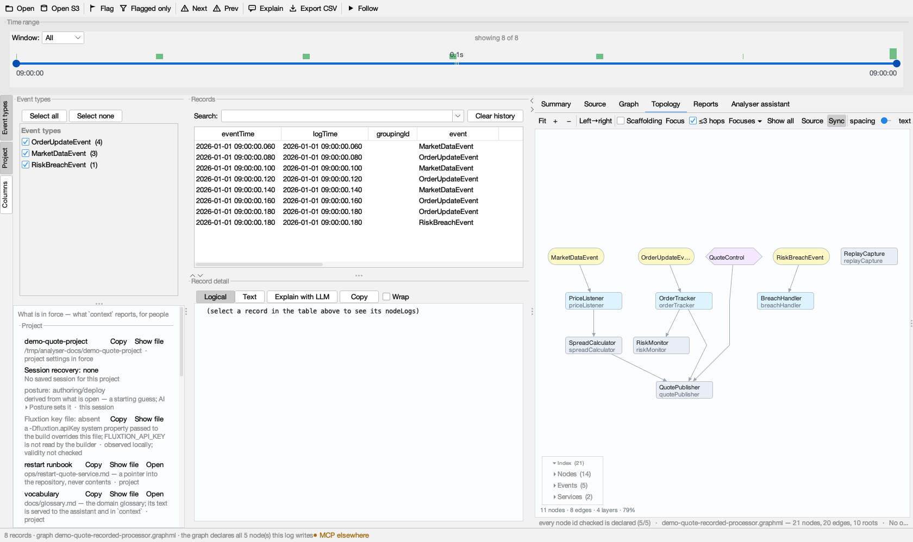

# Sending an investigation

The running analyser writes the bundle. Only the live session knows whether a capture would be coherent: whether a
load is still pending, whether the file changed since it was read, whether another log is opened while the copy is
made. So capture is one operation on the analyser, not a procedure anyone follows.

## Ask your assistant

With an AI assistant connected to the analyser ([Connecting an LLM](../connect-an-llm.md)), you ask in your own
words, and it saves your finding as a walk, captures the bundle and tells you what it left out:

> **You:** I've worked out why the quote service misbehaved at 09:00. Package the investigation for the dev team,
> with a short walk through what I found.

> **You:** This run was recorded with a replay writer. Send the dev team the minute around the breach, with its
> replay records, so they can check it on their own build.

The second is refused, by name, because replay records need the whole run. The assistant explains why and sends
the whole run instead. Both conversations are recorded in full, every call and echo, in
[Evidence bundles with your assistant](with-an-assistant.md).



## What the assistant asks for

The operation it runs, which any client of the action socket can run too:

```
report {bundle: {path: "breach-0900.fexp", notes: "# The 09:00 breach\n\nThe spread moved first."}}
```

- **`path`** is written inside the exchange directory (*AI ▸ Report exchange directory…*), and never overwrites.
- **`notes`** (optional) is your account, in Markdown. It travels as `notes/NOTES.md`.
- **`from` / `to`** (optional, epoch millis) make the bundle an **excerpt**, described below.
- **`replay`** (optional) is the path of the run's replay records, written by a replay writer in the same run as
  the log. They are packed as the `replay/` member. The analyser first checks that each replay record is one of the
  log's records, at its `eventTime`, in order. It refuses replay records from another run, and refuses them with a
  window or while the log is still growing. It counts the log's exported-service calls, which replay records cannot
  carry. See [Commands and file format](reference.md#the-manifest-with-replay-records-format-2).

The bundle is written in the background. `context.capture` says when it is done: `phase: WRITTEN` with its
**identity**, or `phase: REFUSED` with the reason. It also lists anything that was **left out**, **redacted** or
**excerpted**. An assistant reads that and tells you. Send the identity line separately, for example in a chat
message, if the recipient needs to know the file is the one you packed.

## What the analyser does, and when it refuses

1. **It refuses, by name, when a capture would not be coherent:**
    - no log is open;
    - a load is still pending;
    - the log file's identity is not established (it was replaced, or changed after it was read);
    - the file changed on disk since it was read, outside Follow;
    - the log is not one plain file (a rolled set, a directory or a remote store);
    - a bundle is already being written.
2. **It takes the settings in force now, from the analyser itself, not from the file**, so a chart, report or walk
   you saved a moment ago is in the bundle, even when the project's file could not be written (read-only).
3. **It pauses Follow** while it copies, and turns it back on afterwards, whatever happened.
4. **It keeps what may leave, and nothing else:**
    - the log (whole, or the excerpt);
    - the graph;
    - saved charts and named focuses, reports and walks, hidden columns;
    - your notes.

   See [what does not travel](index.md#what-does-not-travel-and-why).
5. **It checks the copy is coherent.** If another log is opened, or the log is closed, while the bundle is being
   written, the bundle would mix two sessions. It is refused and deleted, along with its working folder.

## A log that is still growing

Under Follow, a producer may still be writing to the log. The bundle then holds **what has been read so far**: an
excerpt of every record the analyser read before the capture, never the file, which already has more. It works
like a time-window excerpt:
- walks and reports are re-based and stay current;
- the manifest marks it `readSoFar`;
- `--verify` and the capture's own lines say so.

If nothing has been read yet, the capture is refused.

## An excerpt: only the part that matters

Real logs can be tens or hundreds of MB. `from` and `to` pack only the records whose log time falls in the window:
the contiguous run, in file order, from the first at or after `from` to the last at or before `to`.

- Each record is copied as its exact text, so it is **the same record**. Its digest, which a walk step is bound to,
  is unchanged. The analyser re-reads the excerpt it wrote and refuses it unless every record matches the source.
- **Walks and reports are re-based** onto the excerpt: a step on record 7 of the log becomes record 3 of an
  excerpt that starts at record 4. Each gets the excerpt's own identity, so its steps are **current** on the other
  side.
- A walk or report that points at a record **outside** the window cannot be re-based honestly. It is **left out and
  named**. So is a report whose table is derived by record index.
- The manifest records the cut: which records of how many, and the window. The recipient's `--verify` says the log
  is an excerpt, and which.

## Before you send it

- **Size.** A whole-log bundle is about the size of its log, compressed. Use an excerpt for a big log.
- **Findings as walks.** Flags do not travel. A walk step with a caption on the record says the same thing, and it
  does travel.
