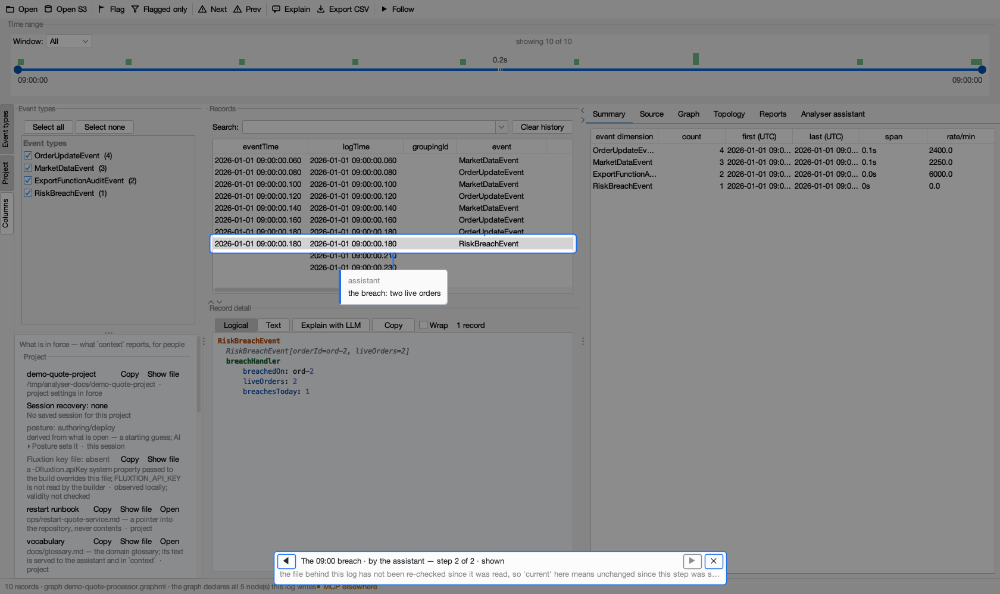
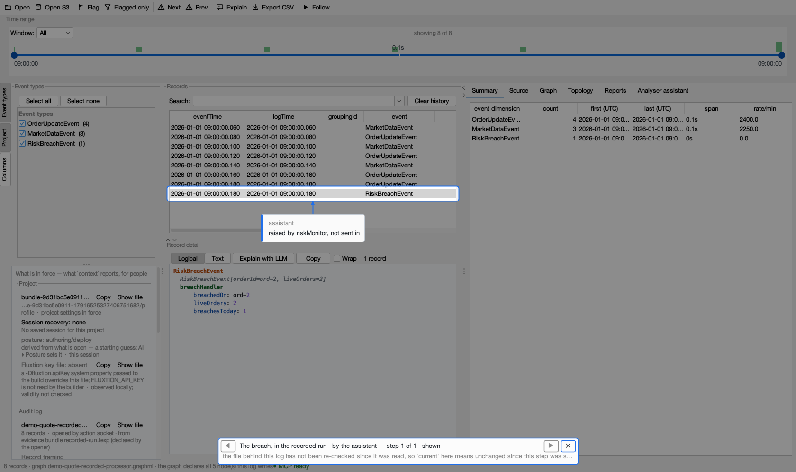
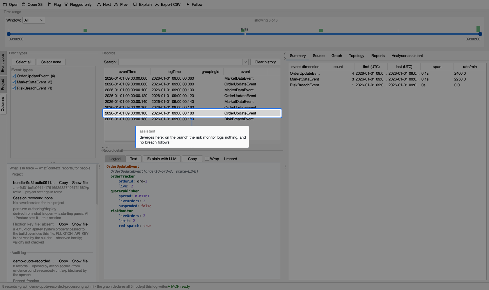

<!-- GENERATED by tools/capture-bundle-conversations.py — edit the script, not this file. -->
# Evidence bundles with your assistant

You rarely type a bundle operation yourself. You ask the AI assistant connected to the analyser ([Connecting an LLM](../connect-an-llm.md)), and it drives the analyser for you. Here are four short conversations on the DEMO set: two by the person **sending** an investigation, two by the person who **receives** it.


The **asks** and the **agent's answers** are written by hand. **Every tool call, every echo and every command's output was recorded from a real run** by `tools/capture-bundle-conversations.py`, under an isolated home with only the DEMO data. Open a collapsed block to see what the agent actually sent and got back. The exact operations are in [Commands and file format](reference.md).


## 1 · "Package this for the dev team": an investigation as one file


> **You:** I've worked out why the quote service misbehaved at 09:00. Package the investigation for the dev team, with a short walk through what I found.


??? example "→ `analyser_context`"
    ```json
    → analyser_context {}
    ← {
      "log": {
        "path": "…/analyser/src/test/resources/topology/demo-quote-audit.yaml",
        "openedFrom": "…/analyser/src/test/resources/topology/demo-quote-audit.yaml",
        "records": 10,
        "sizeBytes": 4053,
        "from": 1767258000060,
        "to": 1767258000230,
        "openedBy": "the command line that started this analyser",
        "freshness": {
          "members": [
            {
              "loaded": "{…}",
              "onDisk": "{…}",
              "state": "unchanged-metadata"
            }
          ],
          "state": "unchanged-metadata",
          "basis": "size, modification time and file identity; unchanged metadata does not prove identical bytes",
          "reload": "explicitly reopen the same path; no automatic replacement"
        },
        "generation": 1,
        "following": false,
        "supportsFollow": true,
        "trailingRecordsIncluded": 1,
        "tailNote": "EOF record included without a closing separator (legal Format 1); completeness unknown. Follow reopens as a…",
        "trailingRecordsPending": 0,
        "streamEnd": {
          "state": "unknown",
          "recordsRead": 10
        }
      }
    }
    ```


The agent saves the finding as a **walk** first, because flags do not travel and a walk does. Each step says where to look and why.


??? example "→ `analyser_walk`"
    ```json
    → analyser_walk {"name": "the-0900-breach", "title": "The 09:00 breach", "steps": [{"caption": "every price enters here", "view": {"tab": "topology"}, "targets": [{"target": "topology:node:priceListener", "caption": "every price arrives here"}]}, {"caption": "the record where the risk limit is reached", "view": {"tab": "summary", "record": 7}, "targets": [{"target": "records:row:7", "caption": "the breach: two live orders"}]}]}
    ← {
      "steps": 2,
      "saved": "the-0900-breach"
    }
    ```


??? example "→ `analyser_report`"
    ```json
    → analyser_report {"bundle": {"path": "breach-0900.fexp", "notes": "# The 09:00 breach (DEMO)\n\nThe spread widened two cycles before the risk limit was reached.\n"}}
    ← {
      "phase": "WRITING",
      "path": "/private<exchange-dir>/breach-0900.fexp",
      "note": "the bundle is written off the event thread; context.capture says when it is written, its identity, and anyt…"
    }
    ```


??? example "→ `analyser_context`"
    ```json
    → analyser_context {}
    ← {
      "capture": {
        "phase": "WRITTEN",
        "path": "/private<exchange-dir>/breach-0900.fexp",
        "identity": "sha256:6c6947743526…"
      }
    }
    ```


> **Agent:** Done: `breach-0900.fexp` is in your exchange directory, with the log, its graph, the walk *The 09:00 breach* and your notes. It also lists what it **left out**, because it describes your machine, not the investigation. Send the file however you like, and send its identity line (`sha256:6c6947743526…`) by another route, such as a chat message: the bundle is unsigned, and matching that line is how the recipient knows the file is the one you packed.





## 2 · "Include the replay records so they can check it"


> **You:** This run was recorded with a replay writer. Send the dev team the minute around the breach, with its replay records, so they can check it on their own build.


The processor that wrote this log had a replay writer compiled in: it recorded each input the service received, at the instant its cycle ran, next to the audit log. The agent names that file.


??? example "→ `analyser_report`"
    ```json
    → analyser_report {"bundle": {"path": "recorded-run.fexp", "replay": "…/analyser/src/test/resources/replay/demo-quote-recorded.replay.yaml", "from": 1767258000100, "to": 1767258000180}}
    ← {
      "ok": false,
      "error": "capture refused: a replay needs the whole run: drop the window or the replay"
    }
    ```


> **Agent:** The analyser refused a time window with the replay records, and it is right to: the processor's state at the start of a window depends on every input before it, so a replay has to start at the beginning. I'll send the whole run. It is eight records, so the size is no concern.


??? example "→ `analyser_walk`"
    ```json
    → analyser_walk {"name": "the-breach", "title": "The breach, in the recorded run", "steps": [{"caption": "the graph raises the breach itself", "view": {"tab": "summary", "record": 7}, "targets": [{"target": "records:row:7", "caption": "raised by riskMonitor, not sent in"}]}]}
    ← {
      "saved": "the-breach"
    }
    ```


??? example "→ `analyser_report`"
    ```json
    → analyser_report {"bundle": {"path": "recorded-run.fexp", "replay": "…/analyser/src/test/resources/replay/demo-quote-recorded.replay.yaml", "notes": "# Recorded run (DEMO)\n\nReplay it into your build and compare.\n"}}
    ← {
      "phase": "WRITING",
      "path": "/private<exchange-dir>/recorded-run.fexp"
    }
    ```


??? example "→ `analyser_context`"
    ```json
    → analyser_context {}
    ← {
      "capture": {
        "phase": "WRITTEN",
        "path": "/private<exchange-dir>/recorded-run.fexp",
        "identity": "sha256:c4602024f96a…",
        "lines": [
          "replay: the run's 7 recorded inputs, paired with the log in order; a recipient can replay them into their o…"
        ]
      }
    }
    ```


> **Agent:** Written as `recorded-run.fexp`, and it carries **the run's 7 recorded inputs, paired with the log in order**: the analyser checked that each one is one of the log's records at the instant its cycle ran, so they cannot be from another run. The eighth record, the breach, is not among them because the graph raised it itself; a replay raises it again. The log holds no exported-service calls, so nothing the replay records cannot carry.


## 3 · "We've been sent this: does our build give the same run?"


> **You:** The dev team sent `recorded-run.fexp`. Check it's intact, then check our build of the quote processor gives the same audit log on that run.


The recipient's agent works with **commands**, not the running analyser: checking a file and replaying it into a build need nothing open. Each command below ran for real; `analyser` is `java -jar fluxtion-auditlog-analyser-<version>.jar`, and the runner is `tools/replay/ReplayBundle.java` in the analyser's repository, run with JBang.


??? example "→ shell: `analyser --verify`"
    ```console
    $ analyser --verify ~/Downloads/recorded-run.fexp
    identity: sha256:c4602024f96a…
    verified: 5 members, each matching the manifest's sha256 and size
    replay: replay/demo-quote-recorded.replay.yaml, the run's 7 recorded inputs
    limit: unsigned: verification detects a changed member; it does not authenticate the sender
    limit: replay: the recorded inputs reproduce this log only on a build whose graph matches, and only as far as the processor reads nothing the records do not carry
    (exit 0)
    ```


> **Agent:** Intact: every member matches the manifest. Its identity line is the one to compare with what the sender sent you separately. It carries the run's 7 recorded inputs.


??? example "→ shell: `jbang tools/replay/ReplayBundle.java`"
    ```console
    $ jbang tools/replay/ReplayBundle.java --bundle ~/Downloads/recorded-run.fexp --processor com.acme.demo.generated.DemoQuoteRecordedProcessor --cp ~/work/builds/our-build --out ~/work/replayed.yaml
    graph: your build's nodes and edges are the bundle's (graph/demo-quote-recorded-processor.graphml)
    replayed: 7 recorded inputs into com.acme.demo.generated.DemoQuoteRecordedProcessor, on a data-driven clock
    wrote: ~/work/replayed.yaml (8 audit records)
    next: analyser --replay-compare ~/Downloads/recorded-run.fexp ~/work/replayed.yaml
    (exit 0)
    ```


??? example "→ shell: `analyser --replay-compare`"
    ```console
    $ analyser --replay-compare ~/Downloads/recorded-run.fexp ~/work/replayed.yaml
    identity: sha256:c4602024f96a…
    verified: 5 members, each matching the manifest's sha256 and size
    replay: AGREES, 8 of 8 records (endTime and thread excepted, differing on 8: when and where a cycle ran, which a replay cannot know)
    limit: unsigned: verification detects a changed member; it does not authenticate the sender
    limit: replay: the recorded inputs reproduce this log only on a build whose graph matches, and only as far as the processor reads nothing the records do not carry
    (exit 0)
    ```


> **Agent:** Our build gives the same audit log. The runner first checked that our build **is** the bundle's processor: the same nodes and edges as the graph the bundle carries. It then replayed the 7 inputs at their recorded instants, and the graph raised the breach again by itself: 8 audit records. The analyser compared them with the bundled log and they agree, 8 of 8. The only lines allowed to differ are when and where each cycle ran (`endTime`, `thread`), which a replay cannot know.


??? example "→ shell: `analyser --unpack`"
    ```console
    $ analyser --unpack ~/Downloads/recorded-run.fexp
    identity: sha256:c4602024f96a…
    verified: 5 members, each matching the manifest's sha256 and size
    replay: replay/demo-quote-recorded.replay.yaml, the run's 7 recorded inputs
    limit: unsigned: verification detects a changed member; it does not authenticate the sender
    limit: replay: the recorded inputs reproduce this log only on a build whose graph matches, and only as far as the processor reads nothing the records do not carry
    working copy: ~/work/copies/bundle-c4602024f96a-9944465563179627251  (the received bundle is unchanged)
    (exit 0)
    ```


??? example "→ `analyser_open`"
    ```json
    → analyser_open {"project": "~/work/copies/bundle-c4602024f96a-9944465563179627251/profile/project.flux…"}
    ← {
      "project": "bundle-c4602024f96a-9944465563179627251"
    }
    ```


??? example "→ `analyser_open`"
    ```json
    → analyser_open {"log": "~/work/copies/bundle-c4602024f96a-9944465563179627251/log/demo-quote-recor…", "graphml": "~/work/copies/bundle-c4602024f96a-9944465563179627251/graph/demo-quote-rec…", "provenance": "evidence bundle recorded-run.fexp"}
    ← {
      "log": "~/work/copies/bundle-c4602024f96a-9944465563179627251/log/demo-quote-recor…"
    }
    ```


??? example "→ `analyser_walk`"
    ```json
    → analyser_walk {"name": "the-breach", "play": true, "step": 1}
    ← {
      "walk": "the-breach"
    }
    ```


> **Agent:** And the sender's walk plays here from a fresh working copy, without touching our project or the file we were sent: the breach record lit, captioned *raised by riskMonitor, not sent in*.





## 4 · "Does the branch with the risk change still behave the same?"


> **You:** And our branch where the risk limit is 3: does it still behave the same on this run?


??? example "→ shell: `jbang tools/replay/ReplayBundle.java`"
    ```console
    $ jbang tools/replay/ReplayBundle.java --bundle ~/Downloads/recorded-run.fexp --processor com.acme.demo.generated.DemoQuoteRecordedProcessor --cp ~/work/builds/risk-change --out ~/work/replayed-risk-change.yaml
    graph: your build's nodes and edges are the bundle's (graph/demo-quote-recorded-processor.graphml)
    replayed: 7 recorded inputs into com.acme.demo.generated.DemoQuoteRecordedProcessor, on a data-driven clock
    wrote: ~/work/replayed-risk-change.yaml (7 audit records)
    next: analyser --replay-compare ~/Downloads/recorded-run.fexp ~/work/replayed-risk-change.yaml
    (exit 0)
    ```


??? example "→ shell: `analyser --replay-compare`"
    ```console
    $ analyser --replay-compare ~/Downloads/recorded-run.fexp ~/work/replayed-risk-change.yaml
    identity: sha256:c4602024f96a…
    verified: 5 members, each matching the manifest's sha256 and size
    replay: DIVERGES at record 6 (OrderUpdateEvent): eventLogRecord.nodeLogs.riskMonitor: the bundled log has '{ liveOrders: 2, limit: 2, redispatch: true}', and the replay has no such line
    replay: the 6 record(s) before it agree
    limit: unsigned: verification detects a changed member; it does not authenticate the sender
    limit: replay: the recorded inputs reproduce this log only on a build whose graph matches, and only as far as the processor reads nothing the records do not carry
    (exit 1)
    ```


> **Agent:** No. The graph is the same, so it replays, but it **diverges at record 6**, the last order update. In the recorded run the risk monitor logged `{ liveOrders: 2, limit: 2, redispatch: true}` on that cycle; on our branch it logs nothing there at all. With the limit at 3, two live orders are no longer a breach, so the monitor stays quiet and the breach the recorded run ends with never comes: the replay has 7 records, not 8. That is the change behaving as intended, and it is still a behaviour change on this run. I've lit the record in the analyser.


??? example "→ `analyser_goto`"
    ```json
    → analyser_goto {"recordIndex": 6, "reveal": true}
    ← {
      "recordIndex": 6
    }
    ```


??? example "→ `analyser_spotlight`"
    ```json
    → analyser_spotlight {"target": "records:row:6", "caption": "diverges here: on the branch the risk monitor logs nothing, and no breach follows"}
    ← {
      "lit": [
        {
          "n": 1,
          "target": "records:row:6",
          "caption": "diverges here: on the branch the risk monitor logs nothing, and no breach follows",
          "bounds": {
            "y": 373,
            "x": 352,
            "height": 32,
            "width": 616
          }
        }
      ]
    }
    ```





---


*Regenerate with `mvn package && python3 tools/capture-bundle-conversations.py`. Every call and command above is the run's own; if one fails, or an answer cites something the run no longer shows, the script stops rather than write a page that pretends it worked.*
