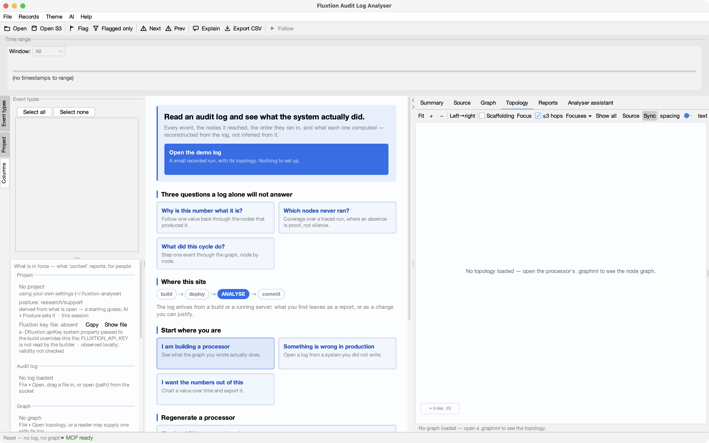
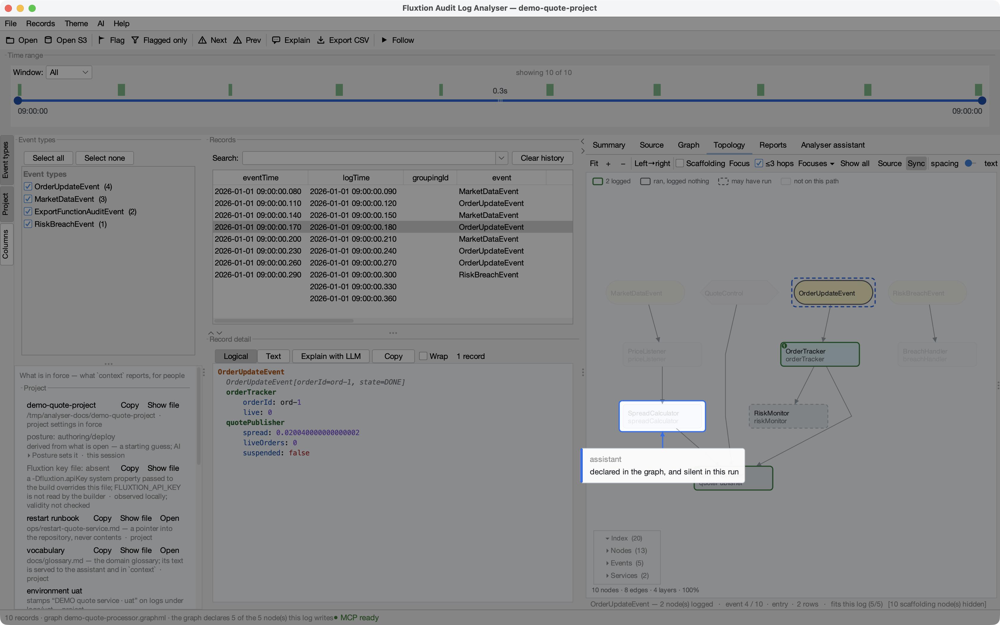

# Guided start — from nothing to a tour, driven by your AI assistant

Paste the prompt below into your AI assistant. It installs the analyser, opens it, connects it, and then
walks you through what the tool does **by driving the window while you watch**.

You need **JDK 21+**. You do **not** need a Fluxtion API key, an account, or a project of your own — the
analyser ships with a demo set.

**Want to design a new application instead?** Follow [Spring authoring step by step](spring-authoring-getting-started.md).
That guided path starts from a downloaded project and its runbooks. This page tours the analyser
using existing evidence; it does not generate a Spring application.

!!! note "Every command is written out on purpose"

    You can read every command before your assistant runs it, and so can your security team — there is no
    step that fetches and executes something you have not seen. The analyser never fetches or executes
    this page.

!!! warning "JBang will ask you to trust the release URL"

    The first install stops on a trust prompt and **cancels itself after about 30 seconds** if nobody
    answers. That decision is yours to make, not your assistant's — the prompt above tells it to wait for
    you rather than choose. Afterwards JBang may say *"Please start a new Shell for changes to take
    effect"*: either open a new shell, or run `~/.jbang/bin/analyser` directly.

## The prompt

```text
Help me get the Fluxtion audit log analyser running, then give me a guided tour.

STEP 1 — install it. Expect TWO interruptions; neither is an error.
Run:
    jbang app install analyser@telaminai/fluxtionauditlog-analyser

(a) JBang will refuse to run the release URL until someone makes a TRUST decision, and it CANCELS
    ITSELF after about 30 seconds. That choice is mine, not yours: show me the prompt, tell me it is
    waiting, and wait for me. Do not pick an option on my behalf.
(b) On a first install it then prints "Please start a new Shell for changes to take effect".
    The `analyser` command may NOT be on PATH in your current shell. Either start a new shell, or
    run it by its installed path: ~/.jbang/bin/analyser
If jbang itself is missing, tell me and stop — installing it is my decision too.

STEP 2 — start it.
Run (new shell, or the full path from above):
    analyser --rest
This starts the analyser with its local socket enabled and opens its window.
It BLOCKS, so run it in the background or a second terminal.

STEP 3 — connect yourself to it.
In the analyser window, I will use  AI ▸ Connect an AI client…  and follow it for my assistant.
Tell me when you are ready for me to do that, wait for me to confirm, then verify by calling
analyser_context and telling me what it reports. If you have no analyser tools after I confirm,
say so plainly rather than pretending — we will fix it before going on.

STEP 4 — give me the tour.
Use the "guided-start" skill if you have it. If you do not, follow these rules:
  - Drive the analyser's UI and tell me what to LOOK AT. Never state a number I cannot see on screen.
  - Call analyser_context before saying "as you can see", to check the view really shows it.
  - Show me three things and then stop: what ran and in what order, which declared nodes have no
    recorded output (say "never logged", not "never ran" - the log cannot prove absence unless
    invocation tracing was on), and one real question answered and bookmarked.
  - If something does not work, say so plainly and carry on. I would rather see a real limitation
    than a smooth demo.
Use the demo set at ~/.fluxtion-analyser/demo/ unless I already have my own log open — in which case
ask me before opening anything, because opening a project closes what I have.
```

## What you will see

The analyser opens on its Start page — no log, no project, and the demo set one click away. Your assistant
starts from here:



Then it drives the window. From analyser 1.14 it also **points**: before it talks about something it dims the
window, lights that one thing, and says in a few words why to look there. The callout is tagged *assistant*
because it is the assistant's words — what it points at is what tells you whether the claim is true.



Any click, or Escape, puts a spotlight out. Nothing about one is ever saved — what the tour leaves behind is
the bookmark from its third beat.

## What it will show you

**What ran, and in what order.** Position in a record is dispatch order, derived by the compiler before
the program ran rather than reconstructed afterwards from timestamps. That is what lets the record be read
as cause rather than as correlation.

**What has no recorded output.** A list of declared nodes that never logged. It needs the declared graph *and*
the record — neither file produces it alone, and no quantity of log lines will, because a log carries no
list of what was supposed to happen. It is "never logged", not "never ran": a node that ran and wrote
nothing looks the same. Only a log with invocation tracing on (the traced demo log, coverage 1.0) lets
the analyser say a node did not run, and the coverage answer states which of the two it is giving you.

**One question, answered and anchored.** A threshold crossing, the record where it happened, and a
bookmark that is still there tomorrow.

## Why the tour works this way

Your assistant is under instructions to **point at the screen rather than tell you the answer**.

That is deliberate. The reason this tool exists is that a record written by execution can be checked
without trusting anyone's account of it — so a tour where the assistant is the source of every claim would
demonstrate the opposite of the product. Everything it tells you, you read off the screen yourself.

If it ever states a figure you cannot see, that is a bug in the tour. Ask it to show you.

## If you would rather not paste a prompt

Install and open it yourself:

```bash
jbang app install analyser@telaminai/fluxtionauditlog-analyser
analyser
```

The Start page has the same demo set behind its own actions, and *AI ▸ Connect an AI client…* does the
connection step whenever you want it. See [Install](install.md) and [Connecting an LLM to the analyser](connect-an-llm.md).

## Next: the same tour on a real project

This page uses the demo set on purpose — nothing to build, no key, no project. When you want the tour on a
system you can run and change, [From playground to analyser in 10 minutes](tutorial-playground.md) starts from a
playground template (*File ▸ New project from template…* fetches it from inside the analyser). That project
**declares this same tour as one of its runbooks**, so with a client connected *"give me the guided tour of this
project"* is the whole prompt.
