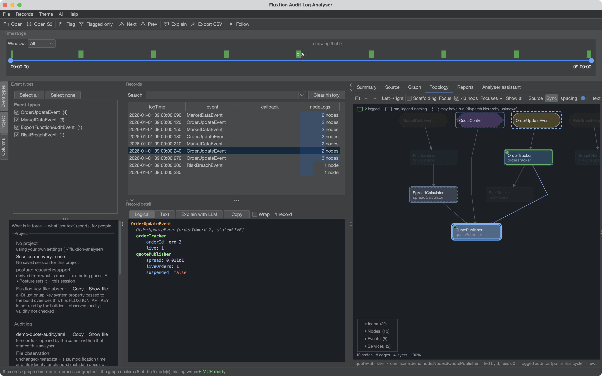

# Fluxtion Audit Log Analyser

A fast desktop tool for **Fluxtion event-audit logs** — browse, filter, graph and explain the event
history of a Mongoose/Fluxtion `EventProcessor`. Index-first, so it stays responsive on multi-GB logs.

Your processor already writes down everything it does. The analyser is what makes that record **answer
questions — in minutes, with evidence** — whether it's you asking or an AI.



## Run it now

No build needed — just **JDK 21+**. **No log to hand is fine**: the analyser opens on a page whose
first button loads a recorded run and its topology from inside the jar. With [JBang](https://jbang.dev):

```bash
jbang analyser@telaminai/fluxtionauditlog-analyser
```

Or download the latest fatjar and run it:

```bash
curl -LO https://github.com/telaminai/fluxtionauditlog-analyser/releases/latest/download/fluxtion-auditlog-analyser.jar
java -jar fluxtion-auditlog-analyser.jar
```

See [Install & run](install.md) for details.

## What it does

**One source of truth, a whole toolchain.** The analyser takes the **Fluxtion event-audit log** — a
deterministic, replayable record of every propagation cycle — and feeds it through one connected
toolchain to **explain, drill down, observe, graph, monitor, interrogate and fix**, in a fraction of the
time that reading raw logs normally takes. Every feature below is a lens on that same log.

--8<-- "assets/audit-loop.svg"

- **Fast on big logs** — a compact columnar index keeps browse/filter/summarise responsive; files above
  a threshold are memory-mapped rather than loaded into heap.
- **Graph any node value** over time — stairs/line/points, booleans as ±1, zoom/pan, multiple graphs,
  CSV/PNG export, and derived **formula series** (`f(x)`). See [Graphs](user-guide/graphs.md).
- **Explain — and let the assistant _drive the analyser_.** Ask Claude/OpenAI what happened; it can
  **plot the offending series, flag the culprit records and filter the view** so you *see* the fault —
  over the same data you can click into and verify. No key? It copies a prompt that lets any agent drive
  the analyser too. See [Assistant](user-guide/assistant.md).
- **Log → source navigation** — click a node line to open the exact class/method. See
  [Source navigation](user-guide/source-navigation.md).
- **Share your setup** — export/import roots, event processors and named graphs to a file. See
  [Sharing setups](user-guide/sharing-setups.md).

## Why it matters

- **Minutes to root cause, not hours.** A production incident in an event-driven system normally means
  grepping a multi-GB log and reconstructing what fired, in what order, by hand. Here the log is indexed
  in seconds, anomalies are pre-tinted, any value graphs over time, two cycles diff in a click, and any
  log line opens the exact source method that wrote it. The answer comes **with evidence**, not a
  plausible story.
- **The audit log becomes an asset, not a storage cost.** You already produce and retain these logs.
  With the analyser the same bytes are incident forensics (*what actually executed, with state*), a
  compliance answer (*prove why this order was amended — replayable, per-cycle, traceable to source*),
  and a shared team artifact — [export your setup](user-guide/sharing-setups.md) so everyone
  investigates from the same roots, graphs and formulas.
- **Only possible here.** A Fluxtion processor is deterministic and its graph is generated from source —
  so a record isn't just a log line, it's a **replayable trace with a code address**. That's what lets
  the analyser (and the assistant) explain *why*, not just *what*.

## Agentic fault-finding — the assistant drives the tool

The feature to see first. Point the assistant at a suspicious window and it investigates *inside the
analyser*: it reads the surrounding records, aggregates over the columnar index, then **renders its
conclusion as a view you can interrogate** — a captioned graph of the offending series, the culprit
records flagged, the table filtered down to them. Its answer is a chart and a set of records, not a wall
of text you have to trust. The verification loop is built in: click a plotted point, jump to a flagged
record, trace it to the exact source method.

!!! tip "No API key needed — and it works with any agent"
    Hit **Copy prompt** and the analyser hands you a self-contained brief — the evidence plus its
    **action protocol** (localhost endpoint, token, verbs). Claude Code, Claude Desktop or any agent can
    then drive the analyser back: seek more records, aggregate, and **plot the fault for you to see**.

See the [Assistant guide](user-guide/assistant.md) for the full workflow.

## Get going

- **[Getting started](getting-started.md)** — open a log, add source roots, pick your event processor,
  configure the LLM, S3 and tailing — everything in Settings to get up and running.
- [Install & run](install.md)
- [User guide](user-guide/index.md)
- [Log format](log-format.md)
- [FAQ](faq.md)
- [Release notes](release-notes.md)
