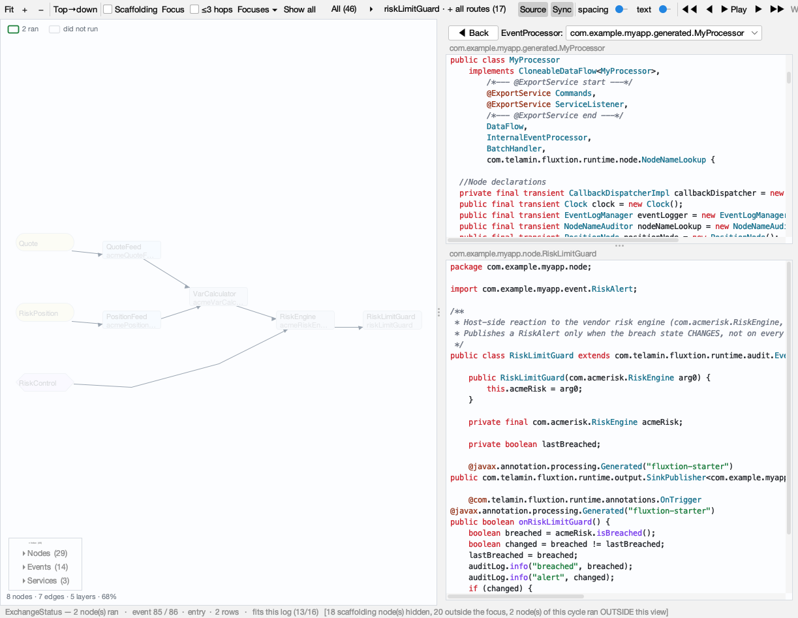

# Integrating a vendor component: a worked example

**Acme Risk is a fictional vendor built for this experiment.** Its jar supplies a risk calculation;
the host is a principal trading desk. The integrator connects the component through a reference,
and Fluxtion composes the supplier's nodes into the host processor.

This page accompanies [Composing a system from supplier jars](composing-a-system.md). The
[preserved experiment][evidence] contains the supplier source, jars, feed, audit logs and
independent calculation. The VaR comparisons below were re-run from that copy for this page.
Generated-code excerpts and the build observations are attributed to the original
[prediction and results record][predictions]; they are not a new generation run.

## The component

The [supplier source][source] depends on Fluxtion's runtime. `RiskEngine` owns a `VarCalculator`,
which reads `QuoteFeed` and `PositionFeed`. The root exposes the `RiskControl` service so its
limit can be changed. The supplier knows its own event interfaces and calculation, not the
host's graph.

```text
RiskEngine — root, exported RiskControl service
  └─ VarCalculator
       ├─ QuoteFeed — prices and volatility
       └─ PositionFeed — positions
```

## The two lines of wiring

Declare the supplier root, configure it, then reference it from your own node. This is the
Spring excerpt preserved in the [experiment's evidence record][record]:

```xml
<bean id="acmeRisk" class="com.acmerisk.RiskEngine">
    <property name="varLimit" value="20000"/>
</bean>
<bean id="riskLimitGuard" class="com.example.myapp.node.RiskLimitGuard">
    <constructor-arg ref="acmeRisk"/>
</bean>
```

!!! warning "Never list a supplier's class in nodeBeans"
    Reference it from one of your own nodes instead. The starter writes skeleton classes for
    `nodeBeans` entries it cannot find source for. A class that exists only in a dependency jar
    looks like a class that does not exist yet, and the skeleton silently replaces it: the build
    stays green and the supplier's component is gone. This is the open
    [feedback #29 defect][tracker], documented in [the P4 reproduction][predictions].

Only the host node belongs in the starter's `nodeBeans` selection here. The compiler discovers
the supplier's sub-graph through the reference. These discovered nodes use the supplier's
`NamedNode` names; the bean id `acmeRisk` does not rename them.

## What appeared



This is the [experiment's original screenshot][screenshot]. It shows the topology and source at
the selected cycle; it is not a claim that every visible node ran in that cycle.

The independently re-read [genuine quote record][genuine] lists this audit order:

```text
acmeQuoteFeed → acmeVarCalculator → acmeRiskEngine → riskLimitGuard
```

There is a display limitation when the host's `MarketPrice` implements the supplier's `Quote`
interface: both handlers dispatch, but the analyser does not draw the supertype route as part
of the concrete event's path. [TA-9][ta9] tracks it. Do not treat the highlighted topology path
as a complete account of this dispatch. The [composition page](composing-a-system.md#components-that-speak-your-events)
includes the abbreviated generated-handler excerpt from the record.

## Control and configuration

The supplier exposes a getter and setter for `varLimit`. The [P9 record][predictions] quotes this
line in generated code for the XML property above:

```java
acmeRiskEngine.setVarLimit(20000.0);
```

`RiskEngine` also implements the exported `RiskControl` interface. The experiment's P12 uses
`flow.getExportedService(RiskControl.class)` and calls `setVarLimit` to change the limit live.
That harness is described in [the record][predictions]; it is separate from the CSV feed and
was not re-run for this documentation change.

The shared-event pattern uses a handler typed on the supplier's `Quote` interface and a host
event implementing it. It does **not** automatically transfer the host's position state into
the vendor. The preserved experiment uses the vendor's own position feed; the host-state
bridge was not implemented.

## Checking the computation

The independent Python calculation reads the feed, computes volatility and VaR, then compares
the result, breach state and alert state with the recorded nodes. It does not use the vendor's
reported VaR as its expected value.

From a checkout of this repository:

```bash
cd docs/handoff/evidence/vendor-integration-2026-09-19
python3 check_var.py runs/risk-run3/audit.yaml
python3 check_var.py runs/risk-tampered/audit.yaml
```

The [checker][checker] and preserved inputs reproduce:

| Run | Feed rows / audit records | Mismatches | Exit status |
|---|---|---|---|
| [Genuine][genuine] | 11 / 11 | 0 | 0 |
| [Tampered][tampered] | 11 / 11 | 9 | 1, the expected rejection |

The numerical tolerance is **1e-6**, as defined in [the checker][checker]. The expected failure
on the tampered run matters: the comparison distinguishes the two recorded computations.

## Upgrading safely

The [preserved jars][jars] capture successive supplier implementations: an encapsulated build,
a build with public nodes and stable names, and a build adding the interface-typed handler.
Their roles and the host-upgrade checks are recorded in [P6, P8, P13 and P17][predictions].

After changing a dependency, re-resolve the runtime classpath before launching: the experiment's
run script used a cached `.fluxtion/classpath`, even though Maven had seen the new jar. Inspect
the project's own setup and hosting runbooks for that refresh step.

Repeat both the host's existing scenarios and the independent supplier calculation after an
upgrade. An unchanged host check does not establish the supplier's arithmetic. The full host
validation harness is not in this evidence copy, so this page does not claim a new run of its
historical host-validation totals.

## When the jar is wrong

The [P16 record][predictions] describes rebuilding the supplier jar under the same filename with
its risk constant zeroed. It records a green build and byte-identical XML, source and record
hashes in the build receipt. Those receipt observations are preserved testimony from that run;
the original before/after receipts are not included in this copy.

The recorded effect is directly checkable: [the tampered log][tampered] reports zero VaR,
and the independent comparison above rejects **9 of its 11 records**. Both logs still contain
the supplier node sequence. The node trace describes which nodes logged and their order; it
does not identify the supplier jar's bytes or establish the correctness of its arithmetic.

## Checklists

### For integrators

- Declare the supplier root and reference it from your own node. Keep dependency-only classes
  out of `nodeBeans` while [feedback #29][tracker] remains open.
- Refresh the runtime classpath after adding or changing a jar; do not assume a successful
  Maven build refreshed a launcher's cached classpath.
- Read the supplier's naming contract. Discovered nodes need supplier-provided stable names;
  names are global, so coordinate them across suppliers.
- Use the supplier's event interface where it fits. Decide separately how host state reaches
  the supplier; shared quote events do not supply position state.
- Keep an independent calculation and rerun it with the host's scenarios after changes.
- Check the audit log as well as the graph, retaining the [supertype-route display caveat][ta9].

### For suppliers

- Make every node reachable from the root a public class, with a public wiring constructor
  matching its final fields, so generated code in another package can reconstruct it.
- Implement `NamedNode` for stable, globally coordinated names; do not rely on generated suffixes.
- Provide getters and setters for configurable properties. The getter-plus-setter path is the
  one exercised by the experiment; setter-only behaviour was not tested.
- Publish public event types and interface-typed handlers so customers can supply events
  without writing adapters.
- Follow the demonstrated node shape: `EventLogNode` for nodes that write audit values, and
  `transient` collections for runtime state. See [the supplier source][source].

These checklists come from [the experiment's predictions, results and limits][predictions].
The experiment did not test dependency resolution by Maven coordinates, runtime-version
conflicts, or two suppliers choosing the same node name.

[evidence]: https://github.com/telaminai/fluxtionauditlog-analyser/tree/597c5886eafa07f5bc22143589e923dd0d63599a/docs/handoff/evidence/vendor-integration-2026-09-19
[predictions]: https://github.com/telaminai/fluxtionauditlog-analyser/blob/597c5886eafa07f5bc22143589e923dd0d63599a/docs/handoff/evidence/vendor-integration-2026-09-19/PREDICTIONS.md
[record]: https://github.com/telaminai/fluxtionauditlog-analyser/blob/597c5886eafa07f5bc22143589e923dd0d63599a/docs/proposals/vendor-integration-doc/README.md
[source]: https://github.com/telaminai/fluxtionauditlog-analyser/tree/597c5886eafa07f5bc22143589e923dd0d63599a/docs/handoff/evidence/vendor-integration-2026-09-19/acme-risk/src/com/acmerisk
[jars]: https://github.com/telaminai/fluxtionauditlog-analyser/tree/597c5886eafa07f5bc22143589e923dd0d63599a/docs/handoff/evidence/vendor-integration-2026-09-19/acme-risk/dist
[checker]: https://github.com/telaminai/fluxtionauditlog-analyser/blob/597c5886eafa07f5bc22143589e923dd0d63599a/docs/handoff/evidence/vendor-integration-2026-09-19/check_var.py
[genuine]: https://github.com/telaminai/fluxtionauditlog-analyser/blob/597c5886eafa07f5bc22143589e923dd0d63599a/docs/handoff/evidence/vendor-integration-2026-09-19/runs/risk-run3/audit.yaml
[tampered]: https://github.com/telaminai/fluxtionauditlog-analyser/blob/597c5886eafa07f5bc22143589e923dd0d63599a/docs/handoff/evidence/vendor-integration-2026-09-19/runs/risk-tampered/audit.yaml
[screenshot]: https://github.com/telaminai/fluxtionauditlog-analyser/blob/597c5886eafa07f5bc22143589e923dd0d63599a/docs/handoff/evidence/vendor-integration-2026-09-19/runs/vendor-topology.png
[tracker]: https://github.com/telaminai/fluxtionauditlog-analyser/blob/main/docs/specs/tracker.md
[ta9]: https://github.com/telaminai/fluxtionauditlog-analyser/blob/main/docs/specs/spec-tool-agreement.md#ta-9--p1--draw-the-route-that-actually-runs-when-dispatch-goes-through-a-supertype
