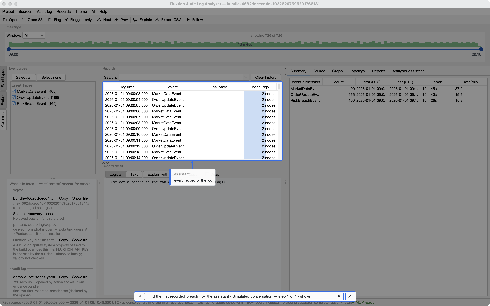
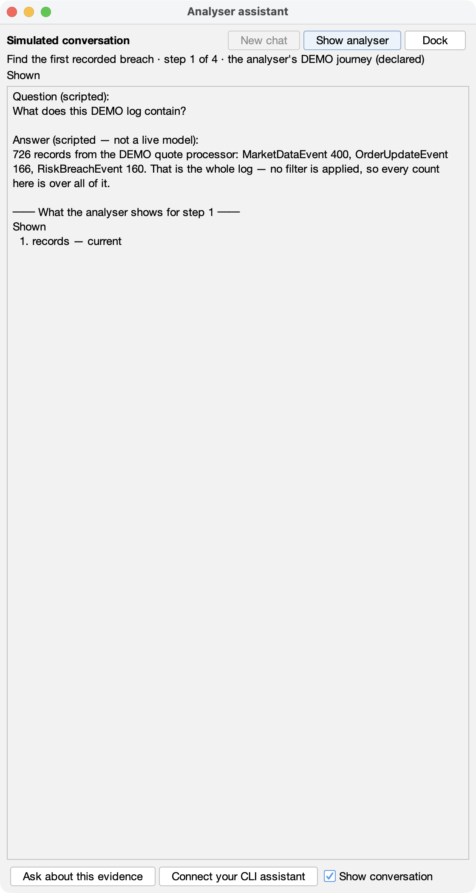
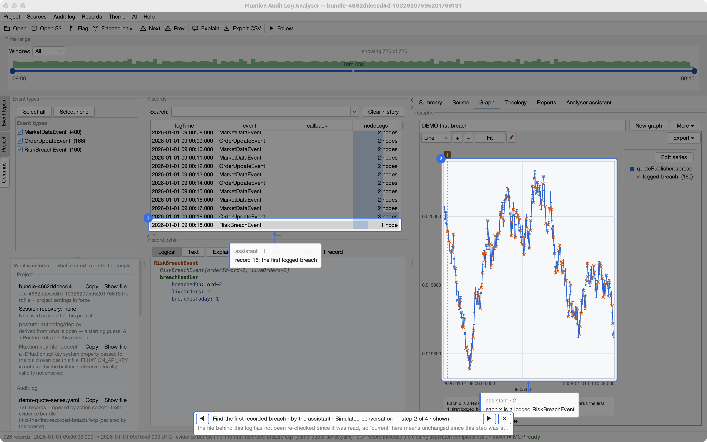
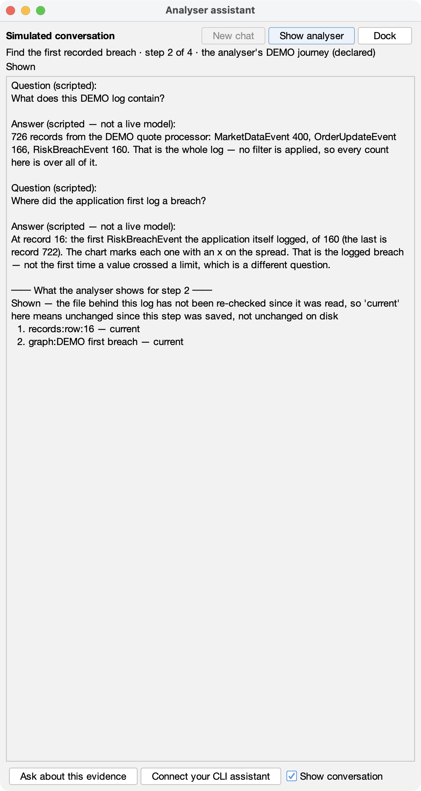
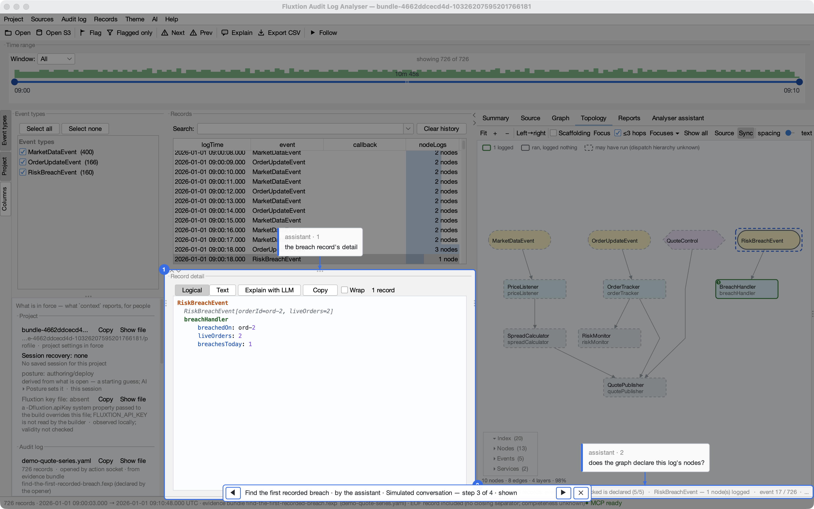
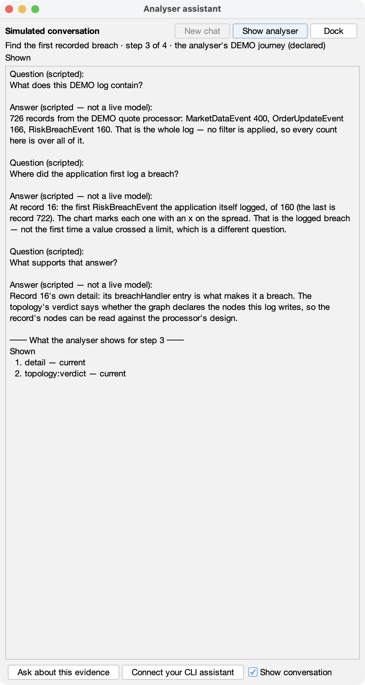
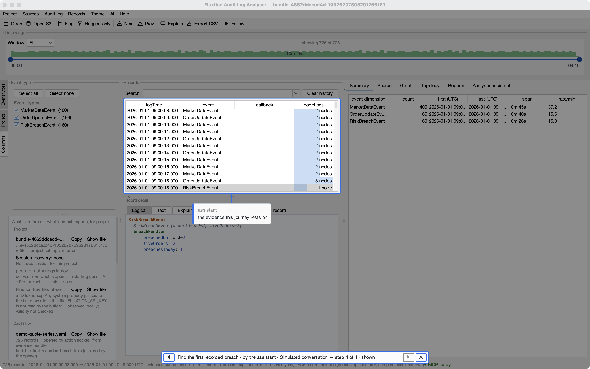
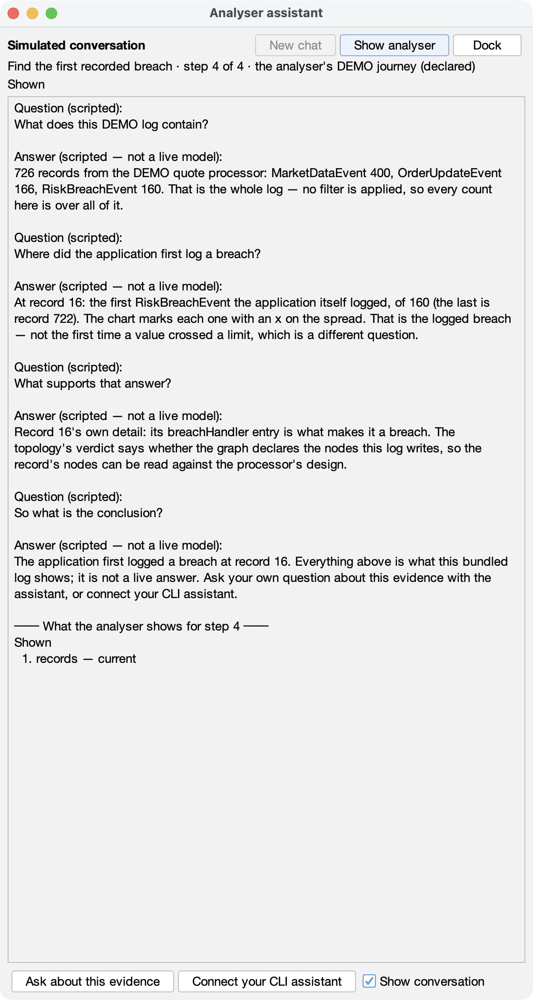

<!-- GENERATED by tools/capture-journey.py from a real run — edit the script, not this file. -->
# Find the first recorded breach

A **conversation journey**: a spotlight walk over the DEMO quote-series log, with a scripted conversation shown beside the analyser's own views as you step through it. Download the bundle, open it, and press **Play**.

| | |
|---|---|
| **What it teaches** | Finding where an application *logged* a breach — its own RiskBreachEvent — and what supports that answer, rather than the first time a value crossed a limit |
| **Steps** | 4 |
| **Duration** | about 3 minutes (an estimate: four stops, read at your own pace) |
| **Needs** | an analyser newer than 1.27.0 — the first release with conversation journeys. 1.27.0 opens the bundle and plays the walk without its dialogue |
| **Download** | [`find-the-first-recorded-breach.fexp`](../assets/journeys/find-the-first-recorded-breach.fexp) — 20,242 bytes, sha256 `cbd8f28dbc50263d45678cc926f089e6ad5cffab1a990f37e8ec87b20fa21743` |
| **Identity** | `sha256:4662ddcecd4d632d393ae05d4a00595cdb8351d7dbee56b0a9c93d718ebb53cb` — compare it with what `analyser --verify` prints |
| **Bundled evidence** | `graph/demo-quote-processor.graphml`, `log/demo-quote-series.yaml`, `notes/NOTES.md`, `profile/project.fluxtion-settings` |
| **Not bundled** | the DEMO processor's Java sources: source navigation is unavailable when you play it |
| **Replay records** | none: this bundle carries no replay inputs, and opening or playing it never runs anything |
| **Provider** | **No provider needed for this demonstration.** Nothing is sent anywhere while it plays |

## Play it

1. Download [`find-the-first-recorded-breach.fexp`](../assets/journeys/find-the-first-recorded-breach.fexp) and check it: `analyser --verify find-the-first-recorded-breach.fexp`.
2. Open it (drop it on the Start page, or choose **Open evidence bundle** there). It opens in a disposable working copy; your own settings are not changed.
3. In **Reports ▸ Spotlight walks**, select **Find the first recorded breach** and press **Play**. Pop the assistant out (**Pop out** in its tab) to keep the conversation beside the evidence while the walk changes views.
4. Step with ◀ ▶ on the strip. At the end, **Ask about this evidence** starts a fresh, live conversation with your own assistant — none of the journey's words go with it — or **Connect your CLI assistant**.

The conversation is **scripted**, and every surface says so. Its facts were asked of the analyser when the journey was built, and a test re-checks them against the bundled log on every build. It is not a live model's output, and nothing in it runs.

## The journey, as it played

### Step 1 — The whole DEMO log: every record, no filter

> **Question (scripted):** What does this DEMO log contain?
>
> **Answer (scripted — not a live model):** 726 records from the DEMO quote processor: MarketDataEvent 400, OrderUpdateEvent 166, RiskBreachEvent 160. That is the whole log — no filter is applied, so every count here is over all of it.

*What the analyser showed:* **shown** — records: current

### Step 2 — The first record where the application logged a breach

> **Question (scripted):** Where did the application first log a breach?
>
> **Answer (scripted — not a live model):** At record 16: the first RiskBreachEvent the application itself logged, of 160 (the last is record 722). The chart marks each one with an x on the spread. That is the logged breach — not the first time a value crossed a limit, which is a different question.

*What the analyser showed:* **shown** — records:row:16: current; graph:DEMO first breach: current

### Step 3 — What supports it: the record's own detail and the pairing verdict

> **Question (scripted):** What supports that answer?
>
> **Answer (scripted — not a live model):** Record 16's own detail: its breachHandler entry is what makes it a breach. The topology's verdict says whether the graph declares the nodes this log writes, so the record's nodes can be read against the processor's design.

*What the analyser showed:* **shown** — detail: current; topology:verdict: current

### Step 4 — The conclusion, and where to go next

> **Question (scripted):** So what is the conclusion?
>
> **Answer (scripted — not a live model):** The application first logged a breach at record 16. Everything above is what this bundled log shows; it is not a live answer. Ask your own question about this evidence with the assistant, or connect your CLI assistant.

*What the analyser showed:* **shown** — records: current

## Your own questions

The live assistant needs a provider of your own (Settings ▸ Assistant), or none at all if you connect a CLI assistant instead — see [Connecting an LLM](../connect-an-llm.md). With no provider configured it sends nothing, and says so:

*(This screenshot is captured natively with `--docked`; it is not in this build.)*

*Regenerate with `mvn package && python3 tools/capture-journey.py`. The dialogue's numbers come from the run; the images are native window captures under an isolated home with only the DEMO data.*
