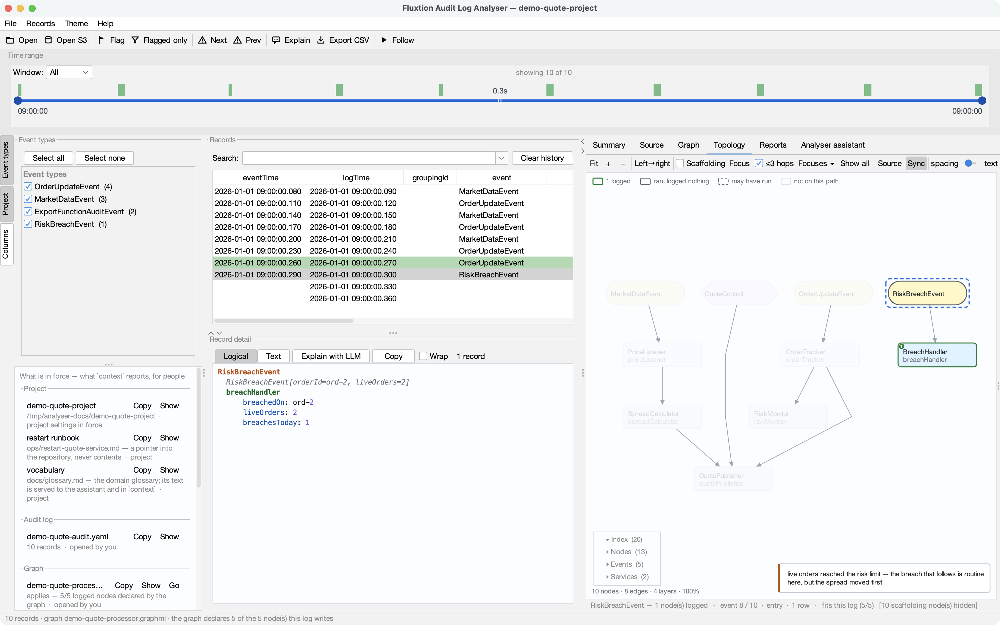
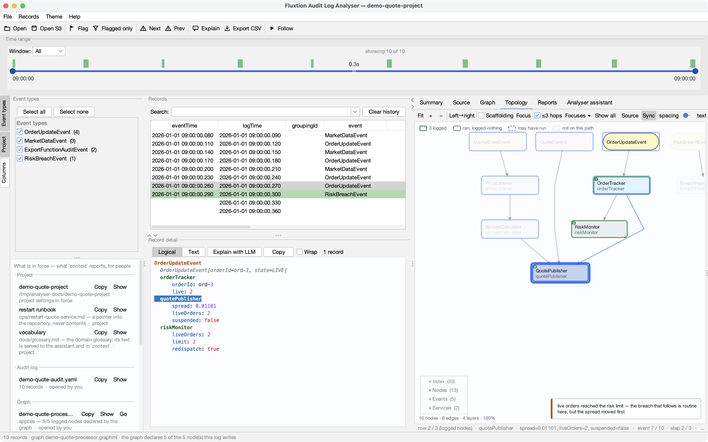
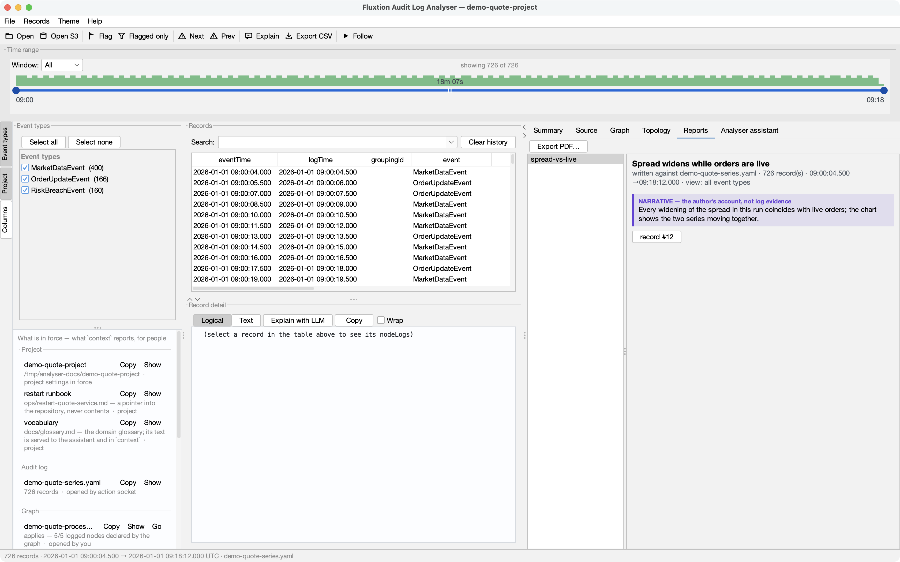
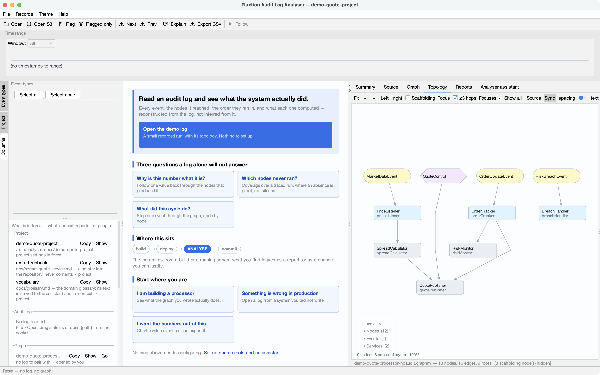

<!-- GENERATED by tools/capture-conversations.py — edit the script, not this file. -->
# Sample conversations — an LLM, MCP, and the analyser

Six short conversations on the demo set that ships in the jar. The **asks** and the **agent's answers** are written by hand; **every tool call and every echo between them was recorded from a real run** by `tools/capture-conversations.py`, under the same isolated home the screenshots come from — so when a verb's echo changes, this page changes with it rather than quietly going stale. Each conversation ends with what the person sees, because the answer is meant to land in the analyser, not in the chat (*The shared research canvas*).


The client discovers one tool per verb — `analyser_context`, `analyser_aggregate`, `analyser_read`, `analyser_flag`, `analyser_coverage`, `analyser_topology`, `analyser_goto`, `analyser_graph`, `analyser_report`, `analyser_open` … — so nothing below is pasted into a prompt; the agent reads the schemas and decides. *Connecting an LLM to the analyser* covers the setup.


## 1 · "What happened around 09:00?" — the answer lands as flags, not prose


> **You:** The quote service looked wrong at 09:00 today. Use the fluxtion-analyser tools: what happened, and mark the records I should look at.

```json
→ analyser_context {}
← {
  "log": {
    "path": "…/analyser/src/test/resources/topology/demo-quote-audit.yaml",
    "openedFrom": "…/analyser/src/test/resources/topology/demo-quote-audit.yaml",
    "records": 10,
    "sizeBytes": 4053,
    "from": 1767258000090,
    "to": 1767258000360,
    "openedBy": "you"
  },
  "graphPairing": {
    "graph": "demo-quote-processor.graphml",
    "applies": true
  },
  "showing": {
    "visible": 10,
    "total": 10
  }
}
```

Ten records, and the graph applies to this log — so a node's absence would be evidence, not silence. The agent starts wide, then narrows.

```json
→ analyser_aggregate {"groupBy": "dimension"}
← {
  "metric": "count",
  "groupBy": "dimension",
  "total": 10,
  "buckets": [
    {
      "key": "OrderUpdateEvent",
      "count": 4
    },
    {
      "key": "MarketDataEvent",
      "count": 3
    },
    {
      "key": "ExportFunctionAuditEvent",
      "count": 2
    },
    "… (+1 more)"
  ],
  "population": {
    "records": 10,
    "filter": {
      "dimensions": [],
      "from": null,
      "to": null,
      "text": null
    },
    "scan": "index"
  }
}
```
```json
→ analyser_read {"recordIndex": 7}
← {
  "records": [
    {
      "recordIndex": 5,
      "byteOffset": 2131,
      "logTime": 1767258000240,
      "text": "eventLogRecord: \n    eventTime: 1767258000230\n    logTime: 1767258000240\n    groupingId: null\n    event: Or…"
    },
    {
      "recordIndex": 6,
      "byteOffset": 2541,
      "logTime": 1767258000270,
      "text": "eventLogRecord: \n    eventTime: 1767258000260\n    logTime: 1767258000270\n    groupingId: null\n    event: Or…"
    },
    {
      "recordIndex": 7,
      "byteOffset": 3019,
      "logTime": 1767258000300,
      "text": "eventLogRecord: \n    eventTime: 1767258000290\n    logTime: 1767258000300\n    groupingId: null\n    event: Ri…"
    },
    "… (+2 more)"
  ]
}
```
```json
→ analyser_flag {"recordIndexes": [6, 7], "note": "live orders reached the risk limit — the breach that follows is routine here, but the spread moved first"}
← {
  "flagged": 2,
  "recordIndexes": [
    6,
    7
  ],
  "note": "live orders reached the risk limit — the breach that follows is routine here, but the spread moved first"
}
```

> **Agent:** At 09:00:00.300 a RiskBreachEvent fired: `breachHandler` recorded `breachedOn: ord-2` with two live orders. The cycle before it (09:00:00.270) is the one that took liveOrders to the limit — I've flagged both with a note; they're the yellow rows in your table and the *Flagged only* toggle shows just them. Nothing else in the ten records is unusual.





## 2 · "Which nodes never ran?" — coverage that counts only what could log


> **You:** Which nodes in this processor never logged anything in this run?

```json
→ analyser_coverage {}
← {
  "declared": 6,
  "covered": 5,
  "uncovered": 1,
  "ratio": 0.833,
  "excludedFromDenominator": {
    "MarketDataEvent": "an event class — data entering the graph, not code that runs",
    "QuoteControl": "an exported service interface — an entry point, not a node that logs",
    "OrderUpdateEvent": "an event class — data entering the graph, not code that runs",
    "RiskBreachEvent": "an event class — data entering the graph, not code that runs"
  },
  "excludedNote": "excluded 4 declared item(s) that can never write audit output: 3 event class(es), 1 exported service(s). Th…"
}
```

> **Agent:** Five of the six nodes that *can* log did; `spreadCalculator` never wrote a record. Four other things in the graph were left out of the denominator on purpose and the echo names them — three event classes and the `QuoteControl` service interface can never write audit output, so counting them would have reported 50% for a run that logged everything it could. Whether `spreadCalculator` is silent by design or silent by accident needs its source; that's the one to look at.


## 3 · "Why is this number what it is?" — one value followed back through the graph


> **You:** The spread in the 09:00:00.270 cycle is 0.011. Show me where that comes from.

```json
→ analyser_topology {"select": "quotePublisher", "scope": "routes"}
← {
  "selected": [
    "quotePublisher"
  ],
  "scope": "routes",
  "visibleNodes": 10,
  "totalNodes": 20,
  "routeBound": true,
  "focus": false
}
```
```json
→ analyser_goto {"recordIndex": 6, "reveal": true}
← {
  "recordIndex": 6
}
```
```json
→ analyser_topology {"step": 2}
← {
  "position": "row 2 / 3 (logged nodes)",
  "currentNode": "quotePublisher",
  "rowCount": 3,
  "atEntry": false,
  "orderMeaningful": true
}
```

> **Agent:** `quotePublisher.spread` is computed from `spreadCalculator`, which listens to `priceListener` — the Topology tab is now focused on exactly those routes, and I've stepped the 09:00:00.270 cycle to the second node it dispatched — `quotePublisher`, after `orderTracker`. In this run `spreadCalculator` logged nothing (see conversation 2), so the 0.011 you see is `quotePublisher` reporting a value it was handed, not one this log lets us trace further. Position within the cycle *is* dispatch order here (`orderMeaningful: true`), so the sequence you're looking at is causal.





## 4 · "Chart it and write it up" — a graph with its reason, and a report that leaves the session


> **You:** Open the longer run and chart the spread against live orders; then write it up as a report I can send.

```json
→ analyser_graph {"name": "Spread vs live orders", "series": ["quotePublisher.spread"], "rightAxis": ["orderTracker.live"], "style": "line", "rationale": "the spread widens when orders are live — checking the two move together"}
← {
  "name": "Spread vs live orders"
}
```
```json
→ analyser_report {"name": "spread-vs-live", "title": "Spread widens while orders are live", "sections": [{"kind": "narrative", "text": "Every widening of the spread in this run coincides with live orders; the chart shows the two series moving …"}, {"kind": "record", "recordIndex": 12}], "path": "spread-vs-live.pdf"}
← {
  "path": "<exchange-dir>/spread-vs-live.pdf",
  "sections": 2,
  "name": "spread-vs-live"
}
```

> **Agent:** The chart is on your Graph tab — spread on the left axis, live orders on the right, captioned with why I drew it. The report is saved in the project as *spread-vs-live* and rendered to the exchange directory as `spread-vs-live.pdf`; its header names the log it was written against, so whoever receives it can check it against the same file.





## 5 · "Use what the project knows" — runbooks, glossary, a saved analysis


> **You:** Is there a standard analysis for this kind of incident, and what does the team do next?

```json
→ analyser_context {}
← {
  "runbooks": [
    {
      "name": "restart",
      "path": "ops/restart-quote-service.md",
      "resolved": "…/demo-quote-project/ops/restart-quote-service.md",
      "exists": true,
      "from": "project",
      "note": "a pointer — read the file from the repository; the analyser stores no instructions and executes nothing"
    }
  ],
  "vocabulary": {
    "path": "docs/glossary.md",
    "exists": true
  },
  "analyses": [
    {
      "name": "spread breach",
      "rationale": "every breach incident starts the same way: the spread before it",
      "parameters": [
        {
          "name": "log"
        }
      ],
      "steps": [
        "open",
        "graph"
      ],
      "from": "project"
    }
  ]
}
```
```json
→ analyser_open {"analysis": "spread breach", "bind": {"log": "…/analyser/src/test/resources/topology/demo-quote-audit.yaml"}}
← {
  "analysis": "spread breach",
  "completed": "2/2 steps",
  "steps": [
    {
      "step": 1,
      "action": "open",
      "ok": true
    },
    {
      "step": 2,
      "action": "graph",
      "ok": true
    }
  ]
}
```

> **Agent:** Yes — the project saves a *spread breach* analysis ("every breach incident starts the same way: the spread before it"). I ran it: it opened the incident log and drew `quotePublisher.spread`. The glossary says a *breach* here is routine, not an outage. For what happens next the project points at `ops/restart-quote-service.md`; I read it — confirm liveOrders is 0, restart through the deployment tool, verify the next log starts within 5 s. I have not run anything. (*Runbooks, glossary and saved analyses with an AI* has this conversation in full.)


## 6 · "Will this processor log at all?" — an answer with no log to examine


> **You:** Support say the audit log from the new build is empty. Here's the build's graph — is that expected?

```json
→ analyser_open {"graphml": "…/analyser/src/test/resources/topology/demo-quote-processor-noaudit.graphml"}
← {
  "graphml": {
    "path": "…/analyser/src/test/resources/topology/demo-quote-processor-noaudit.graphml",
    "nodes": 10,
    "pairing": "no log is open — nothing to check this graph against"
  }
}
```
```json
→ analyser_context {}
← {
  "graphPairing": {
    "auditLogging": "not_enabled",
    "auditLoggingNote": "This processor was built WITHOUT audit logging: EventLogManager is not on the graph, so it will write no au…",
    "graph": "demo-quote-processor-noaudit.graphml"
  }
}
```

> **Agent:** Expected, and not a quiet system: this build was compiled **without** audit logging — `EventLogManager` is not on the graph, so the processor writes no audit log at all, however carefully its nodes call `auditLog.info(…)`. The fix is `addEventAudit()` on the graph builder and a rebuild. I could tell you that from the graph alone, before any run — there was never going to be a log to read.





---


*Regenerate with `python3 tools/capture-conversations.py` after `mvn package`. The calls above are the run's own; if one fails, the script stops rather than writing a page that pretends it worked.*
