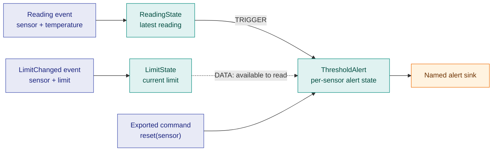
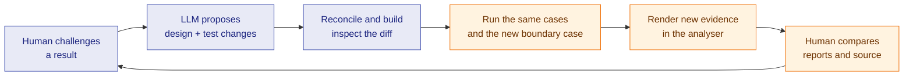

# From a design conversation to an answer you can inspect

The LLM is your design partner. It helps turn a request into explicit behaviour,
uses the Spring authoring tools to build the agreed structure, and drives scenarios
through the application. The analyser is its **render engine for evidence**: the
human and LLM share the same cycles, topology, charts and investigation reports.

These illustrative conversations follow one temperature-monitoring design. The
tables specify **expected results**, not captured runs. An assistant must execute
the scenario and collect evidence before presenting those expectations as observed
behaviour. For recorded analyser tool calls and responses, see
[Sample conversations](sample-conversations.md).

The [capabilities and workflow guide](spring-authoring.md) explains the tools and
the availability of the local authoring workflow, which requires the next compiler
release that includes the starter tool.

## 1. Design a system together

> **You:** I want to monitor temperature readings. Alert when a sensor crosses its
> limit, but don't keep sending alerts while it stays too hot. I also need to change
> a limit and reset a sensor. Help me decide the behaviour before building it.

> **LLM:** Let's settle three cases. Does a reading exactly equal to the limit count
> as hot? Should changing the limit immediately evaluate the last reading? And after
> reset, should a still-hot sensor alert on its next reading?

> **You:** Hot means strictly above the limit. Changing a limit takes effect on the
> next reading. Reset clears the alert state; the next hot reading should alert again.

> **LLM:** Then each sensor needs its latest reading, current limit and an “already
> alerted” flag. A reading at or below the limit clears that flag. A hot reading
> emits an alert only when the flag is clear, then sets it. A limit change stores
> the new limit without evaluating the reading. Reset clears the flag without
> emitting an alert. Is that the intended rule?

> **You:** Yes. Show me the design and the examples we'll use to check it.

### What the LLM makes explicit



This diagram shows **intended information and trigger flow**. Spring constructor
references point from a dependent node to the objects it uses: `ThresholdAlert`
references `ReadingState` and `LimitState`. The XML marks the limit reference as
`DATA`, so a limit update alone does not trigger `ThresholdAlert`.

The LLM records the design as Spring XML, then implements the agreed state changes
in Java. The exported reset interface has a `void reset(java.lang.String)` method.
The names and wiring are authoring declarations; the per-sensor flag and threshold
comparison are application logic.

| Agreed case | Expected result |
|---|---|
| First reading above the limit | One alert; mark that sensor as alerted. |
| Another reading still above the limit | No additional alert. |
| Reading exactly at the limit | No alert; clear the alerted flag. |
| Change a limit without a new reading | Store the limit; no immediate alert evaluation. |
| Reset, then a hot reading | Reset emits no alert; the next reading emits one. |
| A second sensor crosses its limit | Its alert state is independent of the first sensor. |

Before generation, also settle initial limits, unknown sensor IDs and missing-data
behaviour. The examples here assume the sensor already has a configured limit.

## 2. Ask how the system would behave

> **You:** What if the temperature rises above 80, stays there, and I raise the limit
> to 85? Show me when it would alert.

> **LLM:** I'll turn that into an ordered scenario for one sensor, starting with no
> alert active. The expected result is below. Then I'll run the current processor
> against it and bring the evidence into the analyser so we can compare.

| Step | Input | Expected state after the step | Expected output |
|---|---|---|---|
| 1 | Reading 78; initial limit 80 | Not alerted | None |
| 2 | Reading 82 | Alerted | Alert at 82 |
| 3 | Reading 83 | Still alerted | None |
| 4 | Change limit to 85 | Still alerted; waiting for a reading | None |
| 5 | Reading 83 | Not alerted: 83 is below 85 | None |
| 6 | Reading 86 | Alerted | Alert at 86 |

> **You:** In particular, show why changing the limit doesn't immediately clear
> the flag. I don't want an answer based only on reading the XML.

> **LLM:** I'll inspect the generated dispatch and the node's implementation, run
> that sequence, and check the actual alert output. I'll show the limit-change
> cycle and the next reading cycle in the analyser. If the log doesn't record the
> flag transition, I'll identify that gap rather than infer it from silence.

### How the question becomes an experiment

```mermaid
sequenceDiagram
  participant H as Human
  participant L as LLM design partner
  participant P as Project tools
  participant R as Application
  participant A as Analyser canvas
  H->>L: What if the limit changes mid-sequence?
  L->>H: Proposed inputs and expected outputs
  H->>L: Agreed; show the transition
  L->>P: Read XML, node code, runbook and tests
  L->>P: Validate and generate if the design changed
  P-->>L: Diagnostics and generated source
  L->>R: Run scenario from known initial state
  R-->>L: Actual outputs and audit capture
  L->>A: Open matching project, graph and log
  L->>A: Select cycles, plot values, highlight findings
  L->>A: Write expected-versus-observed report
  A-->>H: Evidence and report to inspect
  H->>L: Question a result or refine the design
```

Generation and application execution happen through the LLM's project tools.
Rendering happens through the analyser's tools. Both are part of the same
conversation, with the build and run results determining what the LLM can claim.

With a fixed processor, initial state and input order, plus controlled time and
external-service responses, this scenario can be repeated. That makes it possible
to investigate a disagreement and re-run a proposed change against the same case.

### What you should see on the shared canvas

| Analyser surface | How it answers the question |
|---|---|
| Records and detail | The actual limit-change and reading cycles, selected so you can inspect their fields. |
| Charts | Temperature and effective limit over the scenario, if those numeric audit fields exist. |
| Topology and step-through | The recorded node order and the graph's stated relationship to the log. |
| Source navigation | The generated dispatch and Java methods responsible for the transition. |
| Flags or spotlights | The LLM points at the decisive cycles or values while explaining them. |
| Investigation report | Expected versus observed outputs, supporting references and any unresolved evidence gaps. |

Audit logging must include the state needed to answer the question. For this case,
use explicit numeric/boolean keys for temperature, effective limit, alerted state
and whether an alert was emitted. Captured sink output establishes what left the
system; audit fields explain the path to it. Missing audit output alone does not
establish that a node did not execute.

## 3. Challenge the answer and change the design

> **You:** What happens if I reset after step 3, then send another reading of 83
> before raising the limit? And what about a reading exactly at 80?

> **LLM:** Under the rule we agreed, reset clears the flag and emits no alert. With
> the limit still at 80, the next reading of 83 should emit one. A reading exactly
> at 80 should emit none and clear the flag. I'll make those separate scenarios so
> each starts from a known state, then compare the actual outputs with those
> expectations in the report.

> **You:** I now want lowering the limit below the current reading to alert
> immediately. Show me what needs to change, then demonstrate both behaviours.

> **LLM:** That changes the design: a limit update must cause an evaluation too.
> I'll review the reference mode and evaluation method together, and check how
> the limit event identifies the sensor. I'll also cover raising the limit and
> duplicate alerts. I'll preserve the earlier report, update the project and
> tests, regenerate, and run the before-and-after scenarios separately.

Changing a `DATA` reference to `TRIGGER` changes propagation. Correct handling also
depends on the Java code selecting the right sensor and applying the agreed rule.
The LLM should show both parts of the change. The analyser opens one active log at
a time; use saved reports to retain the earlier investigation while inspecting the
new run.



## What makes the final answer useful

A good investigation report identifies the processor/source revision, starting
state, scenario inputs and expected results. It then records observed outputs,
links the relevant audit cycles and source, and states whether the evidence agrees
with the design. If a stage failed or evidence is missing, that belongs in the
answer too.

The human can ask a follow-up against something visible: “show that cycle”, “why
did this node run?”, “plot this value”, or “try the boundary case”. The LLM turns
the request into work and presents the result on the shared canvas. That is the
connection between design partnership and deterministic execution: a conversation
can produce a repeatable experiment, and its answer can be examined together.

Continue with [Spring authoring capabilities and workflow](spring-authoring.md),
[connecting an LLM](connect-an-llm.md), or
[investigation reports](user-guide/reports.md).
