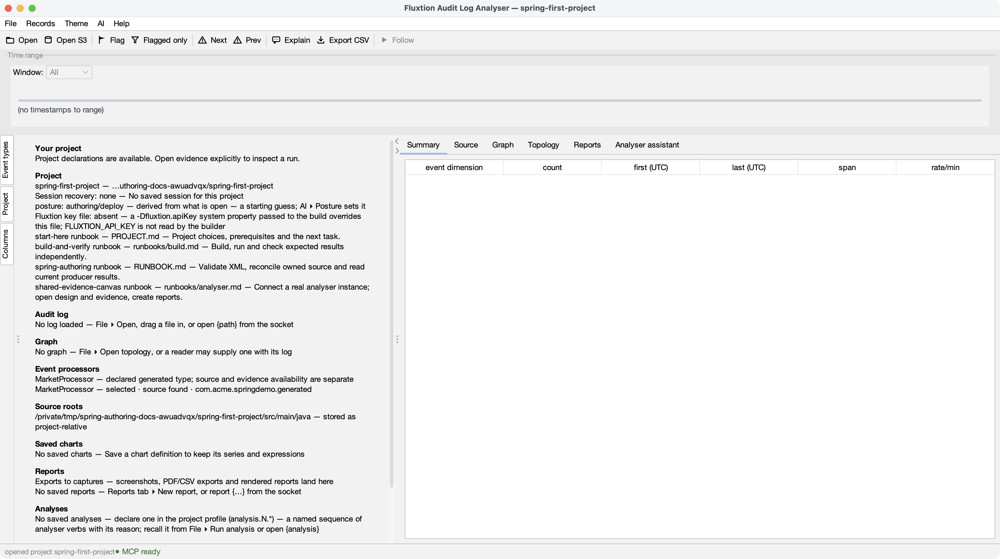
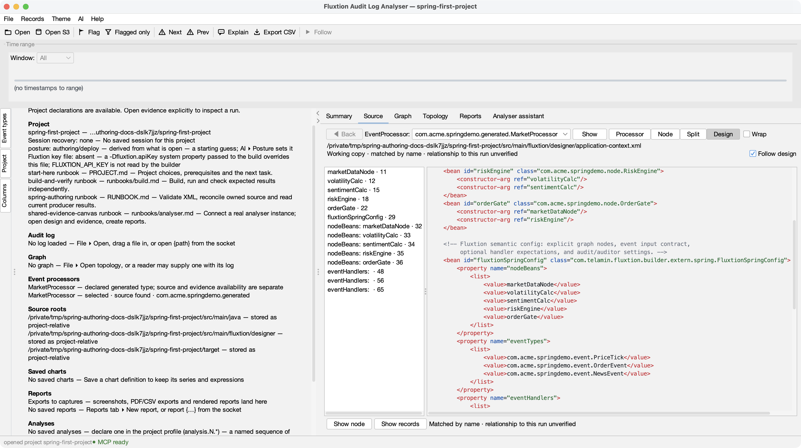
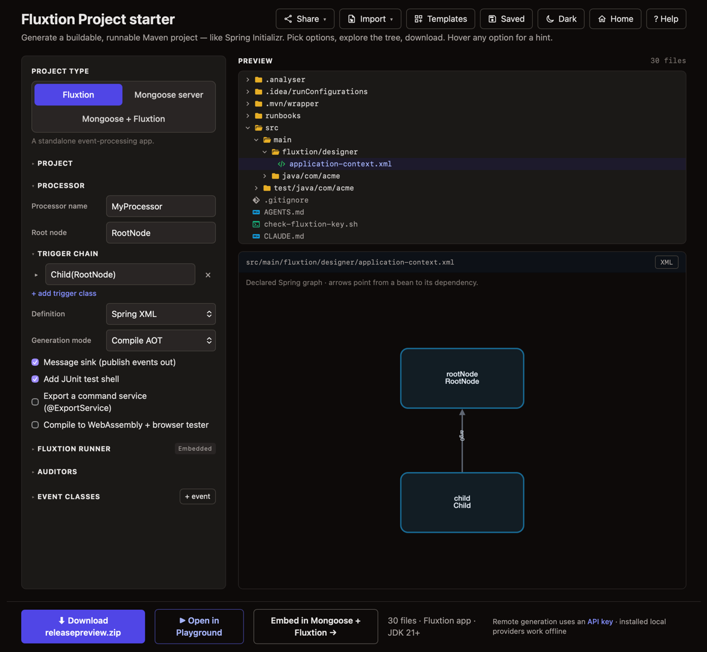
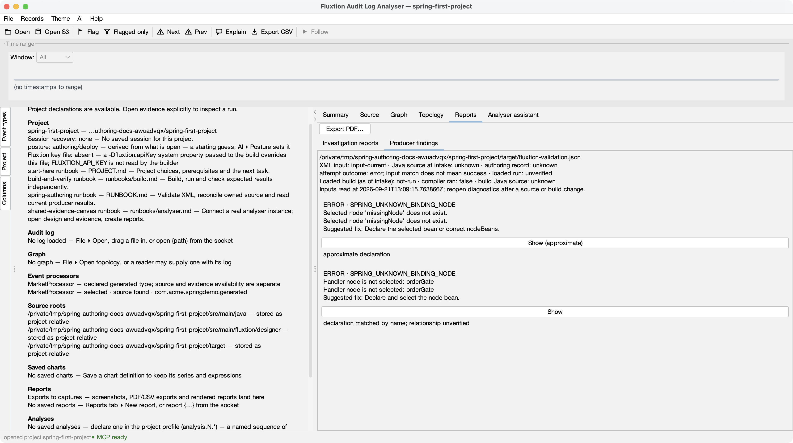
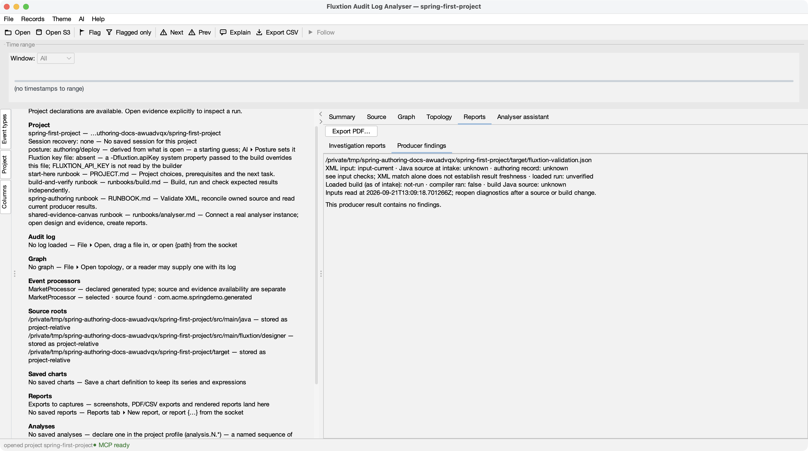

# Getting started with Spring authoring

Use an LLM as your design partner and the analyser as the window you share. Agree what the
application should do, inspect its Spring XML, then compare actual results with your expectations.
The LLM edits and runs the project through its own tools; the analyser displays design and evidence.

**Guided means a conversation following the project's runbooks.** It is optional, with no special
runtime mode or separate “guided” project type. You can follow the same steps yourself.

!!! info "Use starter 1.0.73 or later"
    New **Fluxtion Spring XML** downloads include the fixed public Maven descriptor. The shipped
    `setup.sh`, validation, changed-design generation and sample run have been verified with
    starter **1.0.73**. Setup and XML validation need no compilation key; generation still needs
    the backend prerequisites below.

    If you already downloaded a 1.0.72 project, update `starterVersion` in
    `fluxtion-authoring.json` to `1.0.73`, and update the POM's `fluxtion.bom.version` from
    `1.0.72` to `1.0.73`. Keep your source and ownership entries. Run `./setup.sh` again.

## Choose your starting point

| You want to… | Start here |
|---|---|
| Learn the analyser without building anything | [Guided analyser tour](guided-start.md), using its included demo log. |
| Run an existing example and examine its evidence without a compilation key | [Playground to analyser](tutorial-playground.md), using the Audit analyser bundle. |
| Design and change an application in Spring XML | This guide, using **Fluxtion Spring XML**. |
| Host a Spring design in Mongoose | Use **Fluxtion Spring in Mongoose** and its hosting/build runbooks. It currently omits the local authoring record and scripts, so the setup/validate/generate steps below apply to the standalone template only. |

For the Spring path, use JDK 21, network access for provisioning, and analyser **1.16.0 or later**.
Your local LLM needs access to the downloaded project and a terminal. Generation through RapidAPI
also needs a configured, subscribed compilation key; an installed local generator is a different
route. XML validation itself is keyless.

## 1. Download a project

In the analyser, choose **File ▸ New project from template…** (or **Author a new project** on
the start page). Choose **Fluxtion Spring XML**, read its prerequisites, and download into an
empty directory. A shipped profile opens automatically. The analyser does not build it for you.

Alternatively, open the [website starter](https://fluxtion-playground.dev/start), choose the
template through **Templates**, and leave **Analyser support** enabled. To download directly:

```bash
curl --fail --location \
  'https://fluxtion-playground.dev/start/scaffold?template=fluxtion-spring&artifact=spring-first-project&group=com.acme&basePackage=com.acme.springdemo' \
  --output spring-first-project.zip
unzip -l spring-first-project.zip
unzip spring-first-project.zip
cd spring-first-project
```

The website and local LLM can acquire the project **before an analyser is running**. There is
no need to run a local playground or docs server. Analyser support is on by default, including
older shared configurations; an explicit opt-out removes its profile/integration files.

Read `PROJECT.md`, then `RUNBOOK.md`. Check that these files exist:

| File | Purpose |
|---|---|
| `src/main/fluxtion/designer/application-context.xml` | The declared graph. |
| `src/main/java/` | Node behaviour, event types and application code. |
| `fluxtion-authoring.json` | Pinned starter version and source ownership history; keep it in version control. |
| `PROJECT.md`, `RUNBOOK.md`, `runbooks/` | The project's entry point and task instructions. |
| `.analyser/project.fluxtion-settings` | Source roots, processor declarations and runbook pointers. |

The sample names a market-data node, volatility and sentiment calculations, a risk engine and
an order gate. These are **starter scaffolding**, not implemented trading rules. Agree and test
the behaviour before treating a class name as a capability.

## 2. Open the shared canvas and connect your LLM

Start the [released analyser](install.md). If you downloaded outside the analyser, choose
**File ▸ Open project…** and select `.analyser/project.fluxtion-settings` directly.



**Checkpoint:** the project name and runbooks appear, while the page honestly says **No log loaded**
and **No graph**. A declared processor and a source shell are not proof of a successful build.

Open your LLM client in the same project directory. In the analyser, use
**AI ▸ Connect an AI client…** and follow the instructions for that client.
See [Connecting an LLM](connect-an-llm.md). The download does not contain a machine-specific MCP
endpoint: configure the actual running analyser, then have the client call `analyser_context`.

Paste this prompt once the client can access the project and analyser:

```text
Give me a guided first session with this Spring authoring project.
Read PROJECT.md, RUNBOOK.md, fluxtion-authoring.json and the declared runbooks.
Call analyser_context and confirm which project and files the window is showing.

Start by showing the XML design and explaining the nodes and dependency directions.
Ask what behaviour I want before editing anything. Agree one small input sequence
and expected outputs with me before writing the implementation.

Use the project's tools for validation, generation and execution. Check prerequisites
first; stop at provisioning or key failures and show the actual error. Keep the
download's dependency coordinates. The analyser is our canvas, not our build runner.

After each stage, tell me what to look at in the analyser and verify its context.
Keep XML validity, a successful build, and observed application behaviour separate.
End with one question answered from actual evidence and the next step written down.
```

## 3. Inspect the design before running it

In **File ▸ Settings… ▸ Source roots**, keep the existing Java root and add the project's
`src/main/fluxtion/designer` directory. Add `target` once it exists to authorise producer reports.
Opening a project alone does not authorise every file beneath it.

Choose **File ▸ Open design…**, select `application-context.xml`, then select `riskEngine`
in the **Source** tab's bean index. A connected LLM can make the same selection with
`analyser_source {"bean":"riskEngine"}` after opening the design.



**Checkpoint:** you can read the declaration before any compilation or run. **Follow design**
refreshes it after edits. “Relationship to this run unverified” is not an error: the working XML
has not been proven to describe a loaded execution.

Ask the LLM: “What feeds this node? Which references should trigger it, and which should only
supply data?” The [capability guide](spring-authoring.md#what-you-can-design-together) explains
`DATA`, `TRIGGER`, events, services and lifecycle declarations.

!!! warning "Never list a supplier's class in nodeBeans"
    Reference it from one of your own nodes instead. The starter writes skeleton classes for
    `nodeBeans` entries it cannot find source for. A class that exists only in a dependency jar
    looks like a class that does not exist yet, and the skeleton silently replaces it: the build
    stays green and the supplier's component is gone. This remains open as
    [feedback #29](https://github.com/telaminai/fluxtionauditlog-analyser/blob/main/docs/specs/tracker.md).
    See the [vendor worked example](integrating-a-vendor-component.md) before adding a supplier jar.

The website also previews imported XML as a graph. This separate two-node example shows its
**declaration** view; its arrow points from `child` to its dependency `rootNode`:



This is not the runtime graph for the five-node sample above. Use generated GraphML and a matching
audit log when investigating execution.

## 4. Validate and read a real finding

Run the shipped project commands:

```bash
./setup.sh
./validate.sh --summary-detail
```

`setup.sh` fetches the pinned tool and resolves the classpath. Stop if it fails; do not treat
an incomplete setup as successful validation. Validation checks XML declarations without loading
your node classes. It writes `target/fluxtion-validation.json`.

In the analyser, choose **File ▸ Open producer diagnostics…** and open that JSON file.
The result appears under **Reports ▸ Producer findings**.

For a small learning exercise, save the original XML, change only the `orderGate` value inside
`nodeBeans` to `missingNode`, and validate. The command should fail. Open its new result:



**Checkpoint:** the analyser shows the missing declaration and a suggested correction. It also
says that matching XML is not a successful build. **Show** navigates to the reported location;
approximate locations are labelled.

Restore `orderGate`, validate again, and reopen the result:



“No findings” here means this XML validation produced none. It does not prove Java compilation
or correct business calculations. Reopen diagnostics after each producer run; do not rely on an
older displayed result.

## 5. Implement, generate and run after setup succeeds

Continue only after provisioning works and the project's generation route is available. Have the
LLM implement the agreed behaviour in the node classes, with assertions for your expected outputs.
Then follow `RUNBOOK.md`:

```bash
./generate.sh
./run.sh
```

Reconciliation plans source changes first, preserves implemented bodies where ownership permits,
and refuses conflicts. Read the refusal rather than deleting ownership records to get past it.

!!! warning "New-node stubs still need audit scaffolding"
    Starter 1.0.73 makes stub generation reachable on the standalone template, but generated
    stubs for **new nodes** do not extend `EventLogNode`. Their bodies cannot use its `auditLog`
    field until you add that support. For a new node that must write audit values, manually make
    it extend `com.telamin.fluxtion.runtime.audit.EventLogNode`, then implement the logging and
    check the emitted record. Do not assume a generated stub already logs. This is the known,
    still-open [feedback #6 audit-scaffolding gap](https://github.com/telaminai/fluxtionauditlog-analyser/blob/main/docs/specs/tracker.md).

The build receipt is `target/fluxtion-run.json`; compilation diagnostics belong to the latest
attempt only when that receipt says the compiler ran and its input checks still hold.

The default remote route requires a compilation key. Configure it using the project's preflight
instructions or **AI ▸ Fluxtion API key…**, never by committing it. An installed local provider
can be keyless; a custom HTTP host is not automatically a local provider.

The screenshots show download, design rendering and XML validation. The separate
[1.0.73 release check](https://github.com/telaminai/fluxtionauditlog-analyser/blob/main/docs/handoff/report_sg1_release_2026_09_21.md)
verifies the standalone setup, changed-design generation and sample run. The hosted-template
authoring gap (SG-2) remains open. For a Mongoose template, use
its emitted `run-server.sh` and host runbook; do not substitute the standalone `run.sh` commands.

## 6. Answer one question from evidence

Once you have an actual successful run, open its audit log and generated GraphML in the analyser.
Use the project runbook to locate them; an expected filename is not evidence the file exists.
An XML preview, generated topology and runtime audit each answer a different question.

```text
For the scenario we agreed, compare expected and observed outputs independently.
Show the relevant audit cycles, topology and source in the analyser. Plot only
values that actually exist in the log. Point at the evidence before explaining it.
Create a report that separates observations, interpretation and untested cases.
```

The LLM can drive the same window you inspect. Challenge its answer by opening the selected
records and source. An unlogged node is not proof of non-execution, and unchanged existing
outputs alone do not prove a newly added calculation is correct.

## Come back tomorrow

Keep XML, source, `fluxtion-authoring.json` and project runbooks in version control. Preserve
the logs and outputs needed to reproduce your conclusions. On project reopen or analyser relaunch,
choose **Restore last session** explicitly; changed or missing inputs may be withheld.

A restored canvas does not restore an LLM conversation. Start the new client in the project,
ask it to reread `PROJECT.md` and current results, then call `analyser_context` before continuing.
For examples of the conversation, see [Design and “what if?” questions](spring-authoring-conversations.md).
