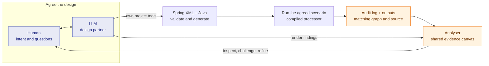

# Spring authoring with an LLM design partner

Describe the system you want to build. Work with an LLM to make its events, state,
dependencies and boundaries explicit. Spring authoring turns that agreed design into
a Java project you can inspect and develop. Run the application, then use the analyser
as the **shared canvas where the LLM renders evidence and the human examines it**.

The conversation continues on that canvas: a selected cycle, a highlighted node, a
chart or an investigation report gives both of you something concrete to discuss.
The LLM's explanation should lead back to those observations and the source that
produced them.

Start with [Spring authoring step by step](spring-authoring-getting-started.md) for the guided
path, download instructions and screenshots. The [sample design and “what if?” conversations](spring-authoring-conversations.md)
show the collaboration; this page explains the capabilities and workflow.

!!! info "Availability of the local authoring workflow"
    The local starter tool and extended XML declarations are now published. A matching project
    download names its required coordinate in `fluxtion-authoring.json` and includes `RUNBOOK.md`,
    `setup.sh`, `validate.sh` and `generate.sh`. Use those project-pinned versions; setup reports
    when the required tool cannot be fetched. Compilation credentials depend on the selected route.
    For the keyless published demo, follow [Playground to analyser](tutorial-playground.md).

!!! info "Standalone and hosted local authoring"
    Starter **1.0.74** adds the hosted Spring authoring record and scripts, callback audit
    scaffolding, classpath protection for reconciled shells, and reconciliation corrections.
    Use the [step-by-step guide](spring-authoring-getting-started.md) for prerequisites,
    existing-project upgrades and the different standalone/hosted launchers. Setup and
    validation are keyless; a successful setup does not establish generation or behaviour.

## One conversation, two workspaces

The **project directory** holds the design and implementation: Spring XML, Java,
ownership history, run instructions and build results. The **analyser window** holds
the evidence being examined: the selected run, its topology, source navigation,
charts, annotations and reports.



The LLM uses its own filesystem and shell tools to work on the project. With an
[AI client connected](connect-an-llm.md), it uses the analyser's tools to select and
present evidence in the same window you are viewing. The analyser renders that
evidence; it does not edit Java, execute runbooks, build a project or deploy a server.

An AI client with access to both the checkout and analyser can support the whole
conversation. Connecting a client to the analyser alone gives it the investigation
surface; building still requires access to the project and build tools.

## Why deterministic execution helps answer “what if?”

An LLM can propose what should happen, turn that proposal into an input scenario,
drive generation and execution with its project tools, and compare the result with
the expectation. The generated processor makes dispatch inspectable in Java; the
run produces outputs and audit evidence that the LLM can present in the analyser.

For a repeatable scenario, keep the processor version, initial state and input
sequence fixed, and control time and external-service responses. That gives the
human and LLM a repeatable experiment to discuss. Deterministic dispatch does not
choose the business rules or make changing external inputs repeatable by itself.

| Question | Evidence to put on the shared canvas |
|---|---|
| “What did we ask it to do?” | The agreed rules and input sequence in the investigation report, alongside the project design. |
| “What does the implementation do?” | Generated dispatch and node source, reached through source navigation. |
| “What happened in this scenario?” | Actual outputs, selected audit cycles, relevant node values and charts. |
| “Does that answer my question?” | Expected versus observed results, with missing evidence and remaining cases stated explicitly. |

The result is an answer you can inspect together: **the LLM explains; the analyser
renders the supporting evidence and report; the human can follow and question it**.

## What you can design together

Spring XML declares the graph and its interaction points. The starter creates Java
structure for that design; you and the LLM implement the domain behaviour in the
node classes. Business calculations, error handling and the meaning of an alarm
still need code and tests.

| Design question | What Spring authoring expresses |
|---|---|
| What arrives from outside? | Named event types and the nodes expected to handle them. Event classes can be scaffolded before they exist. |
| What state or calculation belongs together? | Nodes as beans, with explicit constructor or property references to other nodes. |
| Should a dependency update trigger this node? | `TRIGGER` for normal dependency propagation; `DATA` for a reference that supplies data without triggering its owner. |
| Must this node push into a referenced target? | `PUSH` reverses that edge's propagation direction: the owner is the source. Collection references can name several targets. |
| Does it matter which parent changed? | A parent-update callback tied to the named reference field, in `TRIGGER` mode. |
| Which events qualify, and should processing continue downstream? | Integer or string handler filters and the `propagate` setting. |
| What external capability does a node call? | Imported service interfaces and registration callbacks, with optional deregistration callbacks. |
| What commands can the host call into the graph? | Exported service interfaces with `void` methods, implemented using `implements @ExportService Interface`. |
| What simple control messages does it receive? | Named signals with filtered handlers. |
| What does it publish? | Named sinks with Java publisher types. Sink descriptors in this version expose names and `Object`, not the declared Java value type. |
| What happens when the host starts or stops it? | Initialise, start, stop and teardown hooks. The host invokes the lifecycle. |

These declarations remain reviewable in XML and Java. The compiler checks declared
requirements against the actual classes; XML does not alter existing bytecode.
For exact property names and XML shapes, use the
[canonical Spring authoring contract](https://fluxtion-playground.dev/spring-authoring/contract.md).

## Start with intent and observable examples

Give the LLM a domain problem and ask it to work through the decisions with you.
For example:

```text
Help me design a temperature-monitoring application using Spring authoring.
Read the Spring authoring guide and contract before proposing the XML.

Readings contain a sensor id and temperature. Keep the latest reading for each
sensor. Emit an alert when its temperature crosses a configured limit, and
support a reset command. Discuss how limits are supplied and what reset means.

Ask me about behaviour that is still ambiguous. Agree a few input sequences
and expected alerts before generating the project. Include audit fields that
will let us examine a threshold crossing together in the analyser.
```

Work through events, state, dependency direction, external services and outputs.
Ask the LLM to explain why each dependency should trigger processing or only supply
data. For the example above, decide what happens on repeated readings above the
limit, on a limit change and after reset. Those decisions become tests rather than
assumptions hidden in generated code.

Agree the evidence too. A readable event string helps explain a cycle; separate
numeric fields such as `temperature` and `limit` make it possible to plot it.
The analyser charts top-level numeric/boolean node-log keys, not numbers embedded
inside an object's `toString()`. See [Producing an audit log](producing-a-log.md).

The LLM then emits the Spring XML. Import it into the
[project starter](https://fluxtion-playground.dev/start), inspect the proposed
project, and download it. The starter's declared-graph preview helps discuss the
design; generated source and a real run are still needed to check its behaviour.

## Build in the project, inspect on the canvas

Use JDK 21 for the downloaded project. Read its `RUNBOOK.md` first; it records the
workflow for that template. The Maven wrapper supplies Maven when needed.

```bash
./setup.sh                    # provision the tool and dependencies while online
./validate.sh --summary-detail
./generate.sh
./run.sh
```

The stages answer different questions:

| Stage | What it establishes |
|---|---|
| `setup.sh` | Fetches the pinned authoring tool and resolves the project classpath. Run it again after dependency changes. |
| `validate.sh` | Checks the XML and its declarations without loading your classes. The detailed summary lists declared edges and bindings. Passing does not establish that Java compiles. |
| `generate.sh` | Reconciles source where ownership permits it, then builds and generates the processor. This is where class/model checks run. |
| `run.sh` | Runs the application's example. Use the project's own tests and scenarios to establish the behaviour you agreed. |

Generation follows the builder's selected backend. An installed local provider
can generate without a key or gateway probe once dependencies are provisioned.
Custom HTTP endpoints use the existing client's authentication. The RapidAPI route
requires a key and its gateway preflight. A custom endpoint is not an offline
provider. Offline XML validation and source reconciliation do not need a key.

The analyser bundle also has host-specific run/export/stop scripts. Follow its
README for those steps: a Chronicle capture must be exported as analyser-readable
YAML. See the [bundle walkthrough](tutorial-playground.md#3-run-export-and-stop).

### Bring the result into the analyser

1. **Open the project** using *File ▸ Open project…*. A bundle includes an analyser
   profile; for your own project, use [project setup](user-guide/projects.md) to
   record the source roots and processor.
2. **Open the GraphML** produced with the processor you ran, using *File ▸ Open
   GraphML…*. The compiled graph and the Spring design serve different purposes.
3. **Open the audit log** from that run using *File ▸ Open log…*. Check the graph/log
   pairing and audit-readiness information before interpreting gaps.
4. **Ask the LLM to render an investigation** in the analyser: select the relevant
   cycles, plot values, highlight the important nodes and collect the findings in
   a report.

A useful request once the evidence is loaded:

```text
Show me the first threshold crossing in this run. Plot temperature and limit
using the available audit fields, select the triggering cycle, and show the
relevant topology and source. Point out any evidence we are missing.

Create an investigation report that separates observed values, conclusions
supported by the source, and questions this run cannot answer.
```

The analyser is the LLM's **render engine for the investigation**. The LLM can
filter and select records, build charts, flag findings, use spotlights to direct
attention, and assemble [investigation reports](user-guide/reports.md). You can
click the same points, read the underlying records, follow source links and
challenge the explanation. See [the shared research canvas](the-loop.md#the-shared-research-canvas).

A missing node log is not proof that its method did not execute. Nodes must write
audit output at the active level to appear in the log. Use the analyser's stated
coverage and pairing limits, outputs and tests together. If behaviour differs from the expectation, inspect
the authored node first; consult generated dispatch only if those checks leave the failure unexplained. A successful
build or a plausible chart alone cannot establish all the intended behaviour.

## View design and producer findings

!!! info "Requires analyser 1.16.0 or later"
    Design mode and producer findings require analyser 1.16.0 or later. Analyser 1.15.0 does not
    include these surfaces.

Open the XML with **File ▸ Open design…**, or `analyser_open {"design":"src/main/resources/design.xml"}`.
Authorise its directory in source roots; include the project's `target` directory to read producer results.
The Source tab's Design mode shows declarations and a bean index, and follows file changes independently
of the audit log. `analyser_source {"bean":"gate"}` re-reads and selects a declaration.
[Source navigation](user-guide/source-navigation.md#spring-design-and-file-glances) lists the selectors and
spotlight targets.

Use **File ▸ Open producer diagnostics…**, or `analyser_open {"diagnostics":"target/fluxtion-validation.json"}`.
**Reports ▸ Producer findings** retains every finding, including those without a navigable location.
Validation, reconciliation and compiler result wrappers are detected by shape and version. A new intake
replaces the previous result; a refused or unreadable file clears it. `open {discover:"diagnostics"}` only
lists candidates under the active project's target directory. Intake works without a log.

A finding's **Show** action follows its reported location under authorised roots. Fallbacks select the
binding declaration before its referenced bean; approximate matches and ambiguity are stated. A missing
bean cannot become a silent navigation failure. Java member findings open Java. Accurate producer locations
remain dependent on the producer supplying `sourceRef`; the analyser does not invent them.

The design view and findings separate three facts:

- **XML input-current / input-stale / unknown:** the result hash or run receipt compared with the rendered XML.
- **Java/authoring-record input checks and build outcome:** read at diagnostic intake, timestamped, with
  receipt outputs preferred when available. Reopen diagnostics after editing Java or running the build.
  Hashing is bounded to authorised roots and 10,000 Java files; unavailable comparisons stay unknown.
- **Loaded run relationship: unverified:** a matching bean name permits navigation, never a claim that
  the working copy produced the loaded log. A sidecar retained when the latest build did not run the compiler
  says that it predates that attempt, even if the XML is unchanged.

Producer findings are session state, separate from saved investigation reports. Switching projects clears
the design and findings. Opening a log outside the current project also clears them. Nothing here edits,
validates, generates, or runs the project.

## Change the design without losing the implementation

Keep `fluxtion-authoring.json` committed alongside XML and Java. It records which
constructs the starter owns, their signatures, its last-written wiring annotations
and original stub hashes. That history lets reconciliation distinguish a change
to the XML from a developer's change to an annotation or method body.

- Implemented bodies are preserved. Removing an owned binding from XML can remove
  an untouched stub; an implemented method is retained with its owned wiring
  annotation removed and the change reported.
- Matching unowned members can be adopted, but adoption does not give the tool
  permission to rewrite them. Conflicting annotations, signatures or ambiguous
  members require a decision in the source or design.
- Reconciliation plans all edits first. Any conflict leaves source files and the
  authoring record unchanged and writes a diagnostic report.
- A project with no authoring record is treated as foreign: reconciliation defaults
  off. Do not manufacture ownership history for existing code.

After a change, run the workflow again and inspect the diff and these files:

| File | Use it to understand |
|---|---|
| `target/fluxtion-validation.json` | XML errors, warnings and the declared graph summary. |
| `target/fluxtion-reconciliation.json` | Planned source changes and conflicts. |
| `target/fluxtion-run.json` | Which stages ran, their input hashes, backend route and whether the compiler ran. |
| `target/classes/fluxtion-diagnostics.json` | Compiler findings, when the receipt confirms they belong to this attempt. |

Old output files can survive a failed attempt. Check the run receipt before using
them. Re-run the agreed scenarios and load the matching new graph and log into the
analyser. The analyser has one active log at a time; save the investigation report
before moving to the next run when you need to retain the earlier findings.

## Resume the collaboration in another session

The next LLM session should read the project's `RUNBOOK.md`, authoring record, XML,
node sources and tests. Saved analyser context and investigation reports preserve
the questions and evidence already explored. There is no need to reconstruct the
design from chat history alone.

You can record `RUNBOOK.md` as a project-relative runbook pointer in the analyser
profile, preserving any existing entries. The Project panel shows that pointer;
the LLM reads the file with its own tools. Opening a project never runs its scripts.
See [Portable context](user-guide/portable-context.md) and
[Runbooks with an AI](ai-and-runbooks.md).

The [Spring design-partner procedure](https://fluxtion-playground.dev/spring-authoring/skill.md)
and [XML contract](https://fluxtion-playground.dev/spring-authoring/contract.md) are
the authoring references. This guide explains how to use the resulting project
and the analyser together: agree intent, implement it, run examples, and examine
the evidence on the same canvas.
