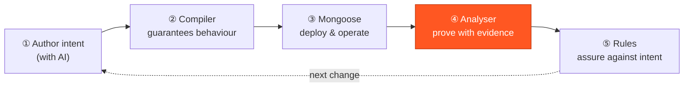
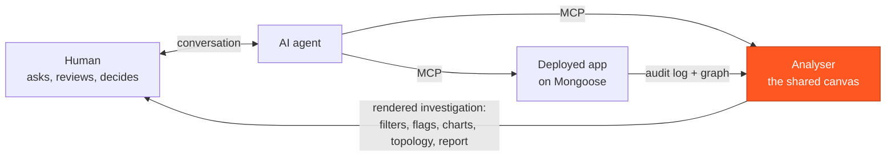

# The build-with-AI loop

Author intent with AI, and **prove the result with evidence** — on one deterministic substrate.

Fluxtion, Mongoose and this analyser form a closed loop for building high-assurance event-driven software
with an AI in the loop. You **author** intent, the compiler **guarantees** behaviour, Mongoose **runs** it,
and the analyser turns the audit into **proof**. The distinctive property: *the runtime that produces the
proof is the runtime that runs in production* — so the answer to "why is this number what it is" comes with
evidence, not a plausible story.

The loop turns the trust model of AI-written software from **generate → review → hope** into
**generate → prove**. Each stage runs on the same deterministic substrate, and each stage produces
evidence. And the analyser is where the two parties in the loop meet: it is the **shared research
canvas** the human and the AI work on together — the AI investigates and renders, the human reviews
(see [the canvas](#the-shared-research-canvas) below).

## ① Author — with AI

Fluxtion is unusually well-suited to being written by an LLM because it **separates authoring intent from
compiler-enforced behaviour**: you author nodes, wiring and audit fields; the compiler guarantees
determinism, audit and replay. The model reasons **locally, one ~30-line node at a time**, and never has
to hold the full topology in its head or worry whether the code is "deterministic enough" — the compiler
owns dispatch order and change propagation. Compile errors are directive (`use @AssignToField`,
`add @FluxtionIgnore`), so the model self-corrects in a tight compile/run loop instead of guessing.

See [Fluxtion — Build with AI](https://fluxtion-playground.dev/build-with-ai).

## ② Guarantee — the compiler

The AOT compiler takes the declared graph and emits a **total dispatch order**: one event handler fires
each reachable node **exactly once, in topological order**, so derived values never read inputs from mixed
generations (no glitches — structurally, not by convention). The same build wires in the **audit** and
makes the run **replayable through the identical `.class` files**. The behaviour is *guaranteed*, which is
what lets everything downstream be honest rather than best-effort.

## ③ Deploy & operate — Mongoose

[Mongoose](https://github.com/telaminai) is the runtime the compiled graph deploys into: connectors
(feeds and sinks), services, an admin surface, agent-group threading, and **composable processors** that
route deterministically across boundaries. New venues, feeds, or capabilities arrive as **plugins** — you
extend the system without touching the graph. This is where the authored, guaranteed graph becomes an
operable service, and where it writes the audit that the next stage reads. See
[Producing an audit log](producing-a-log.md).

## ④ Prove — the analyser

This is the stage this tool owns. The audit log is a **faithful projection of what actually executed**;
the analyser turns it into an answer **with evidence**:

- **Coverage against the declared graph** — including the paths that *didn't* run, so "nothing touched
  this value" is distinguishable from "I never observed it." See [Topology & step-through](user-guide/topology.md).
- **Real execution order and per-node attribution** — this node produced this value, at this point, on
  this event; not an order you invented.
- **Graph any value over time**, diff two cycles, and **click any log line to the exact source method**
  that wrote it. See [Graphs](user-guide/graphs.md) and [Source navigation](user-guide/source-navigation.md).
- **Let an agent drive it** — the [assistant](user-guide/assistant.md) plots the offending series, flags
  the culprit records and filters the view, over data you can click into and verify.

Crucially, this runs on the **deployed** runtime's audit, and a replay of that audit is **byte-identical**
— so the proof and the production run are the same execution. That is what makes a change an AI made
*proven*, not merely reviewed.

## The shared research canvas

The analyser is not a tool the AI uses *instead of* you, or one you use *instead of* the AI. It is the
surface both of you work on — a **shared research canvas**, with the human in the loop by construction.

- **The AI connects to the analyser through MCP** — the same verbs a person has, and nothing a person
  does not: open a log, filter, flag, chart, step the topology, write a report. Every one of them is a
  render into the canvas, and every one is reversible. See [the assistant](user-guide/assistant.md).
- **The AI connects to the deployed app on Mongoose** to fetch what the canvas needs — the audit log
  and the processor's graph — and, on a development server, to act on what was found (turn audit
  detail up, restart after a fix). Today that is an export the agent fetches and opens; it arrives as
  Mongoose's own MCP tool, so the server is driven through the client's per-call approval rather than
  from inside the analyser.
- **You interrogate the running system through the AI**, in your own words — *why is this number what
  it is? which nodes never ran? what changed between these two runs?* — and the AI does not answer
  with a paragraph. It answers **on the canvas**: it plots the offending series, flags the culprit
  records with its reasoning attached, filters the view to the window that matters, steps the cycle
  in the topology, and writes the account up as a report.
- **You review the investigation in the analyser, not in a chat log.** Everything the AI rendered is
  there to be clicked into and checked against the bytes the processor wrote — a flagged record opens,
  a plotted point resolves to its cycle, a coverage claim names the nodes. The AI's conclusion is a
  proposal on a shared surface; the human's judgement is what turns it into a decision.

Two disciplines keep that honest. The analyser **computes; the agent concludes** — the numbers come
from the log, never from the model. And the canvas **refuses to state more than is known**: a graph
that does not fit the log says so, an inferred order is never drawn as causality, and "did not run" is
only claimed when the log can prove it. An AI working on a canvas with those properties cannot quietly
overstate, because the surface it renders into will not let it.

!!! note "The instrument generalises"
    The same analyser has been pointed at a log from a **different engine** (a LangGraph trace translated
    into the audit format by a small adapter) and worked unchanged — and its discipline of *refusing to
    state more than is known* even flagged a node the adapter had fabricated, unprompted. What travels
    is not the file format; it is the refusal to overstate.

## ⑤ Assure — rules against intent

!!! info "Where this is heading"
    Stages ①–④ are shipped and run today. Stage ⑤ is the emerging edge of the loop.

Stages ①–④ prove that a change is **structurally and behaviourally** correct — coordination-safe,
glitch-free, effect-measured. The final stage proves it against **declared intent**: invariants and SOPs
expressed as **rules** — deterministic predicates over graph state, deployed as Mongoose plugins and
discharged by the *same* audit. Because the substrate is deterministic, a rule is just another node and
its evidence is automatic. The result is an **assurance case whose evidence is generated, not hand-authored
by a safety engineer**: axioms and goals at the top, rules as sub-goals, the audit and replay as the
evidence that discharges them.

## What you can and can't assure

Being precise about the boundary is the whole point of a tool that answers *with evidence*:

| Assured, with evidence | Still needs a human or a spec |
|---|---|
| The change is coordination-correct and **glitch-free** | Whether the computed answer is the **business-right** answer |
| The **measured effect** of the change (values, before/after) | Whether the **ruleset is complete** — which invariants are missing |
| **Coverage** — what ran and, equally, what didn't | Requirements the graph was never asked to satisfy |

The discipline that makes the proof trustworthy is the same one the analyser applies to a log: distinguish
**"no rule was violated"** from **"no rule covered this."** Assurance that can't tell those apart is worse
than none, because it is *trusted*. Structural correctness is proven; semantic correctness is argued
against a spec you still have to write.

## Why it matters

Every system that derives state from events has the same 3am problem: a number is wrong or surprising, and
someone reconstructs a *plausible* story from logs. This loop replaces that with a *proven* one. You author
with AI where AI is strong (local intent), the compiler removes the class of bugs AI is worst at (ordering
and concurrency), Mongoose runs it, and the analyser hands back the answer **with the evidence attached** —
over the same bytes your processor already writes down.

Ready to see the proof stage? Start with [Getting started](getting-started.md) and open the
[sample audit log](assets/sample-audit-log.yaml).
