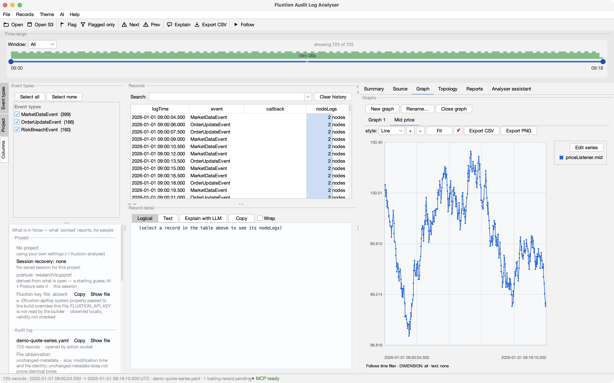

# From playground to analyser in 10 minutes

Download a runnable event-processing system, inspect its graph, run it, and let the analyser show
what the compiled processor actually did — on your machine, with code you can edit.

You need a **JDK 21+**. The project builds and runs with **no Fluxtion API key** because its generated
processor is committed. On a machine without Maven, the wrapper's first download also needs `curl` or
`wget`. A key is needed only when you deliberately regenerate after changing the graph.

## 1. Download the analyser bundle

Open the playground's [template gallery](https://fluxtion-playground.dev/start/templates), choose
**Audit analyser bundle**, click **Open starter**, then **Download ZIP** in the starter.

```bash
unzip audit-analyser-bundle.zip
cd audit-analyser-bundle
```

This is a complete Maven project, not a prebuilt application you cannot inspect:

| Path | What it is |
|---|---|
| `src/main/fluxtion/designer/application-context.xml` | the **graph definition** — nodes as beans, edges as constructor arguments |
| `src/main/java/com/example/myapp/generated/MarketProcessor.java` | the committed **generated processor**, which makes the ordinary build keyless |
| `src/main/resources/com/example/myapp/generated/MarketProcessor.graphml` | the exact topology emitted with that processor |
| `config/server-config.yml` | the Mongoose deployment: feed → processor → sink, with Chronicle audit capture |
| `.analyser/project.fluxtion-settings` | portable analyser context: source root, processor and runbook pointers |
| `.claude/skills/` | this project's run/export/stop and load-log procedures |
| `CLAUDE.md` / `AGENTS.md` | the context an IDE agent receives when it opens the project |

## 2. Inspect the graph before it runs

Start the analyser:

```bash
jbang analyser@telaminai/fluxtionauditlog-analyser
```

That command needs [JBang](https://www.jbang.dev/). The [install page](install.md) also gives the
plain `java -jar` route.

In the analyser:

1. Choose **File ▸ Open project…** and select the `audit-analyser-bundle` directory.
2. Choose **File ▸ Open GraphML…** and select
   `src/main/resources/com/example/myapp/generated/MarketProcessor.graphml`.

Opening the project loads its portable context, but deliberately does not guess which file you want
to inspect. Opening the GraphML is therefore an explicit second action. With no log yet, the Project
panel shows the source root, event processor and shipped runbooks that are already in force.


## 3. Run, export and stop

Start the server in one terminal:

```bash
./run-server.sh
```

It reads `data/input.txt`, dispatches five typed `PriceEvent` cycles through `MarketProcessor`, and
captures the cycles in Chronicle. While it is up it publishes
`~/.mongoose/servers/audit-analyser-bundle`, which is how the other lifecycle commands find the exact
server without a copied URL or token.

In another terminal:

```bash
./export-audit.sh     # writes logs/audit-audit-analyser-bundle.yaml
./stop-server.sh      # waits for process exit and registry removal
```

Export is a separate step because Chronicle capture and analyser-readable YAML are different formats.
The stop helper verifies the Java process and this project's exact jar before signalling it; success
means it observed both the process and registry entry disappear.

## 4. Read the exported run

Return to the analyser and choose **File ▸ Open log…**, then select
`logs/audit-audit-analyser-bundle.yaml`. If you restarted the analyser, open the project, GraphML and
log as three separate actions in that order: a project switch is a session boundary and intentionally
closes any previous log and graph.

The analyser now shows 23 records, the event types it found and whether the graph actually fits the
log. The screenshots in this section were generated from the real bundle staged under a neutral path.


Try these in order:

- Select **PriceEvent** in the Event types panel to remove lifecycle and control records from the view.
- Select a cycle and read `rootNode` followed by `riskCheck` in the logical detail. That is the
  processor's recorded dispatch order for the cycle.
- Check the pairing statement before treating an absent node as meaningful.
- Click a node log, then use **Source** to open the generated processor and node method that produced it.


The analyser can graph any numeric node-log value. The current bundle records the complete
`PriceEvent` under `rootNode.receivedEvent`, but does not yet write `price` as a separate numeric key,
so there is no honest bundle value to tell you to right-click in this release. The screenshot below
shows the same graph action on the analyser's anonymous generated DEMO run; the starter follow-up is
to log `price` separately and make this step executable rather than merely illustrative.



This exported YAML is a **fixed snapshot**, so do not turn on **Follow** and expect Chronicle events to
appear in it. Follow is for a local YAML log that another process is appending to. For this bundle,
export again after another run and reopen the resulting snapshot.

## 5. Ask an AI, then verify what it shows

Select one or more records and click **Explain**. With an LLM provider configured, the in-app assistant
can read around the selection and render findings back into the analyser as filters, flags and graphs.
Without a provider key, **Copy prompt** gives the same evidence and action protocol to another agent.


To let an MCP client work in this analyser window, use **AI ▸ Connect an AI client…**. The dialog
resolves the launcher for this installation and provides the exact client record; do not reconstruct a
hard-coded command from this tutorial.


The useful division of labour is strict: the analyser reads evidence and changes its own views; your IDE
agent edits code. After any explanation, click the plotted point or flagged record and follow it back to
the audit cycle and source.

## 6. Change the processor

Open the Maven project in your IDE. Its `CLAUDE.md`, matching `AGENTS.md`, vendored skills and Spring
authoring snapshot tell the IDE agent how this particular graph is defined and how to run it. Change a
node class, or edit `application-context.xml` to change the graph itself.

Regeneration is the one keyed step:

```bash
./mvnw -Pgenerate-fluxtion package
./run-server.sh
./export-audit.sh
./stop-server.sh
```

Put the key in `~/.fluxtion/fluxtion.apiKeyFile` as `apiKey=…`, or pass
`-Dfluxtion.apiKey=…` to that build. The compiler does **not** read `FLUXTION_API_KEY`, so exporting
that variable alone cannot satisfy regeneration. The ordinary build and run remain keyless.

Reopen the exported YAML and examine the new cycles. The analyser has one active log at a time; it does
not yet compare two complete runs side by side, so this tutorial does not promise that future diff tool.

## Do this on your own system

The bundle is a demonstration; the point is your processor:

- **[Produce a log](producing-a-log.md)** from your own processor.
- **[Open a project](user-guide/projects.md)** for your repository. **File ▸ New project…** offers
  source roots, skill-shaped runbooks and GraphML it finds, and adopts only what you confirm — plus an
  unchecked option to create a `CLAUDE.md` pointing at the canonical Fluxtion authoring docs, which is the
  one choice there that writes a file rather than recording a pointer.

The bundle exists so you can see the complete evidence loop work once before pointing it at something
that matters.
