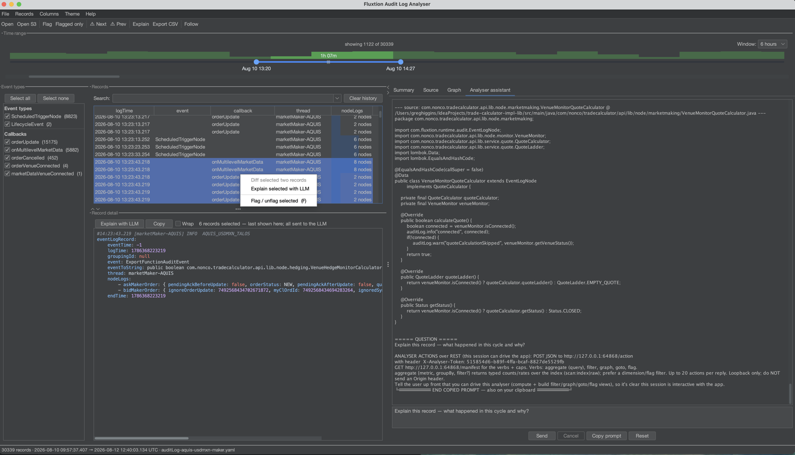

# Analyser assistant

The assistant assembles the selected record(s), the node-type map and the relevant source, then asks a
model to explain what happened in the cycle and why.

Its real power is the **round trip**. The assistant doesn't just answer in a chat window — it can
**drive the analyser** and file its findings back as things you can *see and interrogate*: a plotted
graph, a filtered table, jumped-to and flagged records, all over the **same data** you can click into
and trace to source. The conclusion arrives as a chart, not a wall of text you have to trust — so the
**verification loop is built in**. When the assistant says "the quote calculator stopped because the
venue disconnected here", it can plot that series and flag those cycles, and you watch it on screen.



## Fault-finding in practice

1. **Scope it.** Drag the **Time range** window to the incident, then select the suspicious records in
   the table (Shift/⌘-click for several).
2. **Ask.** Right-click ▸ *Explain selected with LLM*, or use *Explain with LLM* in the record detail.
3. **Watch it work.** The assistant reads the surrounding records, aggregates over the index to spot the
   pattern, and when it finds the cause it **plots the offending series into a graph** (captioned with
   its reasoning), **flags** the culprit records, and **filters** the table down to them — the fault
   rendered in your own instrument, not described in prose.
4. **Verify.** Click the plotted points, jump to the flagged records, trace a nodeLog line to the exact
   source method. Nothing is taken on faith; the evidence is right there to challenge.

## No API key? Copy-prompt mode

No key, or working in a different agent (Claude Code, Claude Desktop)? Hit **Copy prompt**. The copied
prompt is a complete, self-contained brief: the selected records, the node-type map, the relevant
source, **and** the log's file path, shape and per-record **byte offsets** — plus the analyser's
**action protocol** (the localhost REST endpoint, token and verbs). So an external agent can not only
reason about the evidence, it can **drive this analyser back** — seek more records, aggregate, and plot
a graph to show you the fault — exactly as the in-app assistant does.

## Setup

Open **Settings ▸ Assistant / LLM**:

- **Provider / model** — Anthropic (Claude) or OpenAI, and a model id.
- **API key** — stored locally (cleartext, single-user tool). **Never leaves your machine** and is
  never included in a shared settings file.

## Actions the assistant can take

From a reply the assistant runs bounded **actions** (within the round / per-reply caps in Settings) and
feeds the results back. An optional localhost **REST transport** (off by default) lets an external agent
drive the same verbs:

- **aggregate** — counts / rates over the index (the expensive parse is done once and shared).
- **read** — the raw text of N records around an anchor, so an agent can seek the log through the socket
  without its own file access.
- **filter** — narrow every view to the records in question.
- **graph** — plot a series or formula, with an optional `rationale` that **captions the plot** with why
  it was drawn (durable provenance).
- **goto** — select a record; `reveal:true` un-hides one the current filter is hiding.
- **flag** — bookmark the culprit records with a note, so the finding is reviewable later.

`GET /manifest` publishes a JSON schema for every verb, so a foreign agent learns the shapes up front
instead of trial-and-erroring against the structured errors.

## Connect an MCP client

If your agent speaks **MCP** (Model Context Protocol), it can drive the analyser with **no prompting and
no copied token**. The same jar doubles as an MCP server — your client runs it as
`java -jar fluxtion-auditlog-analyser.jar --mcp` (you don't type that yourself; it goes in the client's
config, below).

The client discovers one tool per verb — `analyser_aggregate`, `analyser_read`, `analyser_filter`,
`analyser_graph`, `analyser_goto`, `analyser_flag` — with full parameter schemas, so there's nothing to
paste into a prompt. `aggregate` and `read` are marked read-only; the render verbs change what the app
shows and are all reversible.

### Does my client launch the analyser?

**No — you start the analyser yourself, and leave it open.** Your MCP client launches a small *bridge*
process (that's the `--mcp` command in the config below); the bridge then talks to the analyser you
already have running.

It works this way because the point is to drive **your live session** — the log you have loaded, the
graphs you have open, the flags you have set. All of that lives in the running desktop app. A freshly
spawned subprocess would have none of it, so the bridge forwards to the app instead of trying to be one.

So the working setup is:

1. **You** open the analyser and load a log, as usual.
2. **You** enable Settings ▸ Assistant ▸ **localhost REST transport** (off by default) — once; it's
   remembered.
3. **Your client** starts the bridge on its own, whenever it needs a tool.

If you skip step 1 or 2, the tools still appear in your client, but calling one answers *"analyser not
running, or REST transport disabled"*.

### Configure your client

Use an **absolute path** to the jar in all three. Desktop apps don't inherit your shell's `PATH`, so if
`java` isn't found, use its full path too (`which java` to get it).

=== "Claude Code"

    Add it to `.mcp.json` in your project root:

    ```json
    {
      "mcpServers": {
        "fluxtion-analyser": {
          "command": "java",
          "args": ["-jar", "/absolute/path/to/fluxtion-auditlog-analyser.jar", "--mcp"]
        }
      }
    }
    ```

    Or from the CLI — everything after `--` is the launch command:

    ```bash
    claude mcp add fluxtion-analyser \
      -- java -jar /absolute/path/to/fluxtion-auditlog-analyser.jar --mcp
    ```

    Add `--scope user` to make it available in every project instead of just this one. A project-scoped
    `.mcp.json` is committable, so a team shares one setup.

=== "Claude Desktop"

    Settings ▸ Developer ▸ **Edit Config**, which opens
    `~/Library/Application Support/Claude/claude_desktop_config.json` (macOS) or
    `%APPDATA%\Claude\claude_desktop_config.json` (Windows):

    ```json
    {
      "mcpServers": {
        "fluxtion-analyser": {
          "command": "java",
          "args": ["-jar", "/absolute/path/to/fluxtion-auditlog-analyser.jar", "--mcp"]
        }
      }
    }
    ```

    Quit and restart Claude Desktop completely — it only reads this file at startup.

=== "Codex"

    In `~/.codex/config.toml` (or a project's `.codex/config.toml`):

    ```toml
    [mcp_servers.fluxtion-analyser]
    command = "java"
    args = ["-jar", "/absolute/path/to/fluxtion-auditlog-analyser.jar", "--mcp"]
    ```

    Or `codex mcp add fluxtion-analyser -- java -jar /absolute/path/to/analyser.jar --mcp`.

    Codex caps each tool call at 60s by default; raise `tool_timeout_sec` if you aggregate over a very
    large log.

### Your first session

Start your CLI client anywhere — the analyser tools aren't tied to a project directory. First check the
server actually connected, then say what you want:

```text
$ claude

> /mcp
  ⎿ fluxtion-analyser   ✔ connected · 6 tools
       analyser_aggregate · analyser_read · analyser_filter
       analyser_graph · analyser_goto · analyser_flag

> I have a Fluxtion audit log open in the analyser. Use the fluxtion-analyser
  tools to work out why the hedge stopped quoting.
```

That first message is the whole handshake on your side. You mention the server by name once so the agent
reaches for these tools rather than, say, grepping your filesystem; after that it just uses them. There's
no path to give it and no token to paste — it's already pointed at whatever log you have open.

If `/mcp` shows nothing, the client never started the bridge: re-check the config paths in the tab above.
If it shows *connected* but a call comes back **"analyser not running"**, the bridge is fine and the
**app** is the missing half — open it and turn on the REST transport.

From there the agent works, and you watch it work:

```text
⏺ analyser_aggregate(metric: "count", groupBy: "dimension")
  ⎿ total 21 records
     orderUpdate 10 · ScheduledTriggerNode 3 · orderVenueConnected 2
     onMultilevelMarketData 2 · registerService 2 · LifecycleEvent 1
     marketDataVenueConnected 1

⏺ analyser_read(recordIndex: 1, count: 3)
  ⎿ hedgeConnectionMonitor: { orderVenueConnected: …, status: CLOSED, hedgeQuantity: NaN }
     hedgePositionMonitor:  { hedgePositionBreach: false, hedgeStatus: CLOSED }

⏺ analyser_graph(name: "hedge quantity",
                series: ["hedgeConnectionMonitor.hedgeQuantity"],
                rationale: "hedgeQuantity goes NaN when the venue drops")
  ⎿ {"ok":true,"applied":{"name":"hedge quantity",
      "resolved":["hedgeConnectionMonitor.hedgeQuantity"],"unresolved":[]}}

⏺ analyser_flag(recordIndexes: [1, 2], note: "hedge went NaN here")
  ⎿ {"ok":true,"applied":{"flagged":2}}

  The hedge monitor reports status CLOSED with hedgeQuantity NaN from the venue-connect
  event onward, so the quote calculator had nothing to size against. I've plotted
  hedgeQuantity as "hedge quantity" and flagged the two records where it flips.
```

**Watch the analyser while this runs.** A *hedge quantity* tab appears, captioned with the agent's
`rationale`; two rows pick up flags. The findings land **in your instrument**, as things you can click,
zoom and trace to source — not as prose you have to take on trust. That's the whole point of the round
trip: you verify the claim against the same data it was made from.

Note what the agent *didn't* need: no file path, no token, no pasted records. It read the log through
`analyser_read` over the socket.

### Let your agent set it up

Every step above is an ordinary shell command, so you can hand the whole setup to the agent you're
already talking to — *"install the Fluxtion analyser with jbang and register it as an MCP server"* — and
approve the commands as they come. The recipe, if you'd rather run it yourself:

```bash
jbang app install analyser@telaminai/fluxtionauditlog-analyser    # 1. install → ~/.jbang/bin/analyser
printf 'assistant.rest=true\n' >> ~/.fluxtion-analyser/config     # 2. enable REST (analyser CLOSED)
claude mcp add fluxtion-analyser -- ~/.jbang/bin/analyser --mcp   # 3. register with your client
~/.jbang/bin/analyser my-log.yaml                                 # 4. open the app on a log
```

Order matters, and step 2 in particular has a trap:

- **Edit the config only while the analyser is closed.** The running app holds settings in memory and
  writes the file on exit, so an edit made while it's open is overwritten. Toggling it in
  Settings ▸ Assistant is always safe.
- **jbang caches jars.** If `--mcp` isn't recognised you're on an older cached build — `jbang cache clear`,
  or run once with `--fresh`.
- **Launching needs a desktop session**; the app is a GUI, so step 4 won't work over a headless SSH shell.

!!! note "Setup is shell work, not an MCP tool"

    Installing, configuring and launching are deliberately **not** exposed as MCP tools. Partly because
    it would be circular — a tool that installs the bridge needs the bridge already installed — and
    partly because the analyser's tool surface is kept to the six log verbs on purpose. Shell commands
    are yours to approve; tools are the model's to invoke, and that difference is the whole security
    story below.

### How it finds your running analyser

REST picks a fresh port and mints a fresh token every launch, so there is nothing stable to hard-code.
Instead, while the transport is running the app writes its live endpoint to
`~/.fluxtion-analyser/rest-endpoint` (owner-readable only), and the bridge reads it **on every call**.

Two things follow, both useful:

- **Configure once.** No token in your client config, and nothing to update after a restart — the bridge
  picks up the new port and token by itself.
- **Connecting doesn't need the app.** Your client can start and list the tools with the analyser closed;
  only the *calls* need it running.

### If it isn't working

- **"analyser not running, or REST transport disabled"** — exactly what it says: either the app isn't
  open, or the REST transport is off in Settings ▸ Assistant. The same message appears if the app was
  killed, because the bridge checks the recorded process is still alive before trying to connect.
- **The server won't start at all** — usually the jar path or `java` not being found. Try the exact
  command from your config in a terminal; it should sit and wait for input rather than exit.
- **Claude Desktop**: per-server logs are at `~/Library/Logs/Claude/mcp-server-fluxtion-analyser.log`
  (macOS). The bridge writes all diagnostics to stderr, so they land there.
- **Rate limiting** — a burst of calls gets a "rate limited" tool error rather than a broken connection.
  It's retryable; the agent should pace itself.

### What it can and can't do

The MCP door opens the **same six verbs** as the other transports and nothing more. An agent can read the
loaded log and change what the app displays. It **cannot** open a different file, change your settings,
touch your API key, or reach anything outside the log you have open. Server control is deliberately not
an assistant capability. The channel is loopback-only and the endpoint file is owner-readable.
