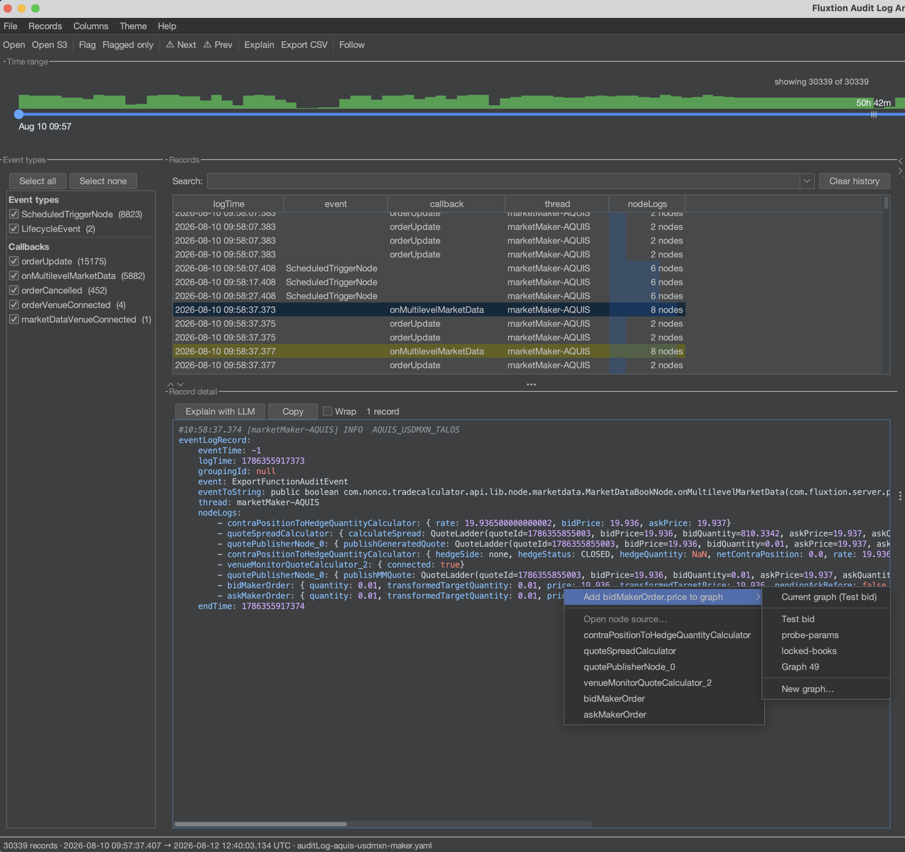
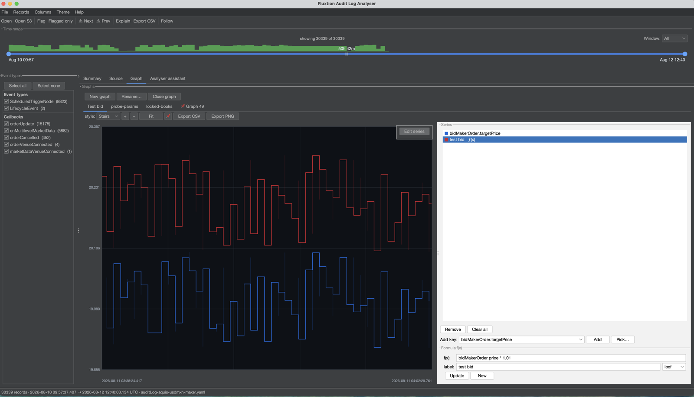

# Graphs

Plot any node value over time. Open the **Graph** tab; each graph is its own sub-tab (add several).

## Adding series

- Click **Edit series** on the plot to open the series panel.
- **Add key** — pick any `instanceId.key` numeric or boolean node value (booleans plot as ±1).
- Or **right-click an attribute** in the record detail view to add it straight to the current, a
  named, or a new graph.

The series key sits as an overlay on the top-right of the plot; right-click a label to remove it.



## Formula series — f(x)

Beyond raw keys, add a **derived series** from a formula over other keys, e.g.:

```
askMakerOrder.price − bidMakerOrder.price
```

- The **f(x)** field shows a **dropdown of matching keys and formula labels** as you type — ↓/↑ to
  move, Enter or Tab to accept, Esc to dismiss.
- Formulas can **reference other formulas** by their label.
- **Resolve policy**: *locf* carries each ref's last value (for cross-node formulas); *strict* only
  evaluates within a single record.



## Styling, zoom and pins

- **Style** — stairs (step), line or points.
- **Zoom / pan** — `+` / `−` / **Fit**, or drag to pan.
- **Pin** — 📌 fixes a graph to a time window so it stops following the shared filter.

## Export

- **Export CSV** writes the plotted series; **Export PNG** saves the chart image.

Saved graphs (names, series, formulas and pins) persist in your profile and reopen with the next log —
and can be shared, see [Sharing setups](sharing-setups.md).
