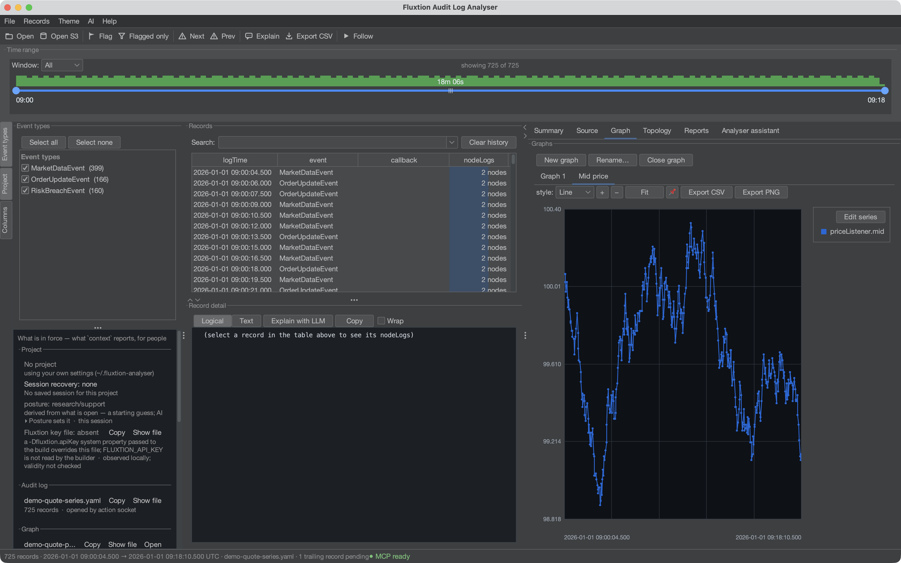
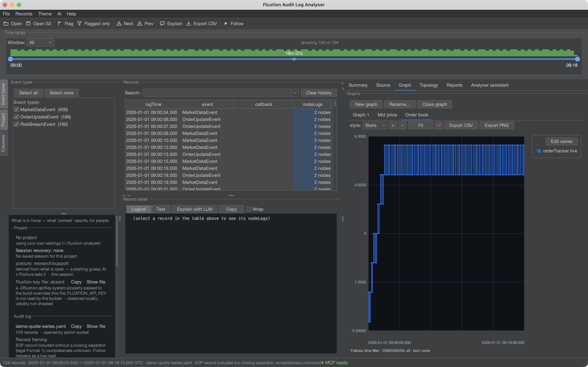

# Graphs

Plot any node value over time. Open the **Graph** tab; each graph is its own sub-tab (add several).

## Adding series

- Click **Edit series** on the plot to open the series panel.
- **Add key** — pick any `instanceId.key` numeric or boolean node value (booleans plot as ±1).
- Or **right-click an attribute** in the record detail view to add it straight to the current, a
  named, or a new graph.

The series key sits as an overlay on the top-right of the plot; right-click a label to remove it.



That is one node's `mid` across a few hundred cycles. Nothing was extracted or transformed to get it:
the value was in the audit log because the node logged it, and every point on the line is a record you
can click back to.

## Formula series — f(x)

Beyond raw keys, add a **derived series** from a formula over other keys, e.g.:

```
askMakerOrder.price − bidMakerOrder.price
```

- The **f(x)** field shows a **dropdown of matching keys and formula labels** as you type — ↓/↑ to
  move, Enter or Tab to accept, Esc to dismiss.
- Formulas can **reference other formulas** by their label.
- **Resolve policy**: *locf* carries each ref's last value (for cross-node formulas); *strict* only
  evaluates within a single record.
- **Conditionals** — a formula can judge its inputs: comparisons (`> < >= <= == !=`) and
  `if(condition, then)` / `if(condition, then, else)`, plus `and`/`or`/`not`. The two-argument `if`
  plots **only while the condition holds** — a false condition yields no data point, so

  ```
  if(askMakerOrder.price − bidMakerOrder.price > 0.004, askMakerOrder.price − bidMakerOrder.price)
  ```

  draws the spread only where it is in breach, with gaps everywhere else. An unknowable condition
  (a missing value) plots nothing rather than guessing a branch.
- **Rolling windows** — formulas can remember recent samples: `lag(x, N)` (the value N samples ago),
  `delta(x)` (change since the previous sample), and `mean` / `sum` / `rollingMin` / `rollingMax`
  `(x, N)` over the last N samples. A window fills before it speaks (no point until N samples), a
  non-numeric sample leaves it unchanged — which also means a full count window **holds its value
  indefinitely after the last contributing sample**: on a gated series like `mean(if(c, x), 10)` the
  plotted mean can be arbitrarily old once `c` stops holding (the time-windowed forms go empty
  instead; prefer them when staleness matters) — and it counts **samples, not time** — a quiet
  market makes a count window span more wall-clock, so for anything rate-sensitive prefer the **time-windowed
  forms**: `mean` / `sum` / `rollingMin` / `rollingMax` `(x, "5m")` (durations: `"250ms"`, `"5s"`,
  `"2m"`, `"1h"`) and `rate(x, "1m")` — the change per minute, scaled from however much of the minute
  the samples actually cover, so a filling window and a full one both read the true rate. A time window
  needs no fill (one sample answers; a `rate` needs two, separated in time), and old samples age out
  against each record's own clock.
  Zooming the time slider never changes a window's contents; only changing the dimension/text filter
  re-extracts.

  Conditionals and windows compose, and the order chooses the meaning:

  | expression | meaning |
  |---|---|
  | `if(c, mean(x, 10))` | mean over **all** samples, plotted only while `c` holds — gate the *output* |
  | `mean(if(c, x), 10)` | mean over **only** the samples where `c` held — gate the *input* |

## Thresholds and condition bands

A threshold worth investigating deserves to be **visible**, not interpolated by eye. A **guide** is a
labelled horizontal rule at a value (`0.004 — 4bp limit`), drawn against either scale, persisted with
the graph and exported with it.

A **condition band** shades the time intervals where a condition held —
`askMakerOrder.price − bidMakerOrder.price > 0.004` as a region you can see at a glance, rather than
gaps you infer. The *condition* is what's saved; its intervals are recomputed with the data, by the
same extraction pass as the series, so a band can never disagree with a plotted series about when the
condition was true. Both are agent-authorable through the `graph` verb (`guides:`/`bands:`).

## External series — plotting what the outside world did

The analyser never learns a foreign format: you (or an agent) adapt a FIX log, GC log or venue export
into a `(timestamp, value)` CSV, and *File ▸ Add series from CSV…* plots it beside the audit-derived
series. The dialog asks for the time/value **columns**, the **time format** and the **IANA zone** —
declared, never guessed, because a silently mis-read clock turns "the venue messaged us, then our book
moved" into its reverse. An optional **offset** applies a deliberate clock correction, always shown.

External series are visibly second-class, on purpose: marked *(external)* in the legend, **stamped on
the chart itself** (so every PNG/PDF says a foreign line is foreign), not clickable to records, and
saved as their *definition* — reopening reloads the file, and a missing file is reported while the
rest of the graph draws.

## Marker series — events on the chart

Values answer "what was it"; **markers** answer "what happened": fills, rejections, cancels drawn as
glyphs (▲ buys, ▼ sells) at their price, each carrying a **payload** — a client order id — shown on
hover. **Clicking a marker selects its record**: the marker is a signpost to the evidence, never a
substitute for it, which is also why payloads never enter formulas or filters. A moment with many
markers renders one glyph with a **×N count badge** rather than soup — the presence of hidden markers
is always visible. A marker's `y` can be a key, a formula, a plotted series to ride, or `axis` for a
tick lane under the plot; and hovering **any** series now snaps to the nearest actual sample
(`series · time · value`), with dense series answering their column's min/max range.

`when` decides where a marker fires, and the two forms differ in a way that matters: a **bare key**
(`orderTracker.orderId`) fires only on records where that key was actually logged — one marker per
event. A **condition** (`orderTracker.live > 0`) is evaluated against carried-forward values, so once
true it stays true on every following record until the value changes — a state, not an event, and
usually hundreds of markers where you expected a handful. Marking *occurrences*, use the bare key;
marking *a regime*, consider a [condition band](#thresholds-and-condition-bands) instead.

## Two scales

A revenue line reaching 2,000 and a stock level oscillating around 20 share a chart where the stock line
is a flat smear along the axis. Both facts are on screen and neither is readable — which is worse than
plotting them apart, because it looks like an answer.

Put the smaller series on the **right-hand scale** and both become legible against a shared grid:

```json
{"series": ["revenueLedger.gross", "stockLedger.onHand"],
 "rightAxis": ["stockLedger.onHand"]}
```

Two scales, not three: past two, a reader has to consult a legend to know what a height means, and the
chart has stopped being a picture.

## Explaining a chart

A plot says *what happened*. It never says *why that matters*, and that second half is usually lost with
the screenshot. Both are held with the graph and drawn **on** it, so they survive an exported PNG:

- **`explanation`** — a multi-line write-up in a box on the plot.
- **`notes`** — pinned to moments, numbered on the chart and listed beneath it. Anchor one with `at`
  (epoch millis) or `recordIndex`, whichever you have to hand.

```json
{"explanation": "Revenue is priced from the request, not from what the shelf could supply.",
 "notes": [{"recordIndex": 99, "text": "first oversell — shelf at zero, till still ringing",
            "series": "stockLedger.onHand"}]}
```

Notes landing on the same pixel column stack rather than overprinting, and `clearNotes` drops the pins
while keeping the write-up.

## Styling, zoom and pins



**Stairs** is the honest style for a value that holds between updates — an order count, a state, a
threshold. A line between two samples implies the value passed through everything in between, which for
`orderTracker.live` it never did.

- **Style** — stairs (step), line or points.
- **Zoom / pan** — `+` / `−` / **Fit**, or drag to pan.
- **Pin** — 📌 fixes a graph to a time window so it stops following the shared filter.

## Export

- **Export CSV** writes the plotted series; **Export PNG** saves the chart image.

Saved graphs (names, series, formulas and pins) persist in your profile and reopen with the next log —
and can be shared, see [Sharing setups](sharing-setups.md).

A series can also be started from the graph of the processor itself — right-click a node in
[Topology & step-through](topology.md) and pick one of the values it logged.
