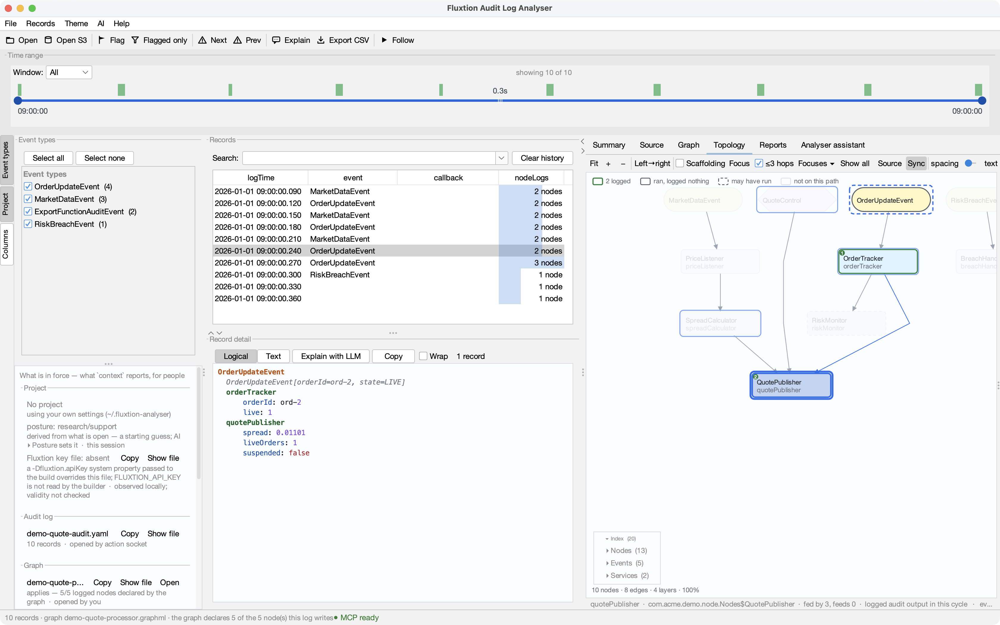

# The Project panel — what is in force

Seven things shape every answer the analyser gives you: which **project** is active, which **audit
log** is open, which **graph** is paired with it, which **event processors** are configured, and which
**source roots** the code is read from. Until now they were told in five places — the window title,
a status line the next message overwrote, the Topology header, and two dialogs. The **Project** panel,
on the left rail under *Event types*, states all five at once.

## What each section says

| Section | Row | Where it came from (the right-hand column) |
|---|---|---|
| **Project** | the profile's name and directory; *Copy* / *Show* the settings file; one row per **runbook pointer**, one for the **vocabulary** file (warning if missing), one per declared **environment** — see [Portable context](portable-context.md) | *project settings in force* — or *No project — using your own settings* |
| **Audit log** | the file you opened, as you named it (`s3://…` stays `s3://…`), records | *opened by you* / *opened by the action socket*, the system it came from, and **who said so** — *declared by the opener*, or the project environment that supplied it |
| **Graph** | the graphml, and the **pairing verdict**: *applies — 5/5 logged nodes declared*, or a warning that it does not fit this log | *opened by you*, or *supplied by the reader (declared / INFERRED)*; when two graphs were in play, which one won and why |
| **Event processors** | every configured class, the selected one marked, and whether its **source was found** under a root | *project* / *own settings* / *discovered under a root* |
| **Source roots** | each root | *project* / *own settings* / *demo (transient)* |
| **Analyses** | each saved analysis — its rationale, step count and the parameters it needs; recall is *File ▸ Run analysis* or `open {analysis}` — the panel only states the offer | *project* |
| **Reports** | where files leave — the assistant's exchange directory, or *File exchange off* with where to turn it on — and each **saved report** by title with its section count | the directory is *own settings* (a path on this machine, never shared); reports are *project* |

An empty section is a sentence, not a blank — *"No graph — File ▸ Open topology, or a reader may
supply one with its log"* — so you never have to go elsewhere to learn why it is empty.

## What it will and will not do

Every button on the panel **reveals or navigates**: *Copy* the full path, *Show* it in the file
manager, *Go* to the Topology or Source tab, *Settings…* for roots and processors. Nothing on it closes,
switches or edits — those stay in the File menu and Settings, so the panel is a display you can trust.

Paths are drawn abbreviated (`~/…/build/x.graphml`); the full value is the tooltip and what *Copy*
copies. That keeps the column readable, and it keeps an incidental screenshot from carrying every path
on your machine.

## It is `context`, for people

The panel is built from the same payload the assistant's `context` verb returns — it reads nothing
else. So when you and an agent connected over MCP look at the same session, you are reading the same
facts, and a fact the panel lacks is added to `context` first. The keys it draws are `project`
(`name`, `root`, `settings`), `log` (`openedFrom`, `openedBy`, `records`), `provenance`,
`graphPairing` (`graph`, `graphSource`, `graphPath`, `applies`, `declaredByGraph`, `loggedNodes`,
`verdict`, `sourceGraphOffered`, `sourceGraphNote`, `auditLogging`, `auditLoggingNote`), `processors` (`class`, `selected`, `source`,
`from`), `source.rootTiers` (`path`, `tier`), `exports` (`enabled`, `dir`) and `reports` (`name`, `title`,
`sections`, `from`).

## Layout

The panel and *Event types* share the left column in a vertical split; drag the bar between them.
The whole column is draggable too — the edge between it and the records table — and both toggles on the
rail hide their panel. Every one of these choices persists.
