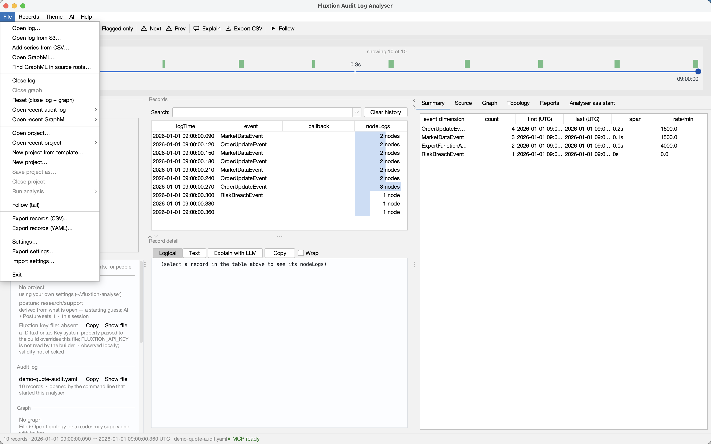
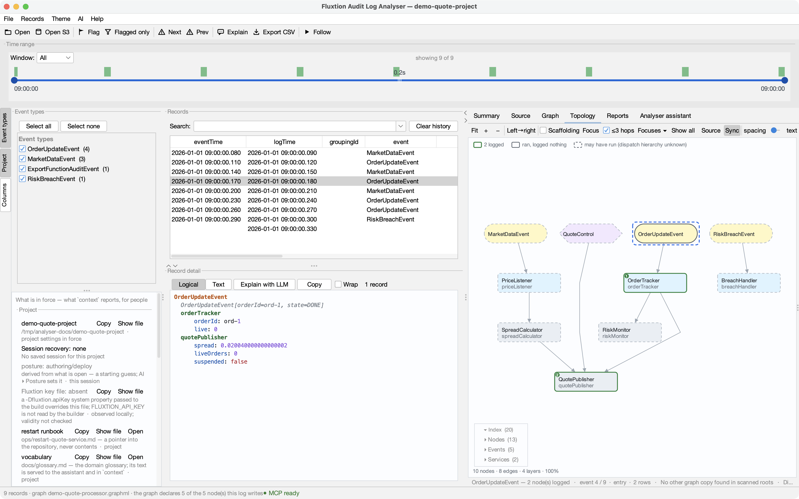

# Working across projects

If you support more than one Fluxtion application, you keep swapping the same five things: source roots,
Maven repos, event processors, saved graphs and hidden columns. A **project profile** holds those in a
file beside the project, so moving between them is one click instead of a re-import.

## The two tiers

| Tier | What's in it | Where it lives |
|---|---|---|
| **Machine** | LLM API key · LLM provider/model · AWS profile/region · theme · recent files · window size · assistant settings · topology display prefs | `~/.fluxtion-analyser/config` |
| **Project** | **source roots · Maven repos · event processors + selected · saved graphs · hidden columns** | `<project>/.analyser/project.fluxtion-settings` |

Nothing appears in both, which is what keeps this simple: there's no "which one wins" rule to remember.
Switching a project swaps the project row and leaves the machine row alone — your key, your theme and
your window stay exactly as they were.

The separate **Fluxtion processor-build key** lives in `~/.fluxtion/fluxtion.apiKeyFile` and is managed
from **AI ▸ Fluxtion API key…**. It is not an analyser setting and cannot enter a project profile. The
Project panel can report whether that canonical file has a configured key, but it cannot know whether a
future Maven build will receive an overriding `-Dfluxtion.apiKey`; it states that precedence rule rather
than guessing a winner.

With **no project open**, the analyser behaves exactly as it always has. Project profiles are opt-in.

## Opening and switching

Project actions are a group of their own. The items above them open a *file to look at*; these change
*which project's settings are in force*. **Save project as…** and **Close project** are greyed out until
a project is open.

**File ▸ Open project…** — pick the project directory, or its `.fluxtion-settings` file directly.

- **File ▸ Open recent project** — the last ten, most recent first.
- **File ▸ New project…** — chooses a directory, then offers the Java source roots, `SKILL.md` runbooks
  and GraphML it can already see there. Every box starts off: finding is not adding. Confirm only the
  facts this analyser should adopt; an empty directory produces an ordinary empty offer and can still
  become an empty profile. It never inherits whatever you happened to have open, or "new project"
  would just be a slow way to copy one.
- **File ▸ Save project as…** — forks the current settings to another project, which becomes active.
- **File ▸ Close project** — returns to the settings you had **before you ever opened a project**.

With a project open, its name sits in the window title — so *which settings am I using right now* is
never a guess.

### The day-two journey

After trying a prepared example, use **File ▸ New project…** on your own repository. The one offer is
the hand-off from demo to real work:

1. review the detected `src/main/java` roots (including one-level Maven modules);
2. choose any project-owned skills that should become declared runbook pointers;
3. optionally choose one discovered GraphML topology to open;
4. confirm once. Only those checked facts enter the new profile.

The scans are bounded and skip build output, dependencies and symlinks. If a safety cap is reached the
dialog says the offer is partial rather than presenting it as the whole repository.

!!! info "Switching replaces, it doesn't merge"

    Open project B while A is active and A's source roots are **gone**, not listed underneath B's. That
    is the whole point: importing one project's settings on top of another's is how you end up with
    four projects' source roots and no idea which is which.

    A profile that mentions no graphs leaves you with no graphs — the replace covers every project
    category, not just the ones the file happens to contain.

!!! note "Switching a project closes the log and graph"

    A profile owns your source roots, event processors, named graphs, focuses and reports. Swap it
    and all of those change underneath whatever you were looking at, so the log and its topology are
    closed with it — otherwise you'd be reading one project's log through another's settings.

    The exception is accepting the *"this log sits inside a project"* offer: there the project is
    adopted **because** you opened that log, so the log stays.

## Your own settings are kept

The first time you open a project, the source roots and graphs you had are **not** deleted. They become
your "no project" settings, and **Close project** brings them back. A year of accumulated configuration
is not something a single click should consume.

## Edits save as you make them

There is no **Save project**. Change a source root, add a graph, hide a column — it persists to the
active project, the same way the analyser has always saved its config. Writes are **debounced**, so a
burst of edits becomes one write rather than fifteen; a profile is often a committed file and a legible
diff is what gets it reviewed.

This includes edits made by an **assistant over the socket**. If an agent adds a source root with
`analyser_source_root`, that lands in the active project like any other change.

## Committing a profile to your repo

`.analyser/project.fluxtion-settings` is designed to be committed, like `.vscode/settings.json`. Clone
the repo, open the analyser, and the project's source roots, event processor and curated graphs are
already configured.

!!! success "Why it's safe to commit"

    **A profile cannot contain either your LLM API key or your Fluxtion build-key value.** The LLM key
    is outside the project tier, while the build key never enters `AppConfig` at all: its dialog writes
    straight to the established local Fluxtion file and then forgets the value.

    The same holds for your AWS profile, your theme and your window size: all machine-tier, none of them
    written to a profile. And paths under your home directory are stored `~`-relative, so a teammate's
    checkout resolves them on their own machine.

    A path that is neither absolute nor `~`-prefixed is **relative to the project root** — the directory
    that holds `.analyser/` — so a hand-written `sourceRoot.0=src/main/java` means what it says, the way
    it would in `.vscode/settings.json`. The analyser writes the file the same way: paths under the
    project come out project-relative, and there is no timestamp, so opening a project and changing
    nothing leaves the committed file **byte-for-byte as it was**. A diff in that file means a setting
    changed.

Treat a committed profile as config-as-code: it evolves, and the diffs are worth reviewing like any
other change.

## Opening a log inside a project

Open an audit log that sits anywhere under a project directory and the analyser offers to load that
project. This is what makes a downloaded example configure itself — get the bundle, open its log, and
the source roots and graphs are set up without touching Settings.

It asks **once per log**, never for a project that's already open, and takes "no" for an answer for the
rest of the session. Opening a log from `s3://` never triggers it: the object is streamed to a temporary
file, and a temp directory isn't a project.

## From an agent

An assistant working over the [action socket](assistant.md) sees the same offer as data —
`context` reports `projectOffer` with the settings path — and accepts it with
`open {project: "<that path>"}`; the same call opens any project by directory. It also reads which
project is in force (`context.project`) and leaves one with `open {close: "project"}`.

The verb **applies rather than asks**, because a question nobody can answer over the socket would
freeze the app. What makes that safe is the answer it gives back: every project-owned category with
its count before and after the switch, the log and graph it closed and where they were (an explicit
switch is a session boundary, exactly as it is from the File menu), the project that was active before,
and the one call that undoes it. Your MCP client's own approval prompt on `open` is where a human says
yes or no.

## Import: merge or open?

**File ▸ Import settings…** now asks which of two different things you mean:

| Choice | What it does | Use it when |
|---|---|---|
| **Merge (share)** | *Adds* the file's settings to what you have now | A colleague sent you their setup and you want their graphs alongside yours |
| **Open as project (replace)** | *Replaces* the project tier and makes the file the active project | The file is a project, and you want to work in it |

These used to be one action, which is why setups piled up. See
[Sharing setups](sharing-setups.md) for what a shared file contains and what it can never contain.

## If a project moves

If the active project's file is gone — repository renamed, checkout deleted — the analyser starts
normally, says so in the status bar, and forgets the pointer. It never fails to open because of a
project, and your machine settings are untouched.
