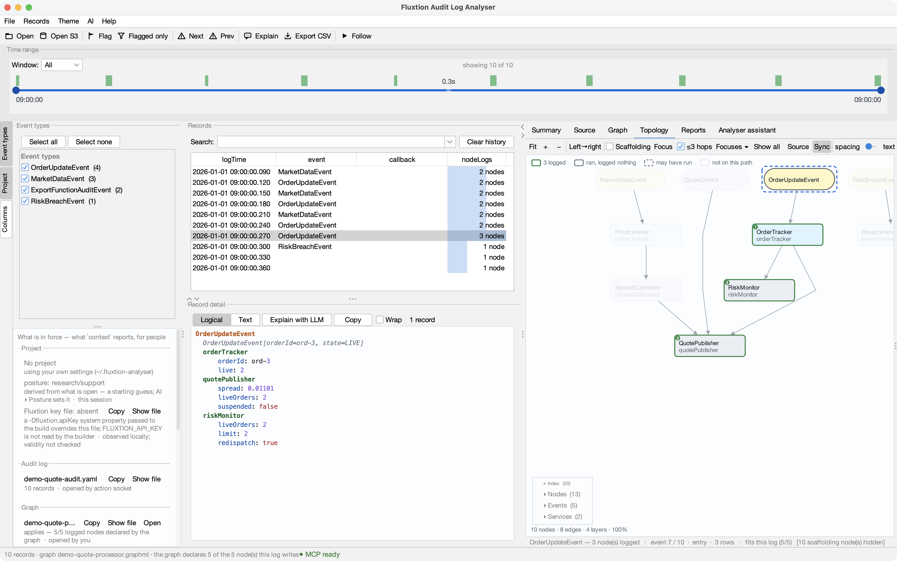
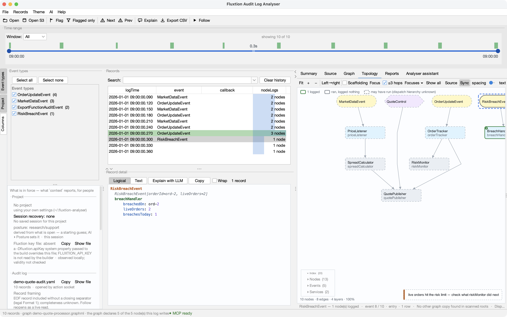

# Records, detail & filtering

These are the core surfaces — the ones you spend most time in. They're all **views over the same
Fluxtion audit log**: the log is the source of truth, and the table, detail viewer, search, filter,
summary, graphs and assistant are just different lenses on it. Narrow the view once and everything
follows.

The main window at a glance:

- **Time range** (top) — a histogram + slider that bounds the visible window.
- **Event types** (left rail) — the dimension checklist that filters the log.
- **Records** (centre) — one row per cycle, with the search box above it.
- **Record detail** (below the table) — the selected record's `nodeLogs`.
- **Right-hand tabs** — Summary, Source, Graph and the Analyser assistant.
- **Status bar** (bottom) — record count, time span and the open file.

## The records table

One row per **event cycle** (one propagation of the processor). Columns include the log time, the
event, the callback, the thread and a node-count.

- **Sort** by clicking a column header; **show/hide** columns from the **Columns** menu.
- **Select** a row to load it into the detail viewer; Shift/⌘-click to select several (the assistant
  sends all of them).
- **Anomaly tints** — rows with a parse-error, a breach or a `NaN` are highlighted; jump between them
  with **⚠ Next / ⚠ Prev** (**F3 / Shift+F3**).
- **Right-click** a row: *Diff selected two records*, *Explain selected with LLM*, *Flag / unflag*.
- **Flag** rows with **F** to bookmark findings; *Records ▸ Show flagged only* focuses on them;
  *Records ▸ Copy selected as YAML* copies them to the clipboard.

## Flagging & focus

Flagging turns the log into a working set of findings. Press **F** (or *Records ▸ Flag / unflag*, or
right-click ▸ *Flag*) to bookmark the selected rows — flagged rows are **tinted** so they stand out in
context.

Toggle **Flagged only** (toolbar) to collapse the table to just the flagged records — a focused view of
everything you (or the assistant) marked as relevant, while the counts and time range still reflect it.
*Records ▸ Clear all flags* resets them.

Because flagging is also one of the assistant's [actions](assistant.md), an agent's findings land here
as flags too — with a note attached — so its conclusions become a reviewable set in your own view, not
just text in a chat.

## The record detail viewer

Below the table, the selected record's **`nodeLogs`** in colourised YAML — the ordered list of every
node that ran in that cycle and the values it logged.

- **Click a nodeLog line** to open that node's source at the method that ran (needs
  [source roots](../getting-started.md#source-roots)).
- **Click the event / `eventToString`** line to jump the Source view to the processor's handler for the
  cycle.
- **Right-click anywhere on a node line** to add any of its values to a graph — current, named, or new.
- **Copy** the shown record(s); toggle **Wrap** (off by default).

## Search

The search box above the table is a **full-text filter** over `eventToString`, `thread` **and** the
node-logs (case-insensitive). It combines with the other filters. Enter remembers a term (dropdown +
inline autocomplete); **Clear history** empties the saved terms. On a memory-mapped multi-GB log a text
search reads records from disk, so it's slower than the index-backed dimension/time filters — the
assistant's `aggregate`/`filter` echoes report `scan: index | raw` so you know which happened.

## The shared filter

One filter scopes **every** view at once — table, summary and graphs all honour it:

- **Time range** (top slider) — drag the two thumbs to bound `logTime`; drag the middle to pan the
  selection keeping its width; double-click to reset. Shrink the visible window with the **Window**
  control (All / week / day / hours / minutes) and pan it across the whole log.
- **Event types** (left rail) — tick the dimensions to keep (an **OR**). The list is split into
  **Event types** and **Callbacks**; use **Select all / Select none**, or right-click an entry for
  *Only this / Add / Remove*. **Select none** clears the view; leaving everything ticked means "all".
- **Search** — the text filter above.

Because there's one filter and one log, the assistant can **drive these same controls** — filter to a
window, jump to a record, plot a series — and you see the result in the very views you're already
reading. See the [Assistant](assistant.md).

## Summary

The **Summary** tab rolls the *currently filtered* records up by event dimension with counts, first/last
times, span and rate. **Right-click** a summary row to filter the whole app by that dimension
(*Filter to / Add / Remove*) — a fast way to drill in.

## Diff

Select **two** records and *Diff selected two records* (Records menu or right-click) for a side-by-side
comparison of the two cycles.

Each record is flattened to `instanceId.key → value` (last occurrence within the record wins) and the
two are aligned key-by-key. Every row is classified and colour-coded:

- **changed** — the key exists in both records with different values (highlighted),
- **only A** / **only B** — the key appears in just one of the two records,
- unchanged rows are shown plain, so the differences stand out.

A header reports the total **difference count**, and you can **export** the whole diff as **CSV**,
**JSON** or **PDF** from the buttons along the bottom.

This is how you catch what moved between two cycles — e.g. a price, a quote id or an order state that
changed one propagation to the next — without eyeballing two raw blocks of `nodeLogs`.

Selecting a record also drives [Topology & step-through](topology.md): the nodes that fired in that
cycle light up on the processor graph, in dispatch order.
