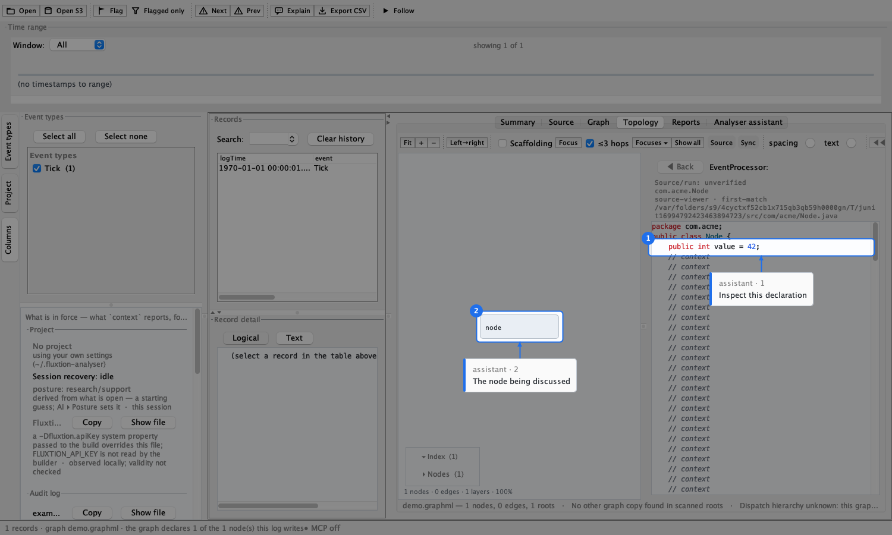

# Source navigation

Jump from a log line straight to the code that produced it.

## Source roots & Maven repos

Open **Settings ▸ Source roots** and add the source directories for your processor and its node classes.
The analyser also searches your local **Maven repositories** (default `~/.m2/repository`) for
`*-sources.jar` when a class isn't under a source root — so third-party node sources resolve too.

A root or repo that can't be found shows **red** in Settings.

## A pane shows the file as it is on disk

Every navigation to a class re-reads its file, even when the pane already shows that class, so a
processor rewritten by regeneration is not left on screen in its old form. This applies to the Source tab
and to the source pane inside the Topology tab. Reopening a log or graph, or bringing a source pane back
into view, rechecks what both panes show. Files are read in the background: while a read is in progress,
the pane's header says its text is not yet rechecked, and a read that takes too long says so rather than
blocking the window. A class whose file has gone is not shown in its former form; the header says it was
shown before. Clicking a node to open its class uses the processor as it is on disk now, so after a class
rename it opens the new class. Being current with disk is not the same as matching the run: the header's
tooltip still reads **Source/run: unverified**, with the file and its SHA-256.

Until a source pane has read the selected processor after a configuration change, the analyser does not
read it on the window's own thread to answer other questions: `context` omits node types and says
`processorModel: not yet read`, and a design bean without a class says `classLookup: processor source not yet
read`. When two panes read the processor, the answer from the later request wins even if the earlier one
arrives last. Source reads share a pool of two workers with a short queue: a newer request cancels and
removes an older one that has not started, and a read that times out says so in the pane. A read that is stuck
on an unresponsive disk and ignores cancellation keeps its worker until it returns, so two such reads can
occupy both workers; further reads then time out and say so. A node you asked to open says why it did not.
Ctrl-click on a type checks that it has source in the background, within the same time limit; a newer click or
navigation supersedes it, and a check that runs out of time never opens anything later. **Back** returns to the last file you actually saw: a "not found" pane is
not added to the history.

## Spring design and file glances

**Sources ▸ Open design…** selects the session's Spring XML. Add its directory to source roots first;
opening a project alone grants no file access. **Source ▸ Design** shows highlighted XML, a bean/config
index, **Follow design**, **Show node** and **Show records**. The latter opens the first record logging the
selected bean's name. Record and topology context menus offer **Show declaration**. These links are
matched by name and always marked **relationship unverified**.

An AI client uses `open {design: "src/main/resources/design.xml"}` for the session file and `source` for
a glance. Accepted shapes are `{file}`, `{file,line}`, `{line}`, `{bean}`, `{file,bean}`, `{fqn}` and
`{fqn,method}`. Mixed selectors are refused. A glance re-reads disk and joins the Back history without
changing the session design. This verb reads XML/Java under authorised local roots; it does not search
Maven jars. Paths may be absolute or project/root-relative. Ambiguous files or bean ids are refused.

Follow works with no log open. During an incomplete XML edit it keeps the last good render and shows the
parse error; an initially malformed file is visible as text with no bean index. Each parsed revision has a
SHA-256 identity. `source:design`, `source:design:bean:<id>` and `source:design:line:<n>` spotlights always
refer to the **session** design, even after a glance at another file. An edited bean's caption is qualified;
a removed/duplicate bean or an edited line anchor goes out. Cross-tab targets are shown in sequence.

The `source {bean}` echo's `records` is a preview count over `recordsScanned` records; `recordsExact` says
whether that covers the whole log. It never proves that this XML produced those records. File reads are
limited to 2 MiB, UTF-8. The analyser never evaluates Spring or writes the source files.

See [Spring authoring](../spring-authoring.md#view-design-and-producer-findings) for diagnostic intake and
the distinction between XML input freshness and a relationship to a run.

## Event processor

The **Source** tab renders the selected `EventProcessor`. Selecting a record scrolls the processor to
the method that dispatches that record (its callback), so you land on the code that ran.

## Click-through

- **Click a node line** in the record detail to open that node's class at the relevant method.
- **Ctrl/⌘-click** an identifier in the source to navigate: a node field's `receiver.method()` opens
  that node's class at the method; a field opens its type; a Type opens its source.
- **◀ Back** (Alt+Left) returns to the previous source.

Navigation resolves through the processor's field declarations, so it works from any file — the
processor or a node class.


## Point at Java beside the graph

An assistant can light a named Java document with `source:java:<fqn>`, or a one-based logical line with
`source:java:<fqn>:line:<n>`. Line numbers follow the editor: a trailing newline creates one final empty line that can also be
anchored. Read the actual source before choosing a line number. There is no implicit
current-file target or node-to-source inference.

For example, after inspecting `com.acme.Node`, send one `spotlight` call:

```json
{
  "targets": [
    {"target": "topology:node:node", "caption": "The node being discussed"},
    {"target": "source:java:com.acme.Node:line:3", "caption": "Inspect this declaration"}
  ]
}
```

With a topology target in the set, the analyser opens the embedded Java viewer and keeps the graph
visible. Otherwise it uses that viewer when Topology is already selected, or the Source tab. A set can
name only one Java document; unavailable source and out-of-range lines refuse before revealing anything.



This recorded image uses a constructed one-node fixture under an isolated home and predates the
Project / Sources / Audit log menu layout. The Java spotlight behaviour shown is unchanged.

The source label and echo state **source-viewer · first-match · relationship unverified**. They disclose
the chosen file/root or archive/entry and the SHA-256 revision of the rendered text. This identifies the
source you can inspect; it does not establish that a loaded run used it or that the lit statement ran.
The caption is the assistant's commentary.

The two source entrances intentionally differ:

| Situation | Java spotlight / viewer | `source {fqn}` glance |
|---|---|---|
| Two roots contain the same FQN | First configured matching root, disclosed | Refuses ambiguity |
| Source exists only in a local sources jar | Uses it if archive lookup is enabled | Refuses; roots only |

Check the disclosed origin before transferring a line number from a glance to a spotlight. Repeating
the Java spotlight rereads hits and misses, including changed entries in known jars. Adding a new sources
jar requires source reconfiguration or restart because jar discovery is cached. No archive is downloaded.
A slow read refuses after ten seconds with “source lookup still running; retry”; its late completion
cannot light a target. The built-in bridge allows sixty seconds; a client with a shorter private timeout
may give up earlier.

A Java line band spans all wrapped rows and clips to the visible text viewport. `partial: true` says
some of a measurable logical line is outside the viewport. If no band can be measured, `partial` is
omitted; remeasurement puts that target out. The whole-document target lights only the visible
text viewport, not its controls. Design XML keeps its different released rule: a line/declaration band
must be wholly visible, while `source:design` means the whole design panel.

Scrolling, resizing or changing wrap remeasures a spotlight or puts it out. Changing the displayed Java
revision extinguishes its old captions; they never move silently to the same line number in new text.
Click, Escape and `spotlight {clear: true}` dismiss them. Nothing is saved.
