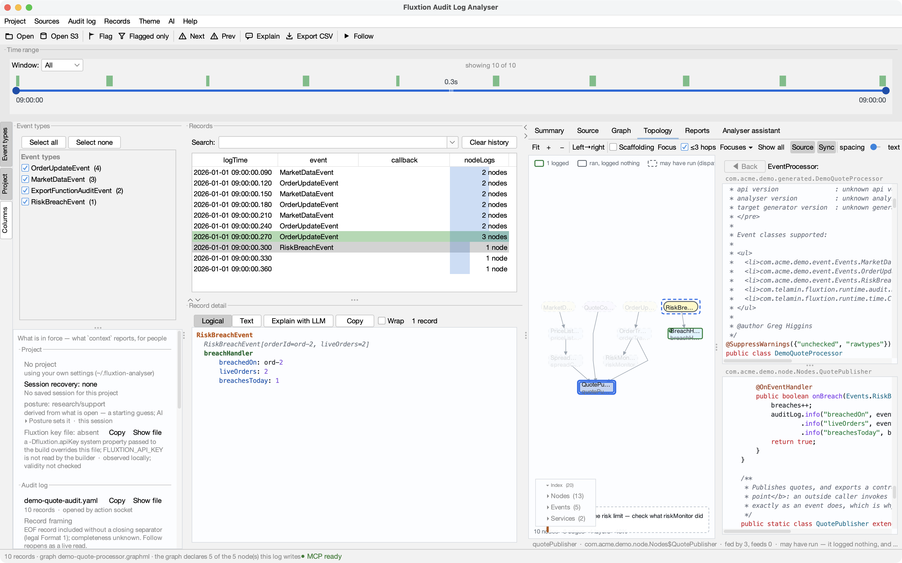

# Source navigation

Jump from a log line straight to the code that produced it.

## Source roots & Maven repos

Open **Settings ▸ Source roots** and add the source directories for your processor and its node classes.
The analyser also searches your local **Maven repositories** (default `~/.m2/repository`) for
`*-sources.jar` when a class isn't under a source root — so third-party node sources resolve too.

A root or repo that can't be found shows **red** in Settings.

## Event processor

The **Source** tab renders the selected `EventProcessor`. Selecting a record scrolls the processor to
the method that dispatches that record (its callback), so you land on the code that ran.

## Click-through

- **Click a node line** in the record detail to open that node's class at the relevant method.
- **Ctrl/⌘-click** an identifier in the source to navigate: a node field's `receiver.method()` opens
  that node's class at the method; a field opens its type; a Type opens its source.
- **◀ Back** (Alt+Left) returns to the previous source.

Navigation resolves through the processor's field declarations, so it works from any file — the
processor or a node class.

