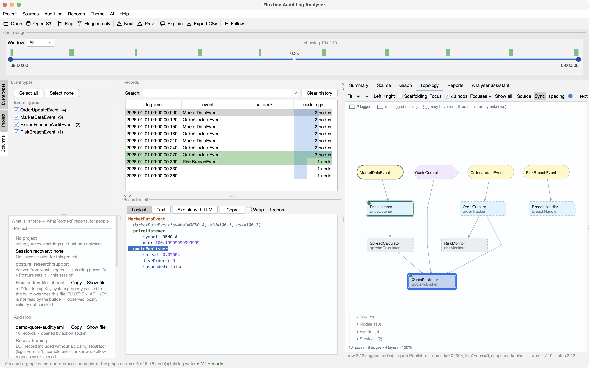
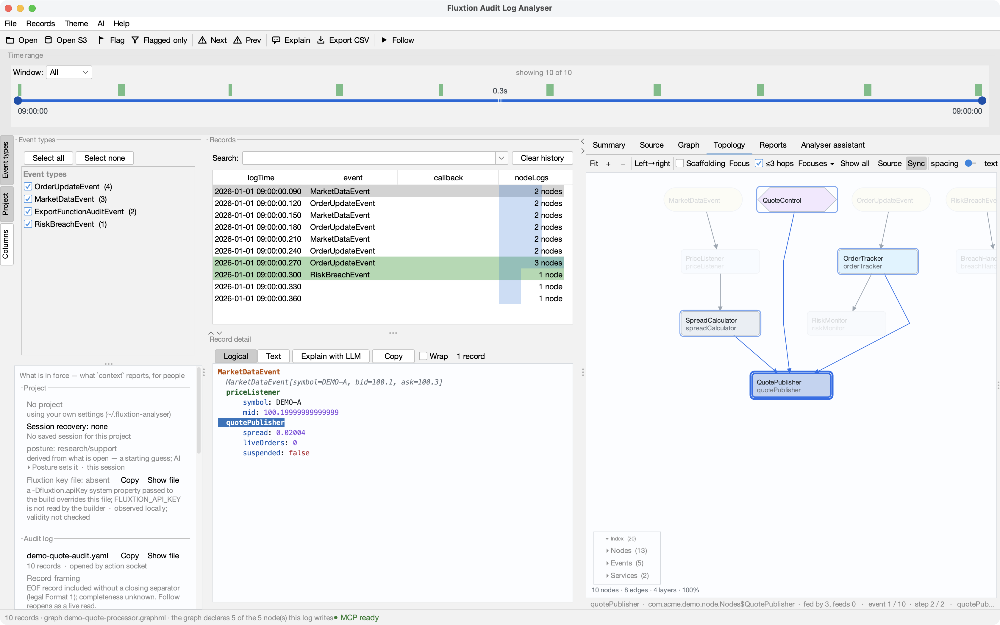

# Topology & step-through

The **Topology** tab draws the processor's node graph and shows what a cycle did to it. The log tells
you which nodes *logged*, and in what order; the graph tells you how they are wired — and therefore what
the log implies about everything that stayed quiet.




A `MarketDataEvent` arrived. Two nodes **logged** — `priceListener` ① and `quotePublisher` ② — and the
rest of the graph is shaded by what the log actually supports, which is not the same as what ran.

Look at `spreadCalculator`, sitting between them with a **dashed** outline. It certainly executed: the
spread it computes is in `quotePublisher`'s log line. It simply writes no audit output of its own, so the
log never mentions it. The order-handling branch is faded because a market-data event cannot reach it.

!!! danger "No audit entry does not mean the node didn't run"

    A node appears in `nodeLogs` only if it **writes** audit output, and only at the audit level in
    force. Plenty of nodes execute silently. So the tab never colours a node "didn't run" — it shows
    four different claims, and says which is which:

    | On screen | What it means |
    |---|---|
    | **green ring + number** | **logged** — it wrote audit output, and the number is its dispatch position. The only thing directly observed. |
    | **solid outline** | **ran, logged nothing** — it is the *only* way into something that ran, so dispatch had no other route. Certain. |
    | **dashed outline** | **may have run** — connected to something that logged, but the log cannot say whether dispatch reached it. A genuine unknown. |
    | **faded** | **not on this path** — nothing that logged is connected to it. |

    The distinction between the last two matters: a node with several parents only needs *one* of them
    to have fired, so its other ancestors are unknowns, not certainties. Hover any node and it tells you
    in words.

    "Ran, logged nothing" is only claimed when the log says how the cycle started. A record that isn't
    event dispatch at all — a startup callback, say — makes no such claim, because nothing upstream ran
    to cause it.

!!! tip "Turn the guesswork off: build with node-invocation tracing"

    If the processor is built with an audit **level** — `cfg.addEventAudit(LogLevel.TRACE)` — Fluxtion
    emits an `auditInvocation(...)` call before every node it invokes, so **every node that runs logs a
    `method` entry** whether or not it makes `auditLog` calls of its own. The runtime level then gates
    whether those fire, so you can raise it on a live processor to get the detail.

    The analyser detects such a record and stops hedging: the log is now a complete list of what ran, so
    a node's absence is **proof it did not run**, and the legend changes to say exactly that. All the
    "may have run" shading above exists because most production logs aren't traced — not because the
    distinction is unknowable.

## Open a topology

Fluxtion emits a `.graphml` for the processor when it builds — typically beside the generated processor
source in your build output. Three ways in:

- **File ▸ Open GraphML…**
- **File ▸ Open recent GraphML** — kept separately from recent logs, so you're not scrolling past logs
  to find a graph
- **drag the `.graphml` onto the window** — it routes to the Topology tab by extension, and dropping a
  log and a graphml *together* opens both: the cycle and the graph it ran on, in one gesture

Whatever was open when you quit is reopened next time, alongside the log — as are the zoom, pan,
orientation, spacing and label size. (**Settings ▸ History ▸ Reset topology view** puts those back.)

You don't need a server for any of this. The graph is a file, the log is a file, and the analyser works
on both offline — which is the point when you're supporting a system whose logs were shipped somewhere
else days ago.

!!! warning "Check it's the same build"

    A topology from a *different* build of the processor renders perfectly and misleads silently. The
    status line tells you what it found — `topology matches the log (8 nodes)`, or a warning naming the
    instance ids that appear in the log but not in the graph. **Treat that warning as a version
    mismatch**, not a curiosity: the picture is wrong in ways you can't see.

## Read the graph

Every edge points from a node to something it feeds, and layers respect that: **a node always sits below
everything that feeds it**. So for any two connected nodes, lower means later.

Two nodes on the same layer are simply unrelated — the layout says nothing about which of them the
processor dispatched first. When you need the true order, that's what the **numbers** give you: they come
from the log, not the layout.

Fill colour distinguishes what a node *is*. Note that **execution enters the graph two ways**, and both
appear at the top with nothing above them:

| | |
|---|---|
| **Events** | event classes arriving at the processor |
| **Event handlers** | the nodes that take them |
| **Exported services** | a service interface the processor exports. An **entry point, not an output**: an external caller invokes the interface and dispatch flows from there, exactly like an event |
| **Nodes** | ordinary compute nodes |

Output goes the other way and isn't a node kind: a node publishes to a **sink**, a Mongoose-supplied
service the graph registers with. You'll see that registration in the graph as a `SinkRegistration` event
feeding the publishing node.

Drag to pan, scroll to zoom (the point under the cursor stays put), **Fit** to frame the whole graph.
Labels fade out when boxes get too small to read them, so a big graph zoomed out stays legible as shape
rather than noise. **Left→right** flips the orientation if a wide graph suits your screen better. The
**spacing** and **text** sliders adjust how much room the layout takes and how big the labels are —
label size is independent of zoom, so labels stay readable when you zoom out to get your bearings.

Hovering a node tells you what it is, what the log claims about it in this cycle, and — when the class is
under one of your [source roots](source-navigation.md) — the **first line of its Javadoc**.

## Find your way round a big graph

A 300-node processor doesn't fit on a screen in a form anyone can read. Three things make it workable.



**Hide the scaffolding.** Fluxtion adds a dozen nodes to every graph it builds — the context, clock,
dispatcher, audit and service plumbing. In the demo graph that's **10 of 20 nodes**: half the picture,
none of it yours. They're hidden by default; the **Scaffolding** checkbox shows them, and the status line
always says how many are being kept back.

**Click a node to scope it, click again to widen.** Each click steps the scope out one level:

```
node  →  + neighbours  →  + all routes  →  whole graph  →  node
```

*Neighbours* is one hop each way; *all routes* is every ancestor and every descendant — what feeds it,
and what it can affect. The status line names the current width and how many nodes it covers.
**Cmd/Ctrl-click** (Cmd on macOS) adds nodes to the selection to build a wider scope.

The selection is ringed heavily, its scope ringed lightly, and everything else dimmed — **dimmed, not
hidden**, because a node you can't see reads as a node that isn't there, and telling those two apart is
this tab's whole job.

**Focus is a filter — drill in, step out.** Press **F** (or **Focus**) and the selection's scope becomes
the graph: everything else is gone, and the tab now treats this **context** as the whole world. Click a
node inside it and the scope cycle runs *within the context*; focus again and you drill a level deeper —
contexts nest. A breadcrumb on the toolbar shows where you are (`All (62) ▸ hedge path (12) ▸ …`, each
crumb clickable), **Esc** steps back out one level, and **Show all** returns to the full graph.

Two things stay honest inside a context. **Clicking empty canvas clears the selection and dimming — it
does not exit the filter** (leaving is always explicit: Esc, a crumb, or Show all). And if the cycle
you're stepping ran through nodes the context can't show, **the status line says how many ran outside
this view** — a filtered picture never quietly pretends a propagation was contained.

**Name a view worth keeping.** **Focuses ▾** saves the current context as a **named focus** — a name
plus a line saying *why the view exists* — and recalls it later from the same menu (or an agent can,
with `topology {focus: "hedge path"}`; agents can save them too, rationale included). Named focuses are
saved with your **project** and shared like saved graphs, so "the hedge path" can be a view your whole
team opens by name. Recalling one against a different build says how many of its nodes resolved instead
of silently showing a subset.

**Pick nodes by name.** The collapsible **Index** at the bottom-left lists everything in three groups —
**Nodes**, **Events** and **Services** — built from the *whole* graph, so it's also how you reach
something the filters are hiding. Clicking an entry selects that node and scrolls it into view;
double-clicking opens its source.

## Step through a cycle

Select any record and the topology shows that cycle. It follows the **table's selection**, so the record
you're reading in the detail pane is the cycle you're looking at here.

Then walk it. **↓** steps forward, **↑** back (or use the ◀ ▶ buttons). **◀◀ ▶▶** skip a whole record
when the rest of a cycle isn't interesting, and **Play** steps automatically to the end of the log:

```
record ─→ row 1 ─→ row 2 ─→ … ─→ next record ─→ its rows ─→ …
   ↑ entry: where the cycle came in
```

One cursor, two depths. Arriving at a record is its own stop — the **entry**, where the graph marks how
the cycle got in (the event, or the exported-service call that was invoked). Step again and you move
through that record's `nodeLogs` rows one at a time; step past the last and you roll into the next
record's entry. Backwards works the same in reverse, landing on the *previous* record's last row.

As you go:

- the node under the cursor takes a **strong halo**, and rows already stepped in this cycle keep a
  **fainter one**, so you can see the path taken through the graph so far;
- the halo sits *outside* the node, so its execution shading stays readable underneath — where you are
  and what the log establishes are different questions;
- the status line names the position — `event 8 / 10 · step 2 / 5` — plus the node and what it logged;
- the detail viewer highlights the matching `nodeLogs` line, so the graph and the text narrate each
  other;
- **only edges whose both ends ran** are highlighted. An arrow from a node that didn't run would say the
  event arrived that way, and a highlighted arrow is an assertion.

Stepping moves through the **filtered** records, so narrowing the time range or the event types narrows
what you walk.

!!! note "What a row is depends on the audit level"

    The position readout says which, because the number matters:

    - **`row 3 / 8 (logged nodes)`** — an untraced record. The 8 rows are the nodes that *logged*, not
      the nodes that ran; silent nodes keep their "ran, logged nothing" or "may have run" shading while
      you step past them.
    - **`invocation 3 / 16`** — a traced record. Every invocation is recorded, so stepping is exact.

    A node that logs **twice** in one cycle gets **two steps** — it lights up again as current, and the
    detail viewer highlights the second line, not the first. That repeat is information, so it isn't
    collapsed.

## Act on a node

Right-click any node:

- **Open source** — opens that node's class **beside the graph**, in a pane with a draggable divider, so
  you can read the code without losing the picture you navigated from. **Enter** on a selected node does
  the same, as does double-clicking an entry in the Index. (Repeated clicks on a node are reserved for
  the scope cycle, so a node's *own* double-click doesn't open source.) The **Source** button shows and
  hides the pane.
- **Graph ▸** — plot one of the values this node logged. Only values that *can* be plotted are offered,
  which follows the same rule as everywhere else: a number inside a `toString()` is text, not a series
  (see [Graphs ▸ Adding series](graphs.md#adding-series)).
- **Filter records to this node** — narrows every view to records mentioning it, via the ordinary search
  box, so you can edit or clear it as usual. It's a free-text scan, so it's slow on a very large log.
- **Copy instance id** — for pasting into a prompt or a search.

## Explain one cycle

A chart explains a **trend**. Most support work is the other question: *this record is wrong — why?*

Select the record, then **Records ▸ Write a finding for this record…**. Write what is wrong, and
optionally where you think the cause is. The finding is then painted as a callout in the bottom-right of
the graph whenever that record is on screen — the explanation in the ordinary text colour, the suggested
fix in green, an amber bar down the left edge so it reads as commentary rather than as more log output.

It matters that this is drawn **on the graph** rather than beside it. This picture gets screenshotted
into a ticket, and an explanation that lives only in the app is gone the moment the image leaves it.

There is exactly **one place** a finding is written — the record's flag — and three places it shows: the
note column in the records table, this callout, and an exported report. That is deliberate. The same
sentence maintained in two places is the same sentence right up until it isn't.

Use the **Callout** state (or `topology {"callout": false}`) to hide it without losing it.

## Export a finding

**Records ▸ Export finding to PDF…** writes the whole diagnosis as one document:

- the explanation and the suggested fix,
- which record, when, which event, which log and which processor — and when the analysis was made,
- **two views of the graph** (below),
- the plot from the selected Graph tab, if one is open, marked with a dashed rule at this record,
- the full event record and node log, in monospace.

The two graph views answer different questions, and the second is the one people forget to ask:

- **The cycle** — only the nodes this event reached, and the order they logged in.
- **Where it sits in the processor** — the whole graph with that cycle lit. What stayed grey is what the
  event did *not* reach, which is the entire evidence for anything of the form "the check never fired".
  A trace on its own cannot show an absence.

Both are drawn for the page rather than screenshotted from the tab, so the document never inherits
whatever zoom you happened to be at, and exporting never changes what you are looking at. Node logs
paginate rather than truncate, and every page carries the record anchor — printed pages get separated
from each other.

An agent can produce the same document without you: write the finding with `flag`, set the view up with
`goto` and `topology`, then call `report`. See [Analyser assistant](assistant.md).

## Where it fits

A Mongoose server with the admin web console can show you a live processor's graph. This tab is for the
other situation, which is most of production support: **many logs, archived, no server to ask** — and
here the graph is wired into the rest of the analyser, so a node reaches its source, its values and the
records it appears in.
