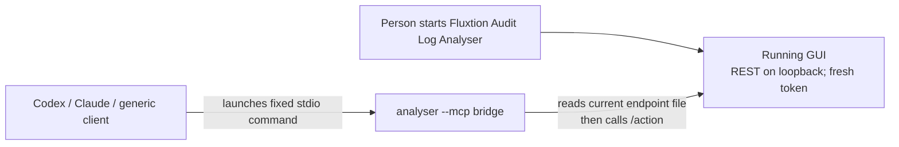

# Spec — Connect an AI client: local MCP setup from the analyser

**Status:** ACTIVE 2026-08-27
**Milestone:** M42  
**Extends:** [M13 MCP transport](spec-assistant-actions-mcp.md), [Start page](completed/spec-start-page.md), and [the connection guide](../site/connect-an-llm.md).  
**Does not reopen:** M41 native installation. JBang remains the supported way to install the application.

## The outcome

A person who installed the analyser with JBang can connect a supported AI client from the running
application, without copying a token, finding an ephemeral port, or hand-authoring client configuration.

| Client | What M42 does | What remains the client's job |
|---|---|---|
| **Codex CLI** | With the user's confirmation, invokes its MCP registration command for a local stdio server. | Discover tools and ask for approval before calls as the client normally does. |
| **Claude Code** | With the user's confirmation, invokes its user-scoped MCP registration command. | Discover tools and apply its normal per-call policy. |
| **Claude Desktop** | Explains that this per-machine JBang/Java bridge has no portable bundled extension, then offers the generic no-token stdio record. | Choose and apply Claude Desktop's supported configuration/installation flow. |
| **Generic MCP client** | Produces a complete, copyable stdio-server configuration using the resolved local launcher. | Choose where and whether to install that configuration. |

The bridge already exists. `analyser --mcp` is a headless stdio MCP server; it reads the live,
loopback-only REST endpoint and per-run token from `~/.fluxtion-analyser/rest-endpoint`, then forwards
calls to the running Swing session. M42 is **client setup and health**, not a second MCP transport.

> **Principle — register explicitly; never self-enrol silently.** An MCP client decides which local
> programs it may launch. The analyser may offer the exact command and execute a client CLI only after
> the person sees and confirms it; it never edits an unknown client configuration file behind their back.

---

## Why this is not M41 again

M41 was correctly withdrawn: `jbang app install analyser@telaminai/fluxtion-auditlog-analyser` already
installs a runnable application and its JDK. The remaining friction is a *second*, client-specific
installation step. Asking an analyst to find a jar, write JSON and understand why a new port and token
must not go in it is poor onboarding; it is unrelated to native bundles.

An MCP registration does **not** require the installed executable's name to match the MCP server name.
The configuration contains a command plus arguments; the server's identity is a client-side label. M42
therefore fixes the identity as **`fluxtion-analyser`**, while the current JBang launcher remains
`~/.jbang/bin/analyser`. The installer resolves and records the actual launcher it will use, never
assumes a shell `PATH`, and never requires a rename to function.

A future JBang catalogue alias named `fluxtion-analyser` may be added if it can coexist with `analyser`
and is upgrade-tested, but it is a distribution nicety rather than a prerequisite or a migration in M42.
Existing registrations named `analyser` are left alone; the setup screen may offer a user-confirmed
migration to the canonical MCP *server label* only.

The registration label is deliberately not the bridge's discovery identity: current bridge responses
advertise `serverInfo.name = fluxtion-audit-log-analyser`. A client may therefore show both names — its
local `fluxtion-analyser` registration and the bridge's protocol identity. M42 must name that fact in
the setup screen and persist neither as a third invented identity. Renaming `serverInfo.name` is a
separate visible protocol-contract decision, not incidental installer polish.

---

## D-I1 — the connection remains a bridge to the live desktop session

The analyser **does not start itself from an MCP request**. A fresh bridge subprocess has no open log,
graphs, flags, source roots or report state; the value is that a client operates the window the person is
already reviewing.

The connection has three independently observable links:



- The GUI's REST transport is still opt-in, loopback-only, and authenticated by its fresh per-run token.
- The registered command is stable: it launches `… --mcp`, which discovers the current endpoint every
  time. A restart needs no new client registration.
- If the GUI is closed or the transport is off, the bridge returns its existing actionable error. It does
  not launch a second GUI, guess a log, or weaken the security model.

**Permanent boundary:** remote/hosted MCP, a fixed listening port, an unauthenticated loopback endpoint,
and automatic app launch from the bridge are out of scope. They would blur the difference between a
client operating a reviewed desktop session and a daemon acting unattended. An agent-driven fresh start
already has the explicit `analyser --rest` route (M19.7), and the bridge's not-running error names it.
Revisit the boundary only if evidence shows this explicit path prevents a real user completing a
supported workflow; do not add an unprompted "future opt-in" launch path.

---

## D-I2 — first contact is a Start-page offer, never a first-run modal

M36 deliberately removed the first-run modal: a first launch is not a fault, and an agent-driven launch
must not wait behind a dialog. M42 keeps that rule.

The Start page gains a normal, non-modal card:

> **Work with an AI client**  
> Let Codex, Claude, or another MCP client query and render into this analyser window. The connection
> stays on this machine; you approve the setup and the client's own tool calls.
>
> **Connect Codex** · **Connect Claude** · **Generic MCP setup**

- It is shown on a fresh local configuration and stays reachable from **Settings ▸ Assistant ▸ Connect
  an AI client…** thereafter. "Not now" merely dismisses the card for this start page; it is not a
  promise that the user never wants the feature.
- A configured/verified connection replaces the card's actions with **Check connection** and
  **Manage clients…**. A generic configuration copied to the clipboard is not presented as installed.
- The card names the *visible benefit* (an agent works in this window), not the transport jargon. MCP
  appears in the detail screen and copied configuration, where it helps an advanced user.

Opening the setup screen performs no write and no process launch. It first explains that the current
window must remain open and shows the state of the local REST transport. If it is off, **Enable local
transport** describes its persistent configuration change and asks for confirmation. It must be enabled
before a registration or loopback test can be called healthy.

---

## D-I3 — one resolved launch command, never a guessed shell command

Introduce a small, testable `McpLaunchCommand` model. It is the single source for the command used by
the setup UI, client integrations, generic snippets, and the loopback probe.

It resolves one of these launch forms, in order of confidence:

1. the absolute `~/.jbang/bin/analyser` launcher installed by the documented JBang command;
2. the **full argument vector** that launched the app, when it can be safely identified;
3. an explicitly chosen local fatjar plus the selected Java executable;
4. no automatic setup — show the exact generic template and explain what path is missing.

The model is an argument vector, not a shell string. Rendering a shell command is solely for display and
copying. Every actual invocation uses `ProcessBuilder(command, args…)`; spaces, quotes and paths cannot
be reinterpreted by a shell. The command never contains the REST URL or token.

The resolved standard command is logically:

```text
<absolute-launcher> --mcp
```

For a JBang install today that is normally:

```text
/Users/name/.jbang/bin/analyser --mcp
```

The example is illustrative; the UI must show the real home-directory path on the current machine.

Form 2 must never mistake `ProcessHandle.info().command()` (`java` under JBang) for an analyser
launcher. It reconstructs a usable full Java/JBang argument vector, removes any opening-log argument,
then proves the result with the loopback probe before offering it to a client. If that cannot be done
unambiguously, form 2 is unavailable — an explicit fatjar is safer than a plausible-looking `java --mcp`.

Running the resolved command in the probe is intentionally stronger than testing classes in-process: it
also catches a stale JBang cache/launcher whose bridge jar is older than the running GUI. That mismatch
is a diagnosable setup failure rather than a mysterious client problem.

---

## D-I4 — client-specific setup paths

**External-contract rule:** before implementing, changing, or testing any Codex, Claude Code, Claude
Desktop, or generic-client integration, read that client's *live* authoritative documentation and
verify the exact CLI/configuration/extension contract. The commands below state the intended shape;
they are not a licence to infer a protocol that has changed.

### Codex CLI

The setup pane detects the `codex` executable without starting it. An explicit **Check Codex
registration** asks the current CLI only whether `fluxtion-analyser` is already registered, using
`codex mcp get fluxtion-analyser --json`. [Live Codex MCP documentation](https://learn.chatgpt.com/docs/extend/mcp?surface=cli)
and the installed CLI were verified on 2026-08-27: the current STDIO registration shape is:

```text
codex mcp add fluxtion-analyser -- <absolute-launcher> --mcp
```

On confirm, the analyser invokes the Codex CLI directly with an argument vector; it never edits
`config.toml` or invokes a shell. It drains combined stdout/stderr with a strict bound and redacts
token-looking values before any diagnostic can escape to the UI or log. A non-zero exit does not change
the analyser's own successful-registration record and gives the person the same command to run in a
terminal. **Replace** is explicitly a confirmed remove of only `fluxtion-analyser`, followed by the
confirmed add; if the add fails after removal, the screen says so rather than pretending the old entry
remains. **Remove Codex connection** removes only the named `fluxtion-analyser` registration after
confirmation.

The setup records that the registration command succeeded; it does not claim Codex is connected until
the loopback probe succeeds, and never claims it has observed a model call.

### Claude Code

The default target is the user's Claude Code configuration, not a repository `.mcp.json`: the analyser
is a personal local desktop tool, and silently adding a server to a project file would make a machine
integration look like checked-in project policy. [Live Claude Code MCP documentation](https://code.claude.com/docs/en/mcp)
and the installed CLI were verified on 2026-08-27. The confirmation uses the current user-scoped STDIO
form, with every Claude option before the name, and the same resolved argument vector:

```text
claude mcp add --scope user --transport stdio fluxtion-analyser -- <absolute-launcher> --mcp
```

Opening setup only locates the `claude` executable. An explicit check invokes `claude mcp get
fluxtion-analyser`; current Claude Code may health-check the server as part of that command, so the UI
states that the explicit check can start the configured bridge. Add, replace, and remove use the CLI
with bounded, redacted output; user-scope removal is always `claude mcp remove --scope user
fluxtion-analyser`, never an inferred edit to another scope.

The screen also offers a **Copy project-scope command**. It is never the default and never writes a
project file: the person intentionally runs it from the desired project root if they want Claude Code
to create or update that project's `.mcp.json`. A user-scope success and `mcp get` result are not
presented as proof that an overlapping local/project configuration will not take precedence. The exact
Claude CLI/options and config schema must be verified against the live Claude documentation at
implementation time (the protocol is an external contract, so rule 6 applies).

### Claude Desktop

Claude Desktop's current [local-server guidance](https://support.claude.com/en/articles/10949351-getting-started-with-local-mcp-servers-on-claude-desktop)
and [MCPB build guidance](https://claude.com/docs/connectors/building/mcpb) were verified on 2026-08-27.
An `.mcpb` is a bundle with a manifest and a local Node/Python/binary entry point. The analyser has no
such portable entry point: its validated bridge is a per-machine JBang launcher or an exact Java-plus-jar
vector. Packaging an extension that re-discovers or re-parses that command would duplicate D-I3's
resolution rules, while shipping a runtime is outside M42's containment boundary.

Therefore v1 retains the documented generic-config fallback rather than producing a plausible but
untestable extension: **Claude Desktop** in setup explains that there is no bundled extension and directs
the person to **Generic MCP setup**, which supplies the resolved no-token stdio configuration. The
analyser never writes Claude Desktop's private configuration database, opens the client, or claims an
extension is installed. Claude Desktop owns installation, enterprise allowlists and enablement; after a
person configures it, the app can still run its own bridge probe but cannot claim a connected desktop
client or observed model call.

If the application later ships a cross-platform bundled bridge executable, revisit the extension route
only with a live MCPB manifest validation and macOS/Windows/Linux launch-command conformance tests. On
non-POSIX platforms the endpoint-file permission is best-effort, while loopback plus the fresh token
remain the security boundary.

### Generic MCP

Generic setup shows a selectable, copyable neutral stdio server record built from the exact resolved
argument vector, not a guessed shell string:

```json
{
  "mcpServers": {
    "fluxtion-analyser": {
      "command": "/absolute/path/to/analyser",
      "args": ["--mcp"]
    }
  }
}
```

For a Java/fatjar launch, `command` is the absolute Java executable and `args` begins with `-jar`; for
an installed JBang launch, it is the absolute JBang launcher followed by `--mcp`. The app writes no
generic client configuration: configuration locations and approval models are client-specific. A **Save
snippet…** action writes only a user-chosen file, with an overwrite confirmation, never a hidden
configuration location.

---

## D-I5 — the analyser can prove its own MCP chain

**Yes, it can test itself — as a loopback integration test, not by pretending to be Codex or Claude.**
First, the probing GUI reads the endpoint file. No file/dead pid is `REST_OFF`; a live pid other than
the probing process is `OTHER_INSTANCE`, and the probe stops there — the well-known endpoint is
last-writer-wins, so launching a bridge would otherwise prove a different analyser window. Only its own
live endpoint may proceed.

The GUI then starts the same resolved `--mcp` bridge command that a client would launch, speaks the
bridge's current supported MCP discovery/tool protocol over the child process's stdin/stdout, and invokes
the read-only `analyser_context` tool.

That proves this complete chain:

```text
setup's resolved command → stdio framing → tool discovery → bridge reads endpoint file
→ fresh token accepted → running GUI ActionServer → context response → bridge result
```

It deliberately does **not** mutate the filter, flags, graphs, files or configuration. `context` works
with or without a loaded log, so it is a reliable health action on a fresh Start page.

The probe has a short timeout, a bounded stderr capture, strict JSON-RPC line parsing, and always closes
stdin/destroys its child process. Its result distinguishes:

| Result | Meaning | UI wording |
|---|---|---|
| `VERIFIED` | discovery, tool list, and `analyser_context` returned from this GUI | **Bridge works now** |
| `REST_OFF` | no live endpoint, or the bridge reports its published analyser-unreachable code `-32001` | **Turn on local transport** |
| `OTHER_INSTANCE` | a different live analyser process owns the well-known endpoint | **Another analyser owns the MCP connection** |
| `LAUNCH_FAILED` | the resolved bridge executable did not start | **Fix launcher path** |
| `PROTOCOL_FAILED` | the launched process was not a compatible bridge | **Bridge needs attention** |
| `ACTION_FAILED` | the bridge reached the app but `context` failed | **App connection needs attention** |

This proves the analyser-side chain and the command a client will run. It cannot prove a third-party
client has imported its configuration, is signed in, or will approve calls; the UI must say that plainly.
The client-specific final check remains “does the client list `fluxtion-analyser` and its tools?”
Before returning `VERIFIED`, the probe re-reads the endpoint file once more: a different live pid at
that point downgrades the result to `OTHER_INSTANCE`. The bridge itself re-reads per tool call, so this
second check closes the last-writer-wins race between the ownership preflight and the context response.

The same probe has two test seams:

- pure tests feed scripted bridge input/output and assert discovery, `tools/list`, and the
  `analyser_context` request stay read-only; one pins that `context` remains in
  `McpTools.READ_ONLY`;
- an integration harness starts a real app with an isolated `user.home`, enables REST, runs the resolved
  child bridge, and asserts a `VERIFIED` loop. It belongs beside the M19 bench because that harness
  already validates a fresh Swing/REST launch under an isolated home. It also covers the dual-era
  discovery choice, `-32001 → REST_OFF`, and pid mismatch → `OTHER_INSTANCE`.

---

## D-I6 — status is honest and client-neutral

Connection status must not collapse three different facts into a friendly green tick.

| Fact | How it is known | Example wording |
|---|---|---|
| Local REST is live | the current `ActionServer` owns it | **Analyser ready for MCP** |
| The bridge command works | M42 loopback probe | **Bridge verified now** |
| A client registration command succeeded | the invoked client CLI's exit/result | **Codex registration installed** |
| A generic/extension configuration was supplied | the app copied/revealed it | **Configuration supplied — verify in your client** |

Only the first two are facts the analyser can re-check without a foreign client. Persist the chosen
setup target and redacted launch-command identity solely to make the screen helpful after a restart; do
not persist endpoint tokens, tool output, or a claim that an external client is currently connected.

---

## D-I7 — security and containment

- Keep the existing `127.0.0.1`, ephemeral-port, fresh-token and mode-600 endpoint-file design. M42
  never converts it to a shared daemon or puts the endpoint/token in client configuration.
- On non-POSIX filesystems the endpoint file's owner-only permission is best-effort; that is already
  how `RestEndpointFile` behaves. The loopback/token design remains unchanged, and Windows docs must
  state the platform limitation rather than promise POSIX mode bits.
- Registration is explicit. The confirmation view names the client, server label, launcher and whether
  it will add, replace, remove, or merely copy. Cancel means no external process and no configuration
  write.
- Do not invoke a shell, parse an untrusted client config, or overwrite a generic/Claude Desktop config.
  Client CLIs are called with argument vectors; their output is bounded and redacted of any accidental
  token-looking values before it reaches the UI/log.
- The bridge retains its existing tool annotations. Read-only calls are marked read-only; `open`,
  `source_root`, `screenshot` and `report` remain destructive hints for client approval.
- The extension contains no credentials and has no capability beyond launching the bridge. Enterprise
  allowlists/policies win over this setup flow and receive a clear, non-bypassable explanation.

---

## Delivery slices

One coherent slice per commit; `mvn test` green before each. Every slice that makes a user-visible
change adds its own `[Unreleased]` CHANGELOG line in the same commit — not deferred to M42.6. UI changes
are built and run manually because headless CI cannot prove a Swing setup flow.

1. **M42.1 — launch-command model and probe core.** `McpLaunchCommand`, argument-vector rendering,
   redaction and the process-managed loopback probe; pure tests plus an isolated-home bench path. Pin
   dual-era selection, `-32001 → REST_OFF`, pid mismatch → `OTHER_INSTANCE`, and context's read-only
   membership before adding a human surface.
2. **M42.2 — human surface and local readiness.** Start-page card, persistent Assistant entry,
   REST-off explanation/enabling confirmation, and the four-layer honest status model. Build/run the
   jar and check the fresh Start page stays dialog-free.
3. **M42.3 — Codex.** Detect/register/remove via the current Codex CLI, showing exact confirmation and
   safe failure/copy fallback. Verify against a clean Codex config/home, then run the loopback probe.
4. **M42.4 — Claude Code.** User-scoped registration and a deliberate, copy-only project-config path.
   Verify the current external CLI/schema first, then against a clean Claude Code configuration.
5. **M42.5 — Claude Desktop.** Verify the live MCPB contract. Retain the generic fallback when its
   documented packaging cannot launch the per-machine JBang/Java bridge without inventing a second
   launcher.
6. **M42.6 — generic configuration and docs.** Copy/save generic snippet, update the connection guide,
   Assistant guide, Start-page documentation and screenshots/transcripts; regenerate and inspect every
   visual/text artifact. Setup surfaces are captured **only** by the isolated-home generated-capture
   harness: their real absolute launcher paths are a screenshot leak surface a text sweep cannot see.

## Acceptance

- A JBang-installed analyser can register the stable `fluxtion-analyser` MCP server with Codex from the
  app, without a manually copied path/token/port; the registered command survives an analyser restart.
- Claude Code has the same user-scoped route; no project configuration is changed unless the person
  explicitly selected a project and applied the shown diff themselves.
- Claude Desktop gets a documented, tested local-extension route or the explicit generic-config fallback;
  no unsupported private configuration editing is claimed.
- A generic MCP user can copy a valid command/arguments block for the actual local launcher.
- **Check connection** launches the same bridge command, calls only `analyser_context`, and accurately
  distinguishes every failure mode in D-I5, including `OTHER_INSTANCE`. It causes no visible UI or
  persistent-state mutation.
- A fresh, no-log launch stays non-modal; the setup remains discoverable after dismissal.
- No client configuration, terminal history, UI message, screenshot, transcript or persisted config
  contains a per-run endpoint token.
- `mvn test`, `mkdocs build --strict`, the public-data sweep, and visual inspection of regenerated
  setup screenshots/transcripts pass before release.

## Review decisions recorded

- The three-tier client boundary stands: direct client-CLI registration for Codex/Claude Code,
  client-owned installation for Claude Desktop, and copy-only generic configuration.
- A JBang `fluxtion-analyser` alias is a separate distribution change; the tracker decision governs it.
- `analyser_context` remains the probe: it is a real agent-facing, read-only, logless diagnostic. A
  permanent `ping` tool solely for self-test would pollute every client's tool list.
- The no-auto-launch boundary in D-I1 is permanent, subject only to its stated evidence-based revival
  trigger.
